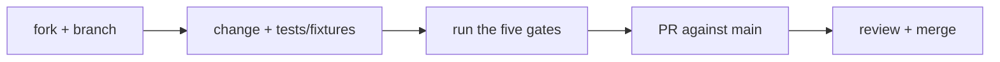

# Contributing to fdf

Thanks for your interest! This page covers everything a change needs to land.

## What this repo is

This is the source of the `fdf` CLI, its agent skills, and the versioned FDF
specs — **not** a project that uses FDF. The bundles under `testdata/` are
conformance fixtures, not real documentation. Bugs, ideas, and format
discussion all belong in [GitHub issues](https://github.com/GiteshDalal/fdf/issues).

## Development setup

You need Go 1.26+ (and optionally `shellcheck` for `install.sh`):

```bash
go build ./cli/cmd/fdf          # build the CLI
go test ./...                   # full test suite, including conformance fixtures
go run ./cli/cmd/fdf validate   # run without installing
```

## Before you open a PR

CI runs these five gates on ubuntu and macos; run them locally first:

```bash
go vet ./...
go test ./...
test -z "$(gofmt -l .)"        # gofmt -w . to fix
shellcheck install.sh
# skills lint: every skills/*/SKILL.md starts with --- and has name:/description:
```

## The conformance contract

`testdata/*/` fixtures are the executable spec. **If your change alters
validation behavior, it must add or update a fixture** — a `bundle/` directory
plus an `expect.txt` of `exit:`/`contains:` assertions. The fixtures, not the
Go test assertions, are where conformance is pinned. Name fixtures after the
case they lock in (e.g. `done-with-open-task`).

## Changing the spec

`spec/<version>.md` files are normative and frozen once released. Format
changes start as an issue; a version bump touches the new spec file,
`supportedVersions` in the validator, a `migrate` path, `currentVersion`,
fixtures for the new rules, and the skills/primer — see CLAUDE.md for the
full checklist.

## Pull requests



Keep PRs focused; one logical change each. By participating you agree to the
[Code of Conduct](CODE_OF_CONDUCT.md). fdf is [MIT licensed](LICENSE) — your
contributions are too.
