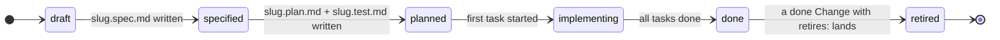
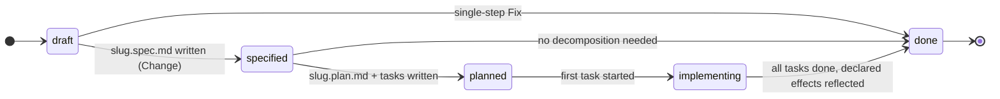

# Feature Document Format (FDF) — v0.5

FDF is a **self-contained, opinionated format** for documenting software
features and their implementation trail as a directory of markdown files with
YAML frontmatter. A feature is written in Markdown + Gherkin; its design spec,
implementation plan, acceptance tests, and tasks live beside it as
**stem-qualified trail siblings**. Four bundle-root **context documents** —
`STACK.md`, `ARCHITECTURE.md`, `SURFACES.md`, `INFRA.md` — hold the
project's current stack, architecture, surface (interface) principles, and
build/deployment infrastructure so an agent or reader needs no outside
context. Work that arrives **after a feature is delivered** — a change
request (`type: Change`) or a defect (`type: Fix`) — lives under `changes/`
and amends the feature it affects rather than forking a parallel copy of it.
There is no schema registry and no required tooling: if you can `cat` a file
you can read it. The reference tool is the `fdf` CLI in this repository.

Base rules: every non-reserved `.md` file is a **document** with YAML
frontmatter and a required `type`; a document's **ID** is its path minus
`.md`; `INDEX.md` and `LOG.md` are reserved filenames at the bundle root and
in group directories; consumers tolerate unknown types, extra keys, and broken
links rather than rejecting a bundle.

# Living and episodic documents

Every FDF document belongs to one of two classes, and which one it is
determines what happens to it when the software changes. This distinction is
normative: it is what keeps a bundle from drifting once features start
shipping.

| | Documents | On change |
|---|---|---|
| **Living** — describes the system as it is **today** | `Feature` (Gherkin), `Test`, `Surface`, the four `Context` documents | **Amended in place.** A living document that describes behavior the software no longer has makes the bundle lie. |
| **Episodic** — a frozen record of **one piece of work** | `Spec`, `Plan`, `Task`, `Change`, `Fix`, `Log` entries | **Never rewritten.** New work gets a new episode; the old one stands as the record of why things were done the way they were. |

A delivered feature that changes therefore keeps one feature document, whose
Gherkin is edited to match reality, and gains a second episode — a change
document with its own spec, plan, and tasks. The original `slug.spec.md` and
`slug/` task set are not touched: they record how the feature was first built,
which is precisely the context needed to judge a later change.

# Structure

- A **bundle** is a directory tree of markdown files rooted at the project's
  bundle root (see *Location*).
- A **group** is a plain directory with an `INDEX.md` listing (e.g.
  `payments/` in the example below). Groups are not documents and carry no
  type.
- A **feature** `<group>/<slug>.md` owns **stem-qualified trail siblings** at
  the group level — `<group>/<slug>.spec.md`, `<group>/<slug>.plan.md`,
  `<group>/<slug>.test.md`, and optionally `<group>/<slug>.surface.md` and
  `<group>/<slug>.log.md` — plus a **task directory** `<group>/<slug>/` that
  holds only ordered `NN-slug.md` tasks. **Position and stem are the link** —
  no frontmatter pointers. The role suffix is a single lowercase token after
  the last dot before `.md` (e.g. `instant-refunds.spec.md` → stem
  `instant-refunds`, role `spec`). Allowed trail roles: `spec`, `plan`,
  `test`, `surface`, `log`. The task directory may contain **only** task
  files; nothing else (not trail documents, not `INDEX.md`, not `LOG.md`). A
  `draft` feature has no trail siblings and no task directory at all.
- **Context documents** `STACK.md`, `ARCHITECTURE.md`, `SURFACES.md`,
  `INFRA.md` (`type: Context`) live at the bundle root. Each is the current
  snapshot of, respectively, the project's technology stack, its architecture
  and design principles, its interface and interaction principles for all
  surfaces, and its build/deployment infrastructure and targets. They are
  **critical**: a conforming producer treats them as read-mostly, updating
  them only with explicit human approval and logging each change. See
  *Context documents* under Body conventions.
- **Change and Fix documents** live in the reserved bundle-root directory
  `changes/` (`type: Change` or `type: Fix` — two document types sharing one
  home, so a feature's whole post-delivery history is in one place), with the
  same stem-qualified trail grammar as a feature: `<slug>.spec.md`,
  `<slug>.plan.md`, optional `<slug>.log.md`, and a task directory `<slug>/`.
  Allowed trail roles are only `spec`, `plan`, and `log`: neither type ever
  owns a `test` or `surface` sibling, because those are **living** documents
  belonging to the affected feature.
- `changes/` holds those documents **directly** (`changes/<slug>.md`) and/or
  in **groups** (`changes/<group>/<slug>.md`) — the same groups defined
  above, a plain directory with an `INDEX.md`. Both shapes are legal and may
  coexist: a young bundle stays flat, a bundle with hundreds of changes files
  them into groups. A directory under `changes/` is a **task directory** when
  a sibling `<name>.md` change or fix exists and a **group** otherwise;
  groups do not nest further. `changes/` itself always carries
  `changes/INDEX.md`.
- Releases live in `releases/<version>.md`; the release ID is the version.
- `README.md` at the bundle root is legal and ignored (git-forge landing page).
- `SPEC.md` at the bundle root is the recommended home for a copy of this
  specification (`type: Reference`), so consumers need no external context;
  `fdf init` places it there. Root `SPEC.md` is the format reference only —
  it is **not** a feature trail document.

Example layout:

```
docs/features/
├── INDEX.md
├── LOG.md
├── SPEC.md                 # vendored format reference (type: Reference)
├── STACK.md                # type: Context
├── ARCHITECTURE.md         # type: Context
├── SURFACES.md             # type: Context
├── INFRA.md                # type: Context
├── changes/
│   ├── INDEX.md
│   ├── refund-rounding.md            # type: Fix, filed flat (one file)
│   └── payments/                     # group: INDEX.md, no sibling .md
│       ├── INDEX.md
│       ├── refund-window.md          # type: Change
│       ├── refund-window.spec.md     # type: Spec
│       ├── refund-window.plan.md     # type: Plan
│       └── refund-window/            # task directory ONLY
│           └── 01-shorten-settlement.md
├── payments/
│   ├── INDEX.md
│   ├── instant-refunds.md            # Feature + Gherkin
│   ├── instant-refunds.spec.md       # type: Spec
│   ├── instant-refunds.plan.md       # type: Plan
│   ├── instant-refunds.test.md       # type: Test
│   ├── instant-refunds.surface.md    # type: Surface (optional)
│   ├── instant-refunds.log.md        # type: Log (optional)
│   └── instant-refunds/              # task directory ONLY
│       ├── 01-refund-api.md
│       └── 02-refund-ui.md
└── releases/                         # optional
    ├── INDEX.md                      # newest first
    ├── 1.1.0.md                      # type: Release, status: shipped
    └── 1.2.0.md                      # type: Release, status: planned
```

# Location

The bundle lives at **`docs/features/`** by default — the recommended
location. Tools MUST honor overriding it via the `FDF_ROOT_DIR` environment
variable or a `--root` flag (precedence: flag → env → default); relative
values resolve against the project root, absolute values are used as-is.

The mount may be a plain directory **or a git submodule at the same path**
(a wiki-style separate docs repo). Conforming tools MUST treat both
identically: `resource:` paths resolve against the **project** root — when
the bundle is a submodule (its root has a `.git` *file*), tools walk up to the
superproject working tree. A bundle checked out standalone gets format
validation with repo-integrity checks skipped and a warning, never a false
failure.

## Monorepos

A repository holding several inter-related projects is still **one project**
for FDF's purposes, and the recommended shape is **one bundle at the
repository root**. A feature describes what the software does for a user, and
in a monorepo a single capability routinely spans components — an endpoint, a
web form, a mobile screen are one capability, not three. It is therefore one
Feature, whose tasks carry `resource:` paths into each component. **Which
components a feature touches is expressed by those paths, never by where the
feature file sits.**

Groups stay what they are: organization. Group by capability domain when
features cross components (`auth/`, `payments/`), by component when they do
not (`marketing/`, `admin/`). Nothing in FDF ties a group name to a directory
in the code.

The four Context documents describe the repository as a whole, with
per-component sections where components genuinely differ: a `STACK.md` with a
section per component, an `INFRA.md` with a section per deployment target.
`ARCHITECTURE.md` carries more weight here than in a single-project bundle —
component boundaries and what calls what is exactly the context an agent
lacks. `SURFACES.md` already spans every surface by design.

Separate bundles are right only when the projects are **not** inter-related:
independent teams, independent release cadence, each extractable into its own
repository tomorrow. That is several projects sharing a VCS, and each takes
its own bundle at `<project>/docs/features/`, selected with `--root` or
`FDF_ROOT_DIR`. The cost is real and one-way: `depends-on`, `affects`, and
releases are all bundle-scoped, so nothing links across the boundary and no
release spans it. Pay it only when the projects genuinely do not link.

# Casing

Case marks reserved-ness. Uppercase fixed names at the **bundle root**:
`INDEX.md`, `LOG.md` (reserved machinery); `SPEC.md` (format reference only,
`type: Reference`); and `STACK.md`, `ARCHITECTURE.md`, `SURFACES.md`,
`INFRA.md` (context documents). Group directories also use uppercase
`INDEX.md` (and may use a group-level `LOG.md` where applicable), as do
`changes/` and every group inside it. Trail documents are **lowercase**
stem-qualified files: `slug.spec.md`, `slug.plan.md`, `slug.test.md`,
`slug.surface.md`, `slug.log.md`. Everything else is lowercase and enforced:
groups and slugs `[a-z0-9-]`, change slugs and `changes/` group names
`[a-z0-9-]`, tasks `NN-[a-z0-9-]+.md`, releases `<version>.md`. `changes/`
and `releases/` are reserved lowercase directory names at the bundle root and
are not themselves groups. Any other uppercase filename is an error.

# Types

| Type        | What it is                                        | Where it lives                              |
|-------------|---------------------------------------------------|---------------------------------------------|
| `Reference` | Meta documents                                    | bundle root                                 |
| `Context`   | Stack / architecture / surfaces / infra snapshot (critical) | `STACK.md`/`ARCHITECTURE.md`/`SURFACES.md`/`INFRA.md` at bundle root |
| `Feature`   | One capability, Markdown + Gherkin                | `<group>/<slug>.md`                         |
| `Spec`      | Approved design for a feature or a change         | `<group>/<slug>.spec.md`, `changes/…/<slug>.spec.md` |
| `Plan`      | Implementation plan; body links every task        | `<group>/<slug>.plan.md`, `changes/…/<slug>.plan.md` |
| `Test`      | How the feature's scenarios are proven            | `<group>/<slug>.test.md`                    |
| `Surface`   | Feature-level surface (interface) design          | `<group>/<slug>.surface.md` (optional)      |
| `Log`       | Feature-, change-, or fix-scoped log of decisions | `<group>/<slug>.log.md`, `changes/…/<slug>.log.md` (optional) |
| `Task`      | One implementable unit of the plan                | `<group>/<slug>/NN-slug.md`, `changes/…/<slug>/NN-slug.md` |
| `Change`    | Post-delivery request to alter documented behavior | `changes/<slug>.md` or `changes/<group>/<slug>.md` |
| `Fix`       | Post-delivery defect: code did not match the documented behavior | `changes/<slug>.md` or `changes/<group>/<slug>.md` |
| `Release`   | A planned or shipped release referencing features, changes, and fixes | `releases/<version>.md` |

A document's `type` must match its position; validators reject, say, a
`Feature` file at the bundle root, a `Spec` file inside a task directory, or a
`Change`/`Fix` file outside `changes/`. Position constrains type without always
determining it: a change-document position admits exactly the two
post-delivery types and nothing else. Feature ID remains `<group>/<slug>`
(path of the feature file without `.md`); a change or fix ID is its path minus
`.md` too — `changes/<slug>` when filed flat, `changes/<group>/<slug>` when
filed in a group.

# Frontmatter

Shared fields on every document: `type` (**required**), `title`,
`description`, `tags`, `timestamp`. Per-type fields:

| Field        | On      | Meaning                                                                 |
|--------------|---------|-------------------------------------------------------------------------|
| `status`     | Feature | **Required.** `draft → specified → planned → implementing → done → retired` |
| `status`     | Change, Fix | **Required.** `draft → specified → planned → implementing → done`   |
| `status`     | Task    | **Required.** `pending → in-progress → done`                            |
| `status`     | Release | **Required.** `planned → shipped`                                       |
| `affects`    | Change, Fix | **Required.** Feature ID(s) this document touches; string or list; each must name an existing `done` or `retired` Feature |
| `retires`    | Change  | Optional — Feature ID(s) this change retires; each must be a `retired` Feature. Never on a `Fix`: retiring behavior is a deliberate change |
| `replaced-by`| Feature | Optional — the Feature ID that supersedes a `retired` feature           |
| `version`    | Feature, Change, Fix | Optional — the release this document targets or shipped in |
| `depends-on` | Feature | Optional — Feature ID(s) this feature builds on; each must exist; the graph MUST be acyclic |
| `date`       | Release | Target date while `planned`, actual date once `shipped`                 |
| `resource`   | Task, Change, Fix | Optional — project-relative path(s) to the code it touches; string or list, each must exist |
| `depends-on` | Task    | Optional — sibling task IDs (filename minus `.md`) that must complete first; the graph MUST be acyclic |

`depends-on` means different things by position and that is deliberate: on a
`Task` it names **sibling filenames** within one task directory (execution
order inside one episode); on a `Feature` it names **bundle-relative feature
IDs** (`payments/instant-refunds`) because the relationship crosses groups.
Both graphs must be acyclic; they are separate graphs.

`Spec`, `Plan`, `Test`, `Surface`, `Log`, and `Context` carry only shared
fields. The bundle root `INDEX.md` pins the spec: frontmatter
`fdf_version: "0.5"` plus a link to this document.

# Lifecycle

## Features



| Feature status | Invariant                                                              |
|----------------|------------------------------------------------------------------------|
| `draft`        | Feature file only; **no trail siblings**; **no task directory**        |
| `specified`    | `slug.spec.md` exists                                                  |
| `planned`      | `slug.plan.md` and `slug.test.md` exist (and `slug.spec.md`)           |
| `implementing` | Plan, ≥ 1 task under `slug/`, not all tasks `done`                     |
| `done`         | Spec, plan, test, ≥ 1 task, all tasks `done`                           |
| `retired`      | The behavior no longer exists in the software. Named by the `retires:` of exactly one `done` Change, which carries the rationale; `replaced-by:` names the successor when there is one. Test coverage (F8) is no longer required. |

`slug.surface.md` and `slug.log.md` are **optional** at every status — never
hard-required by lifecycle. `retired` is terminal and reversible only by a new
feature: a retired document is kept, never deleted, because it records
behavior the software once had and the reasoning for dropping it. Feature
`status` tracks implementation; release `status` tracks shipping.

A delivered feature never returns to `implementing`. Post-delivery work is a
`Change` or `Fix` document, which carries its own status; this keeps `done` a
stable signal and keeps a `shipped` release's feature list valid forever.

## Changes and fixes

Both post-delivery types share one status vocabulary; they differ in what each
status requires, which is why they are separate types rather than one type
with a discriminator field.



| Status         | `Change`                                                 | `Fix`                                         |
|----------------|----------------------------------------------------------|-----------------------------------------------|
| `draft`        | Document only; no trail siblings, no task directory      | same                                          |
| `specified`    | `slug.spec.md` exists (the approved design)              | never required; permitted when the approach warrants writing down |
| `planned`      | `slug.spec.md` and `slug.plan.md` exist                  | `slug.plan.md` exists                         |
| `implementing` | Plan, ≥ 1 task in its task directory, not all done       | same                                          |
| `done`         | All tasks (if any) `done`; declared scenario changes reflected in every affected feature (F10) | All tasks (if any) `done`; declared regression cases present (F10) |

A `Change` passes through `specified`: altering documented behavior is a
decision, and `slug.spec.md` is where a human approves it. A `Fix` has no such
gate — it restores behavior already approved — so it may go straight from
`draft` to `done`.

Tasks are **optional** for both: the floor for a `Fix` is a single file. When
a task directory exists it must have a `slug.plan.md` linking every task,
exactly as for a feature (F6). A change that grows beyond a handful of tasks,
or that adds behavior that reads as its own `Feature:` declaration with its
own As-a / I-want / So-that, is a **new feature** rather than a change; a new
feature may record its lineage with `depends-on`.

# Body conventions

## Feature documents (Markdown + Gherkin)

Gherkin lives in ```` ```gherkin ```` fences under conventional headings, with
markdown prose between fences carrying what Gherkin can't:

- `# Feature` — exactly one fence with the `Feature:` block (name +
  As-a / I-want / So-that), then prose: context, links to related
  documentation, links to its own trail once it exists.
- `# Scenarios` — one fence per `Scenario:` / `Scenario Outline:`.
- `# Citations` — optional.

A Feature document contains exactly one `Feature:` declaration and at least
one `Scenario:` across its fences; concatenating the fences in order yields
one valid `.feature` file.

A feature document is **living**: when a change alters what the software does,
the scenarios here are edited to describe the new behavior. The superseded
text is not preserved here — it lives in the change document that removed it,
in `slug.log.md`, and in version control. A feature document carries no
hand-written back-links to the changes that touched it; the `affects:` edge is
the single source of that relationship and tools derive the rest.

## Context documents

Four bundle-root documents (`type: Context`) are the project's living
context, written once at bundle setup (the `fdf-init` interview) and changed
only with explicit human approval:

- **STACK.md** — the technology stack: languages, frameworks, runtimes,
  libraries, data stores, and the versions in use.
- **ARCHITECTURE.md** — the architecture and design principles: the style
  (e.g. modular monolith, microservices, serverless, frontend/backend/
  fullstack), how code is organized, and the guidelines contributors follow.
- **SURFACES.md** — interface and interaction principles for **all surfaces**
  through which people or systems engage the project (HTTP APIs, human UIs,
  CLIs, events/webhooks, file formats, and other inputs) — not “UI only”.
  Covers, as applicable: API naming, errors, versioning, pagination, and auth
  presentation; frontend structure, UX principles, brand, and links to
  assets/exemplars; CLI command design, flags, output, and exit codes;
  integrations and inputs (event shapes, validation philosophy,
  operator-facing feedback). Stub headings (scaffold): Purpose, Surfaces,
  Principles, Conventions by surface, Assets and exemplars, Out of scope.
- **INFRA.md** — build and deployment infrastructure: how the project is
  built, tested, packaged, and deployed, and the environments and targets it
  runs on.

A **surface** is any interface through which people or systems engage the
project. FDF deliberately avoids “design”/“UX” as document names: both are
GUI-connoted, and “design doc” collides with internal technical design
(Spec/Architecture territory). Precedent for the term: “API surface”,
“surface area of a library”.

Each Context document is a **current snapshot**, not a changelog. A conforming
producer treats them as read-mostly: after completing a feature or a change it
MAY propose additions or corrections (a new technology, a new pattern, new
infrastructure such as a cache or queue, a new surface convention), but MUST
obtain explicit human approval before writing, and SHOULD record each approved
change in the nearest log (`LOG.md` at the bundle or group root, or
`slug.log.md` for feature- or change-scoped notes). Until the interview has
filled a document it carries a stub marker (`<!-- fdf:stub -->`) and counts as
absent for F9. Their upkeep is the human's responsibility; their accuracy is
what lets an agent work from real project context rather than guesswork.

## Trail documents

- **`slug.spec.md`** (`type: Spec`) — the approved design: what is being
  built and why, alternatives considered. Episodic: written once per episode
  and never rewritten by later work.
- **`slug.plan.md`** (`type: Plan`) — a `# Tasks` heading with an ordered
  list linking every task file under the task directory; the authoritative
  task ordering. Links are relative paths from the plan file (e.g.
  `instant-refunds/01-refund-api.md`). For a feature, the final task always
  satisfies `slug.test.md`.
- **`slug.test.md`** (`type: Test`) — `# Test Cases`: one entry per scenario,
  naming the scenario **verbatim** and giving the concrete verification — a
  command, a test-file path, or an explicit manual procedure. Optional
  `# Setup`. Every scenario in the feature document MUST have a test case
  here from `planned` onward. Living: it is the feature's standing regression
  suite and is amended by every change that touches the feature.
- **`slug.surface.md`** (`type: Surface`, optional) — feature-level surface
  design that Gherkin cannot hold (layout, choreography, API envelope choices
  for this feature, CLI flag set rationale, copy, a11y for this flow). The
  interaction design of **any surface** this feature exposes (UI, API, CLI,
  events) — not limited to visual design. Living: a change that alters the
  interface amends it in place. Validation never requires it for a status.
- **`slug.log.md`** (`type: Log`, optional) — a feature- or change-scoped log
  beside the document, same `## YYYY-MM-DD` heading format as the
  bundle-root log, recording major decisions and notable user interactions.
- **Tasks** — live only in a feature's or a change's task directory, as
  `NN-[a-z0-9-]+.md`. Body: `# Objective`, `# Steps`, `# Acceptance`;
  acceptance references the scenario names it satisfies. `depends-on`
  expresses execution ordering beyond `NN-` numbering; serial consumers
  follow plan order, parallel consumers schedule topologically. `resource`
  and `depends-on` are frontmatter fields (never body headings). Example task
  `payments/instant-refunds/03-integration-tests.md`:

  ```yaml
  ---
  type: Task
  status: pending
  resource: [tests/refunds_test.go]        # existing paths only; omit for files not yet created (R1)
  depends-on: [01-refund-api, 02-refund-ui]  # YAML list for 2+; bare scalar for one; MUST be acyclic
  ---
  ```

  A comma-joined string (`depends-on: 01-refund-api, 02-refund-ui`) is a
  single invalid ID and fails F6; a `resource` path that does not yet exist
  fails R1.

## Change and Fix documents

A `Change` or `Fix` document under `changes/` is the unit of post-delivery
work. It states what is wrong or what should be different, names
the features it touches, and **declares the effects it will have on those
features' living documents** so a validator can confirm the effects actually
landed. Neither contains Gherkin: behavior statements belong in the feature
documents they amend.

Choosing between them is the routing decision, and the test is one question —
*does this require the feature's Gherkin to change?*

- **`type: Fix`** — no. The feature document was right; the code drifted from
  it. Restoring the documented behavior needs no design approval.
- **`type: Change`** — yes. Someone is deciding what the software should do,
  including the case where the original document was silent or wrong on a
  situation nobody recognized at the time. This needs the design gate:
  `slug.spec.md`, approved, before implementation.

### Change body

- `# Problem` — what is inadequate about the delivered behavior, and for whom.
- `# Scenario changes` — **required**. One `## <feature-id>` heading per ID in
  `affects`, and one heading for each; under it, entries in exactly three
  forms:
  - `- add: <scenario name>` — a scenario that must exist in that feature
    once the change is `done`.
  - `- modify: <scenario name>` — an existing scenario whose **name is
    unchanged** and whose steps change; must exist before and after.
  - `- remove: <scenario name>` — a scenario that must **not** exist once the
    change is `done`.

  A rename is `remove:` the old name plus `add:` the new one. Names are
  matched **verbatim** against the feature's Gherkin, the same way
  `slug.test.md` entries are.
- `# Impact` — optional: migrations, compatibility, rollout, the features in
  `affects` that need no scenario change but are touched anyway.
- `# Rationale` — **required when `retires:` is present**: why the feature is
  being retired or replaced, and what supersedes it. This is the one place a
  retirement's reasoning is recorded, and F10 will not let a feature be
  `retired` without it.

### Fix body

- `# Symptom` — the observed wrong behavior, with a reproduction.
- `# Root cause` — why the code diverged from the documented behavior.
- `# Regression cases` — **required**. One `## <feature-id>` heading per ID in
  `affects`; under it, one entry per scenario the fix proves, naming the
  scenario **verbatim** and giving the concrete verification — a command, a
  test-file path, or an explicit manual procedure, exactly as in
  `slug.test.md`. Every named scenario MUST already exist in that feature: a
  fix that needs a scenario that is not there is a `Change`.

A `Fix` carries no `# Scenario changes` section and a `Change` carries no
`# Regression cases` section; each is an error on the other type. Landing a
fix means the affected features' `slug.test.md` files gain or strengthen the
cases named here — the regression test is the durable artifact that keeps the
defect from returning.

### Multi-feature changes and fixes

`affects` is a list on both types, and `# Scenario changes` / `# Regression
cases` carry one heading per affected feature, so a change request that spans
features and a defect that surfaces in several features are the same shape.
This is the one relationship in FDF that position cannot express — it is
many-to-many — and so it is the one place an explicit frontmatter edge is
used instead of stem and position.

A consequence worth stating outright: **for a change or a fix, location is
filing, not meaning.** `affects` is the whole link, so nothing ties the group
a change sits in to the groups of the features it touches, and no rule checks
that they correspond. Naming `changes/` groups after feature groups is the
recommended convention and nothing more; a project may just as well file by
quarter, by release, or by theme. This is also why the two types live under
one bundle-root `changes/` rather than inside each feature group: a change
that spans groups would have no correct home there, and a change that grows a
second affected feature in another group would have to move. Nothing ever
moves here.

## Release documents

`# Features` — links to every feature in the release; `# Changes` — optional,
links to every `Change` and `Fix` document shipping in the release; `# Notes`
— optional. A document's `version: "X"` and `releases/X.md`'s lists are two
ends of one relationship, checked in both directions. `releases/INDEX.md`
lists newest first. Releases are optional.

Those two lists are the only content in FDF that is **wholly derived**: they
are a projection of the `version:` fields already carried by features,
changes, and fixes, and they add no information a tool could not compute. They
are written down anyway because a bundle must be readable with `cat` alone —
the same reason a plan lists its tasks when the task directory sits right
beside it. That combination (derived, yet materialized) is what F7 polices,
and it is why a conforming tool MAY generate them: `fdf release <version>`
rewrites `# Features` and `# Changes` from a bundle scan. What a tool MUST NOT
derive is membership itself. Which work ships in a release is a human
decision, recorded as `version:` on each document; the release file is
downstream of those decisions, never upstream. `# Notes` is human prose and a
generator preserves it untouched.

## Cross-linking

Bundle-relative `/…` links within the bundle (a feature's stem trail
conventionally uses relative links instead); relative paths for out-of-bundle
targets. Cross-linking a feature with the documentation of the code that
implements it is encouraged in both directions. Links **from** a feature to
the changes and fixes that amended it are deliberately not required: they are
derivable from `affects:`, and a required back-link is a standing invitation
to drift.

# Conformance

A **conforming bundle** satisfies all hard rules; a **conforming validator**
enforces them with these severities and reports the soft checks as warnings,
never errors:

| Rule | Hard requirement |
|------|------------------|
| F1 | Parseable YAML frontmatter with non-empty `type`; ISO-8601 `## YYYY-MM-DD` log headings; root `fdf_version` pin, when present, matches a spec version the tool supports (an absent pin is a warning) |
| F2 | `Feature`/`Change`/`Fix`/`Task`/`Release` carry a valid `status` from the closed vocabularies |
| F3 | Positional integrity: every `slug.<role>.md` trail file has a sibling `slug.md` feature, change, or fix; allowed trail roles are `spec`, `plan`, `test`, `surface`, `log` under a group and only `spec`, `plan`, `log` under `changes/` (an unknown or misplaced role suffix is an error); `type` matches position; every task directory contains **only** `NN-[a-z0-9-]+.md` task files — no `SPEC.md`/`PLAN.md`/`TEST.md`, no `INDEX.md`, no `LOG.md`, no other files; `Context` documents are the four named files at the bundle root; a change-document position (`changes/<slug>.md` or `changes/<group>/<slug>.md`) holds a `Change` or a `Fix` and nothing else, and those two types appear nowhere else; a directory under `changes/` with a sibling `<name>.md` is that document's task directory and one without is a group (`INDEX.md`, no further nesting); casing rules; nothing nests deeper than a task directory |
| F4 | Status ↔ artifact invariants per type (tables above); e.g. a `specified` feature requires `payments/instant-refunds.spec.md`, a `planned` `Change` requires both its `<slug>.spec.md` and `<slug>.plan.md` stem siblings, and a `planned` `Fix` requires only the plan |
| F5 | Feature bodies: exactly one `Feature:`, ≥ 1 `Scenario:`, fences start with Gherkin keywords; `Change` and `Fix` bodies carry no Gherkin fences |
| F6 | `# Tasks` links exactly the task files present under the task directory; a task directory with ≥ 1 task has a plan; `depends-on` names existing siblings; the task dependency graph is acyclic |
| F7 | Release ↔ `version` bidirectional consistency for features, changes, and fixes; `shipped` lists only `done` documents |
| F8 | From `planned` onward `slug.test.md` exists (`type: Test`) and covers every scenario name; a `retired` feature is exempt |
| F9 | Once the bundle has ≥ 1 feature, the four `Context` documents (`STACK.md`, `ARCHITECTURE.md`, `SURFACES.md`, `INFRA.md`) exist at the bundle root with `type: Context` and are past their stub state |
| F10 | **Change integrity.** On every `Change` and `Fix`: each `affects` ID names an existing Feature whose status is `done` or `retired`; the declaration section its type requires (`# Scenario changes` for a `Change`, `# Regression cases` for a `Fix`) is present with one heading per `affects` ID and no heading outside it, and the other type's section is absent; `retires` appears only on a `Change`. Once the document is `done`: every `add`/`modify` scenario name exists **verbatim** in the named feature, every `remove` name does not, every `Fix` regression name exists in the named feature and carries a non-empty verification, and every `retires` ID names a `retired` feature whose `Change` body has a `# Rationale`. A `retired` feature is named by the `retires:` of exactly one `done` `Change`. `replaced-by`, when present, names an existing feature. Feature `depends-on` names existing features and is acyclic |
| R1 | Every `Task`, `Change`, and `Fix` `resource` path exists in the project (skipped with a warning for standalone bundles) |

Soft: broken cross-links, missing recommended fields, index-listing presence,
log newest-first ordering; a Context document that is still an unfilled stub
in a bundle with no features yet; an affected feature's `slug.test.md` whose
`timestamp` predates a `done` `Change` or `Fix` that names it (a likely
un-landed regression case).

A landed `remove:` is terminal for that scenario name: once a `done` Change
has removed a scenario from a feature, no other document is held to it any
more. An earlier `Fix` that proved it, or an earlier `Change` that added it,
was telling the truth when it was written — and those are **episodic**
documents, which are never rewritten. Without this carve-out F10 would
contradict the rule it exists to serve, forcing every scenario rename to go
back and edit frozen history.

F10 cannot prove that a regression case was *strengthened* — no static check
can compare against history. What it does guarantee is that a change cannot
reach `done` while the features it claims to alter still describe the old
behavior, and that every retirement carries a written reason. That is the
drift this rule exists to prevent.

F10, the `Change` and `Fix` types, the `retired` feature status, feature
`depends-on`, and releases listing changes apply to bundles pinning v0.5.
Bundles pinning earlier versions are validated under their pin: v0.4 has the
stem-trail layout and four Context documents but no `changes/`; v0.3 requires
the three Context documents (`STACK`/`ARCHITECTURE`/`INFRA`), uses the nested
paired-directory layout, and may use feature-directory `LOG.md`; v0.2 has no
Context documents.

# Versioning

Spec versions are `MAJOR.MINOR`. Bundles pin their version in the root
`INDEX.md`; tools state which versions they validate and offer mechanical
migration between adjacent versions (`fdf migrate`). This document is v0.5;
`fdf migrate` upgrades a v0.4 bundle by rewriting the pin, re-vendoring the
bundle's `SPEC.md`, and scaffolding `changes/INDEX.md`. The upgrade is purely
additive: no existing document moves, changes shape, or needs editing, and a
v0.4 bundle that never records a change or a fix validates identically under
v0.5.

# Extending a bundle

0. `fdf init` scaffolds the bundle and the four Context stubs (`STACK.md`,
   `ARCHITECTURE.md`, `SURFACES.md`, `INFRA.md`); the `fdf-init` interview
   fills them before feature work begins.
1. `fdf new <group>/<slug>` — a `draft` feature; write the Gherkin.
2. Advance via stem trail files: `slug.spec.md` (→ `specified`), then
   `slug.plan.md` + `slug.test.md` (→ `planned`), then tasks under `slug/`
   (→ `implementing`, → `done`). Optionally add `slug.surface.md` when
   brainstorm surfaces non-observable interface decisions. Keep `# Tasks` in
   lockstep; the final task satisfies `slug.test.md`.
3. Link from the group `INDEX.md`; note changes in the nearest log
   (bundle/group `LOG.md` or `slug.log.md`).
4. After delivery, every further modification is a change or a fix —
   `fdf change [<group>/]<slug> --affects <group>/<slug>[,…]` when the
   Gherkin must change, `fdf fix [<group>/]<slug> --affects …` when it must
   not; the leading group is optional and files the document under
   `changes/<group>/`.
   Declare the effects, get the spec approved for a `Change`, do the work,
   and amend the affected features' living documents — Gherkin,
   `slug.test.md`, and `slug.surface.md` — before flipping to `done`. The
   original feature's spec, plan, and tasks stay untouched.
5. To cut a release, set `version: "X"` on each feature, change, and fix that
   ships in it, then `fdf release X` to scaffold or refresh `releases/X.md`
   from those fields, and `fdf release X --ship` once they are all `done`.
   The command derives the lists and never chooses the contents.
6. `fdf validate` before committing.

# Acknowledgements

FDF's bundle conventions were inspired by
[OKF v0.1](https://github.com/GoogleCloudPlatform/knowledge-catalog/blob/main/okf/SPEC.md);
FDF is self-contained and not a profile of it. Gherkin keyword semantics:
[Gherkin reference](https://cucumber.io/docs/gherkin/reference/).
