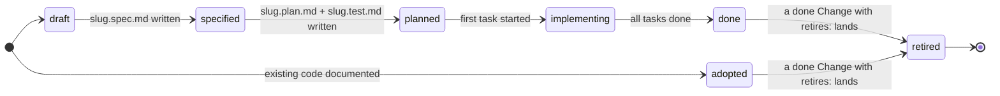
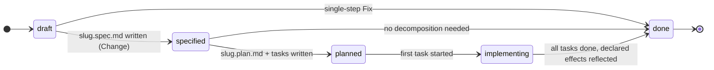
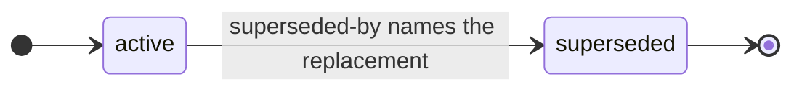
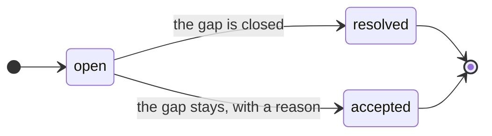
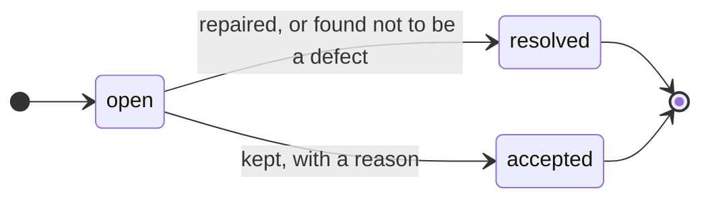

# Feature Document Format (FDF) — v0.7

FDF is a **self-contained, opinionated format** for documenting software
features and their implementation trail as a directory of markdown files with
YAML frontmatter. A feature is written in Markdown + Gherkin; its design spec,
implementation plan, acceptance tests, and tasks live beside it as
**stem-qualified trail siblings**. Five bundle-root **context documents** —
`STACK.md`, `ARCHITECTURE.md`, `SURFACES.md`, `INFRA.md`, `DOMAIN.md` — hold
the project's current stack, architecture, surface (interface) principles,
build/deployment infrastructure, and domain language, so an agent or reader
needs no outside context. Recurring mechanisms that every feature must follow
the same way — authorization, permission checks, payment capture, database
access — are **practice documents** (`type: Practice`) under `practices/`,
written once and binding rather than re-derived, differently, in every spec.
What the project has said but not yet done everywhere is recorded as **debt**
(`type: Debt`) under `debts/`, so a known gap is a document rather than a
rumour; what the software does wrong and nobody is repairing yet is recorded
as a **bug** (`type: Bug`) under `bugs/`. Work that arrives **after a feature
is delivered** — a change request (`type: Change`) or a defect (`type: Fix`) —
lives under `changes/` and amends the feature it affects rather than forking a
parallel copy of it. A capability the software had before the bundle existed
is **adopted**: documented from the code as it stands, without inventing the
build history it never had.
There is no schema registry and no required tooling: if you can `cat` a file
you can read it. The reference tool is the `fdf` CLI in this repository.

Base rules: every non-reserved `.md` file is a **document** with YAML
frontmatter and a required `type`; a document's **ID** is its path minus
`.md`; `INDEX.md` and `LOG.md` are reserved filenames at the bundle root and
in group directories; consumers tolerate unknown types, extra keys, and broken
links rather than rejecting a bundle.

# Living and episodic documents

Every FDF document belongs to one of two classes, and which one it is
determines what happens to it when the software changes. This distinction is
normative: it is what keeps a bundle from drifting once features start
shipping.

| | Documents | On change |
|---|---|---|
| **Living** — describes the system as it is **today** | `Feature` (Gherkin), `Test`, `Surface`, `Practice`, `Debt`, `Bug`, the five `Context` documents | **Amended in place.** A living document that describes behavior the software no longer has makes the bundle lie. |
| **Episodic** — a frozen record of **one piece of work** | `Spec`, `Plan`, `Task`, `Change`, `Fix`, `Log` entries | **Never rewritten**, except by a maintenance edit (below). New work gets a new episode; the old one stands as the record of why things were done the way they were. |

A delivered feature that changes therefore keeps one feature document, whose
Gherkin is edited to match reality, and gains a second episode — a change
document with its own spec, plan, and tasks. The original `slug.spec.md` and
`slug/` task set are not touched: they record how the feature was first built,
which is precisely the context needed to judge a later change.

## Maintenance edits

Three edits are allowed on every document, living or episodic, at any status.
Each substitutes one name for another according to a mapping recorded
elsewhere, and changes nothing else — no fact about the work and nothing that
was delivered — so none needs a `Change` or `Fix`:

- A **lexicon fix** brings the wording into line with `DOMAIN.md`: a banned
  word replaced by the term it is banned in favour of, or a Gherkin step that
  quoted a surface's label reworded to name the concept, the label moving to
  the step definition or the test. The mapping is the lexicon, and a bundle
  that bans a word is swept, frozen records included, until it speaks one
  vocabulary.
- A **reference repair** follows a move. Moving or renaming a document
  changes its ID; every link to it, every frontmatter edge that names it
  (`affects`, `retires`, `replaced-by`, `depends-on`, `superseded-by`), and
  every declaration heading that names it is updated to the new ID. The
  mapping is the move. A log entry keeps its words — they record what things
  were called then — but its links are repaired so they still resolve.
- A **path repair** follows the code: a `resource` or `applies-to` path is
  updated to where that code lives now, after a refactor moved it. The
  mapping is the code move. A path whose code is gone is not repaired; it is
  an R1 finding about the document that names it.

Every maintenance edit is logged — a lexicon fix and a move in the
bundle-root `LOG.md`, a path repair in the owning document's log. A scenario
name is fixed everywhere it appears in the same edit — the Gherkin,
`slug.test.md`, task acceptance, and every change, fix or bug that names it —
because names are the joins F8, F10 and F14 check. Quoted surface wording,
which the lexicon does not govern, stays as it is. Anything else done to an
episodic document is not maintenance: new work gets a new episode.

# Structure

- A **bundle** is a directory tree of markdown files rooted at the project's
  bundle root (see *Location*).
- A **group** is a plain directory with an `INDEX.md` listing (e.g.
  `payments/` in the example below). Groups are not documents and carry no
  type.
- A **feature** `<group>/<slug>.md` owns **stem-qualified trail siblings** at
  the group level — `<group>/<slug>.spec.md`, `<group>/<slug>.plan.md`,
  `<group>/<slug>.test.md`, and optionally `<group>/<slug>.surface.md` and
  `<group>/<slug>.log.md` — plus a **task directory** `<group>/<slug>/` that
  holds only ordered `NN-slug.md` tasks. **Position and stem are the link** —
  no frontmatter pointers. The role suffix is a single lowercase token after
  the last dot before `.md` (e.g. `instant-refunds.spec.md` → stem
  `instant-refunds`, role `spec`). Allowed trail roles: `spec`, `plan`,
  `test`, `surface`, `log`. The task directory may contain **only** task
  files; nothing else (not trail documents, not `INDEX.md`, not `LOG.md`). A
  `draft` feature has no trail siblings and no task directory at all; an
  `adopted` feature has no build trail — no spec, no plan, no task directory —
  and only the living siblings `slug.test.md`, `slug.surface.md` and
  `slug.log.md` (see *Adopted features*).
- **Context documents** `STACK.md`, `ARCHITECTURE.md`, `SURFACES.md`,
  `INFRA.md`, `DOMAIN.md` (`type: Context`) live at the bundle root. Each is
  the current snapshot of, respectively, the project's technology stack, its
  architecture and design principles, its interface and interaction principles
  for all surfaces, its build/deployment infrastructure and targets, and the
  domain language every document and every identifier in the code is written
  in. They are **critical**: a conforming producer treats them as read-mostly,
  updating them only with explicit human approval and logging each change. See
  *Context documents* under Body conventions.
- **Practice documents** live in the reserved bundle-root directory
  `practices/` (`type: Practice`), directly (`practices/<slug>.md`) and/or in
  **groups** (`practices/<group>/<slug>.md`). A practice is the project's
  binding answer to *how do we do X* for one recurring mechanism. It owns no
  episodic trail — no spec, no plan, no test, no task directory — and its one
  legal trail sibling is `<slug>.log.md`, where approved amendments are
  recorded. Every directory under `practices/` is therefore a group, never a
  task directory. `practices/` itself always carries `practices/INDEX.md`.
- **Debt documents** live in the reserved bundle-root directory `debts/`
  (`type: Debt`), directly (`debts/<slug>.md`) and/or in **groups**
  (`debts/<group>/<slug>.md`). A debt is the record of a **known gap between
  what the project says and what the code does** — work deliberately left
  undone, or a rule the codebase does not follow everywhere yet. Like a
  practice it owns no episodic trail and its one legal trail sibling is
  `<slug>.log.md`; every directory under `debts/` is a group. `debts/` itself
  always carries `debts/INDEX.md`.
- **Bug documents** live in the reserved bundle-root directory `bugs/`
  (`type: Bug`), directly (`bugs/<slug>.md`) and/or in **groups**
  (`bugs/<group>/<slug>.md`). A bug is the record of a **known defect** — the
  software doing something wrong that someone could observe — that nobody is
  repairing yet. It has the same shape as a debt: no episodic trail, one
  legal trail sibling `<slug>.log.md`, every directory under `bugs/` a group,
  and `bugs/INDEX.md` always present.
- **Change and Fix documents** live in the reserved bundle-root directory
  `changes/` (`type: Change` or `type: Fix` — two document types sharing one
  home, so a feature's whole post-delivery history is in one place), with the
  same stem-qualified trail grammar as a feature: `<slug>.spec.md`,
  `<slug>.plan.md`, optional `<slug>.log.md`, and a task directory `<slug>/`.
  Allowed trail roles are only `spec`, `plan`, and `log`: neither type ever
  owns a `test` or `surface` sibling, because those are **living** documents
  belonging to the affected feature.
- `changes/` holds those documents **directly** (`changes/<slug>.md`) and/or
  in **groups** (`changes/<group>/<slug>.md`) — the same groups defined
  above, a plain directory with an `INDEX.md`. Both shapes are legal and may
  coexist: a young bundle stays flat, a bundle with hundreds of changes files
  them into groups. A directory under `changes/` is a **task directory** when
  a sibling `<name>.md` change or fix exists and a **group** otherwise;
  groups do not nest further. `changes/` itself always carries
  `changes/INDEX.md`.
- Releases live in `releases/<version>.md`; the release ID is the version.
- `README.md` at the bundle root is legal and ignored (git-forge landing page).
- `SPEC.md` at the bundle root is the recommended home for a copy of this
  specification (`type: Reference`), so consumers need no external context;
  `fdf init` places it there. Root `SPEC.md` is the format reference only —
  it is **not** a feature trail document.

Example layout:

```
docs/features/
├── INDEX.md
├── LOG.md
├── SPEC.md                 # vendored format reference (type: Reference)
├── STACK.md                # type: Context
├── ARCHITECTURE.md         # type: Context
├── SURFACES.md             # type: Context
├── INFRA.md                # type: Context
├── DOMAIN.md               # type: Context — the domain language
├── bugs/
│   ├── INDEX.md
│   └── refund-split-capture.md       # type: Bug, status: open
├── changes/
│   ├── INDEX.md
│   ├── refund-window-boundary.md     # type: Fix, filed flat (one file)
│   └── payments/                     # group: INDEX.md, no sibling .md
│       ├── INDEX.md
│       ├── refund-window.md          # type: Change
│       ├── refund-window.spec.md     # type: Spec
│       ├── refund-window.plan.md     # type: Plan
│       └── refund-window/            # task directory ONLY
│           └── 01-shorten-settlement.md
├── debts/
│   ├── INDEX.md
│   └── authz-legacy-handlers.md      # type: Debt, status: open
├── practices/
│   ├── INDEX.md
│   ├── permission-checks.md          # type: Practice
│   ├── permission-checks.log.md      # type: Log (optional, only legal sibling)
│   └── payments/                     # group: INDEX.md, no task directories
│       ├── INDEX.md
│       └── idempotency.md            # type: Practice
├── payments/
│   ├── INDEX.md
│   ├── card-payments.md              # Feature, status: adopted (predates the bundle)
│   ├── card-payments.test.md         # type: Test
│   ├── instant-refunds.md            # Feature + Gherkin
│   ├── instant-refunds.spec.md       # type: Spec
│   ├── instant-refunds.plan.md       # type: Plan
│   ├── instant-refunds.test.md       # type: Test
│   ├── instant-refunds.surface.md    # type: Surface (optional)
│   ├── instant-refunds.log.md        # type: Log (optional)
│   └── instant-refunds/              # task directory ONLY
│       ├── 01-refund-api.md
│       ├── 02-refund-ui.md
│       └── 03-integration-tests.md
└── releases/                         # optional
    ├── INDEX.md                      # newest first
    ├── 1.1.0.md                      # type: Release, status: shipped
    └── 1.2.0.md                      # type: Release, status: planned
```

# Location

The bundle lives at **`docs/features/`** by default — the recommended
location. Tools MUST honor overriding it via the `FDF_ROOT_DIR` environment
variable or a `--root` flag (precedence: flag → env → default); relative
values resolve against the project root, absolute values are used as-is.

The mount may be a plain directory **or a git submodule at the same path**
(a wiki-style separate docs repo). Conforming tools MUST treat both
identically: `resource:` paths resolve against the **project** root — when
the bundle is a submodule (its root has a `.git` *file*), tools walk up to the
superproject working tree. A bundle checked out standalone gets format
validation with repo-integrity checks skipped and a warning, never a false
failure.

## Monorepos

A repository holding several inter-related projects is still **one project**
for FDF's purposes, and the recommended shape is **one bundle at the
repository root**. A feature describes what the software does for a user, and
in a monorepo a single capability routinely spans components — an endpoint, a
web form, a mobile screen are one capability, not three. It is therefore one
Feature, whose tasks carry `resource:` paths into each component. **Which
components a feature touches is expressed by those paths, never by where the
feature file sits.**

Groups stay what they are: organization. Group by capability domain when
features cross components (`auth/`, `payments/`), by component when they do
not (`marketing/`, `admin/`). Nothing in FDF ties a group name to a directory
in the code.

The five Context documents describe the repository as a whole, with
per-component sections where components genuinely differ: a `STACK.md` with a
section per component, an `INFRA.md` with a section per deployment target.
`DOMAIN.md` stays singular and repository-wide on purpose — a monorepo is
exactly where one concept acquires a different name in each component, and one
lexicon over all of them is the correction.
`ARCHITECTURE.md` carries more weight here than in a single-project bundle —
component boundaries and what calls what is exactly the context an agent
lacks. `SURFACES.md` already spans every surface by design, and `practices/`
earns its keep here: a mechanism repeated across components is the clearest
case for writing it down once.

Separate bundles are right only when the projects are **not** inter-related:
independent teams, independent release cadence, each extractable into its own
repository tomorrow. That is several projects sharing a VCS, and each takes
its own bundle at `<project>/docs/features/`, selected with `--root` or
`FDF_ROOT_DIR`. The cost is real and one-way: `depends-on`, `affects`, and
releases are all bundle-scoped, so nothing links across the boundary and no
release spans it. Pay it only when the projects genuinely do not link.

# Casing

Case marks reserved-ness. Uppercase fixed names at the **bundle root**:
`INDEX.md`, `LOG.md` (reserved machinery); `SPEC.md` (format reference only,
`type: Reference`); and `STACK.md`, `ARCHITECTURE.md`, `SURFACES.md`,
`INFRA.md`, `DOMAIN.md` (context documents). Group directories also use
uppercase `INDEX.md` (and may use a group-level `LOG.md` where applicable), as
do `changes/`, `practices/`, `debts/` and `bugs/` and every group inside them. Trail
documents are **lowercase** stem-qualified files: `slug.spec.md`,
`slug.plan.md`, `slug.test.md`, `slug.surface.md`, `slug.log.md`. Everything
else is lowercase
and enforced:
groups and slugs `[a-z0-9-]`, change slugs and `changes/` group names
`[a-z0-9-]`, practice, debt and bug slugs and their group names `[a-z0-9-]`,
tasks `NN-[a-z0-9-]+.md`, releases `<version>.md`. `changes/`, `practices/`,
`debts/`, `bugs/` and `releases/` are reserved lowercase directory names at
the bundle root and are not themselves groups. Any other uppercase filename is
an error.

# Types

| Type        | What it is                                        | Where it lives                              |
|-------------|---------------------------------------------------|---------------------------------------------|
| `Reference` | Meta documents                                    | bundle root                                 |
| `Context`   | Stack / architecture / surfaces / infra / domain snapshot (critical) | `STACK.md`/`ARCHITECTURE.md`/`SURFACES.md`/`INFRA.md`/`DOMAIN.md` at bundle root |
| `Practice`  | How the project does one recurring mechanism; binding on all code | `practices/<slug>.md` or `practices/<group>/<slug>.md` |
| `Debt`      | A known gap between what the project says and what the code does | `debts/<slug>.md` or `debts/<group>/<slug>.md` |
| `Bug`       | A known defect nobody is repairing yet: the software does something wrong | `bugs/<slug>.md` or `bugs/<group>/<slug>.md` |
| `Feature`   | One capability, Markdown + Gherkin — built through the lifecycle, or `adopted` from existing code | `<group>/<slug>.md` |
| `Spec`      | Approved design for a feature or a change         | `<group>/<slug>.spec.md`, `changes/…/<slug>.spec.md` |
| `Plan`      | Implementation plan; body links every task        | `<group>/<slug>.plan.md`, `changes/…/<slug>.plan.md` |
| `Test`      | How the feature's scenarios are proven            | `<group>/<slug>.test.md`                    |
| `Surface`   | Feature-level surface (interface) design          | `<group>/<slug>.surface.md` (optional)      |
| `Log`       | Feature-, change-, or fix-scoped log of decisions | `<group>/<slug>.log.md`, `changes/…/<slug>.log.md` (optional) |
| `Task`      | One implementable unit of the plan                | `<group>/<slug>/NN-slug.md`, `changes/…/<slug>/NN-slug.md` |
| `Change`    | Post-delivery request to alter documented behavior | `changes/<slug>.md` or `changes/<group>/<slug>.md` |
| `Fix`       | Post-delivery defect: code did not match the documented behavior | `changes/<slug>.md` or `changes/<group>/<slug>.md` |
| `Release`   | A planned or shipped release referencing features, changes, and fixes | `releases/<version>.md` |

A document's `type` must match its position; validators reject, say, a
`Feature` file at the bundle root, a `Spec` file inside a task directory, a
`Change`/`Fix` file outside `changes/`, a `Practice` outside `practices/`, a
`Debt` outside `debts/`, or a `Bug` outside `bugs/`.
Position constrains type without always determining it: a change-document
position admits exactly the two post-delivery types and nothing else. Feature
ID remains `<group>/<slug>` (path of the feature file without `.md`); a change
or fix ID is its path minus
`.md` too — `changes/<slug>` when filed flat, `changes/<group>/<slug>` when
filed in a group. Practice, debt and bug IDs follow the same rule:
`practices/<slug>`, `debts/<group>/<slug>`, `bugs/<slug>`, and so on.

# Frontmatter

Shared fields on every document: `type` (**required**), `title`,
`description`, `tags`, `timestamp`. Per-type fields:

| Field        | On      | Meaning                                                                 |
|--------------|---------|-------------------------------------------------------------------------|
| `status`     | Feature | **Required.** `draft → specified → planned → implementing → done → retired`, or `adopted → retired` for a capability that predates its document |
| `resource`   | Feature | **Required on `adopted`** — the path(s) of the code it documents; string or list, each must exist (R1). Optional on any other status: a built feature reaches its code through its tasks, so it rarely needs one |
| `status`     | Change, Fix | **Required.** `draft → specified → planned → implementing → done`   |
| `status`     | Task    | **Required.** `pending → in-progress → done`                            |
| `status`     | Release | **Required.** `planned → shipped`                                       |
| `status`     | Practice | **Required.** `active → superseded`                                    |
| `applies-to` | Practice | Optional — project-relative path(s) the practice governs; string or list, each must exist |
| `superseded-by` | Practice | **Required when `status: superseded`** — the Practice ID that replaces it |
| `status`     | Debt    | **Required.** `open → accepted \| resolved`                             |
| `status`     | Bug     | **Required.** `open → accepted \| resolved`                             |
| `affects`    | Change, Fix | **Required.** Feature ID(s) this document touches; string or list; each must name an existing `done`, `adopted` or `retired` Feature |
| `affects`    | Bug     | Optional — the Feature ID(s) the defect shows up in; string or list; each must name an existing Feature, and every feature under `# Violates` must be listed |
| `retires`    | Change  | Optional — Feature ID(s) this change retires; each must be a `retired` Feature. Never on a `Fix`: retiring behavior is a deliberate change |
| `resolves`   | Change, Fix | Optional — Bug ID(s) this document repairs; string or list; each must name a `Bug` under `bugs/`, or — once this document is `done` — one already cleared into `bugs/LOG.md`. Once this document is `done`, every bug it names that is still in the register must be `resolved` |
| `replaced-by`| Feature | Optional — the Feature ID that supersedes a `retired` feature           |
| `version`    | Feature, Change, Fix | Optional — the release this document targets or shipped in |
| `depends-on` | Feature | Optional — Feature ID(s) this feature builds on; each must exist; the graph MUST be acyclic |
| `date`       | Release | Target date while `planned`, actual date once `shipped`                 |
| `resource`   | Task, Change, Fix | Optional — project-relative path(s) to the code it touches; string or list, each must exist |
| `resource`   | Debt    | The path(s) carrying the gap. Optional — a debt for work never written has none — but it is the whole link, so a debt without it is warned about. Each must exist (R1), which is what makes a stale debt loud |
| `resource`   | Bug     | The path(s) carrying the defect — as on a Debt: optional, warned about when absent on an `open` or `accepted` bug, and each must exist (R1) |
| `strict`     | Context (`DOMAIN.md` only) | Optional — `true` makes F12's banned-word findings errors in every validation, exactly as `--strict-domain` does |
| `depends-on` | Task    | Optional — sibling task IDs (filename minus `.md`) that must complete first; the graph MUST be acyclic |

`depends-on` means different things by position and that is deliberate: on a
`Task` it names **sibling filenames** within one task directory (execution
order inside one episode); on a `Feature` it names **bundle-relative feature
IDs** (`payments/instant-refunds`) because the relationship crosses groups.
Both graphs must be acyclic; they are separate graphs.

`applies-to` is the practice counterpart of a task's `resource`, and it is
deliberately one-directional: a feature never lists the practices it follows.
Which practices govern a piece of work is **derived** by intersecting a task's
`resource` paths with the `applies-to` paths of the active practices — position
and paths are the link here as everywhere else, because a hand-written
back-link is a standing invitation to drift.

`Spec`, `Plan`, `Test`, `Surface`, `Log`, and `Context` carry only shared
fields, apart from `DOMAIN.md`'s optional `strict`. The bundle root
`INDEX.md` pins the spec: frontmatter `fdf_version: "0.7"` plus a link to this
document.

# Lifecycle

## Features



| Feature status | Invariant                                                              |
|----------------|------------------------------------------------------------------------|
| `draft`        | Feature file only; **no trail siblings**; **no task directory**        |
| `specified`    | `slug.spec.md` exists                                                  |
| `planned`      | `slug.plan.md` and `slug.test.md` exist (and `slug.spec.md`)           |
| `implementing` | Plan, ≥ 1 task under `slug/`, not all tasks `done`                     |
| `done`         | Spec, plan, test, ≥ 1 task, all tasks `done`                           |
| `adopted`      | Documents code that existed before its document: **no** `slug.spec.md`, `slug.plan.md` or task directory; `resource` names the code; no `version`; zero scenarios allowed, and `slug.test.md` covers every scenario once there is one |
| `retired`      | The behavior no longer exists in the software. Named by the `retires:` of exactly one `done` Change, which carries the rationale; `replaced-by:` names the successor when there is one. Test coverage (F8) is no longer required. A retired feature keeps the trail it had: `slug.spec.md` is required when it has a `slug.plan.md` or a task directory. |

`slug.surface.md` and `slug.log.md` are **optional** at every status — never
hard-required by lifecycle. `retired` is terminal and reversible only by a new
feature: a retired document is kept, never deleted, because it records
behavior the software once had and the reasoning for dropping it. Feature
`status` tracks implementation; release `status` tracks shipping.

`adopted` is a second way into the lifecycle, not a stage of the first. A
capability the software had before the bundle existed was never specified,
planned or built through FDF, so it has no episodic trail, and writing one
after the fact would invent a history. It is delivered — post-delivery work
reaches it exactly as it reaches a `done` feature — and it never becomes
`done`. See *Adopted features*.

A delivered feature never returns to `implementing`. Post-delivery work is a
`Change` or `Fix` document, which carries its own status; this keeps `done` a
stable signal and keeps a `shipped` release's feature list valid forever.

## Changes and fixes

Both post-delivery types share one status vocabulary; they differ in what each
status requires, which is why they are separate types rather than one type
with a discriminator field.



| Status         | `Change`                                                 | `Fix`                                         |
|----------------|----------------------------------------------------------|-----------------------------------------------|
| `draft`        | Document only; no trail siblings, no task directory      | same                                          |
| `specified`    | `slug.spec.md` exists (the approved design)              | never required; permitted when the approach warrants writing down |
| `planned`      | `slug.spec.md` and `slug.plan.md` exist                  | `slug.plan.md` exists                         |
| `implementing` | Plan, ≥ 1 task in its task directory, not all done       | same                                          |
| `done`         | All tasks (if any) `done`; declared scenario changes reflected in every affected feature (F10) | All tasks (if any) `done`; declared regression cases present (F10) |

A `Change` passes through `specified`: altering documented behavior is a
decision, and `slug.spec.md` is where a human approves it. A `Fix` has no such
gate — it restores behavior already approved — so it may go straight from
`draft` to `done`.

Tasks are **optional** for both: the floor for a `Fix` is a single file. When
a task directory exists it must have a `slug.plan.md` linking every task,
exactly as for a feature (F6). A change that grows beyond a handful of tasks,
or that adds behavior that reads as its own `Feature:` declaration with its
own As-a / I-want / So-that, is a **new feature** rather than a change; a new
feature may record its lineage with `depends-on`.

## Practices



| Practice status | Invariant                                                             |
|-----------------|-----------------------------------------------------------------------|
| `active`        | How the project does the thing today; new code follows it             |
| `superseded`    | No longer how it is done. `superseded-by:` names the `Practice` that replaces it |

A practice has no episodic trail — no spec, no plan, no test, no tasks —
because it is not a piece of work; it is the standing answer that work
follows. The episode that first established it is a feature's or a change's
`slug.spec.md`, frozen where it already sits. A `superseded` practice is kept,
never deleted: it explains code still in the tree and the reasoning that put it
there.

## Debt



| Debt status | Invariant                                                                 |
|-------------|---------------------------------------------------------------------------|
| `open`      | The gap exists and should close                                           |
| `accepted`  | The gap exists and the project is keeping it. Requires `# Rationale`      |
| `resolved`  | The gap is closed. Requires `# Resolution` saying what closed it          |

`accepted` is not a failure state and is not a synonym for `open`. A register
with no honest way to say *we looked, and this stays* only ever grows, and a
register that only grows is one nobody reads — which is how every debt list
dies. Recording the decision is the point; leaving the entry to rot is not.

A debt owns no episodic trail and no tasks, because **a debt is a register
entry, not a unit of work**. The work that closes it routes exactly as any
other work does: a `Change` when documented behavior changes, a `Fix` when
documented behavior is restored, and plain code work when nothing observable
changes — which is the usual case for bringing code into line with a practice.
The debt is flipped to `resolved` when that work lands.

A `resolved` debt may be **retired from the register** once its resolution is
recorded in `debts/LOG.md` (`fdf debt --cleanup` does both in one step). The
two registers — debts and bugs — are the only places FDF removes a document,
and removal is allowed for exactly one reason: unlike a `retired` feature or a
`superseded` practice, a resolved entry describes nothing that still exists.
What must survive is the fact that the entry was closed and what closed it —
which is why it moves to the log rather than simply being deleted. An `open`
or `accepted` entry is never removed.

## Bugs



| Bug status | Invariant                                                                  |
|------------|----------------------------------------------------------------------------|
| `open`     | The defect exists and nobody has closed it. Every scenario named under `# Violates` exists |
| `accepted` | The project keeps the defect. Requires `# Rationale`, and carries **no** `# Violates` |
| `resolved` | Closed. Requires `# Resolution` naming what closed it. A bug that still cites a scenario under `# Violates` is closed only by the `done` `Fix` or `Change` whose `resolves` names it |

The vocabulary is the debt register's, and so is the reason for `accepted`: a
register with no honest way to say *we looked, and this stays* only ever
grows. The one difference is the restriction on `accepted`. A defect that
contradicts a scenario cannot be kept forever, because then the feature
document promises something the project has decided the software will not
do. Either the code is repaired — a `Fix` — or the promise is changed to what
the software does — a `Change` — and either way the bug is then `resolved`.

A bug owns no episodic trail and no tasks: like a debt, it is a register
entry, not a unit of work. It is **never resolved in place**: a repair changes
what the software does, so it goes through the document that authorizes that
— a `Fix` or a `Change`, or a task while the affected feature is still in
flight — and that document, not the bug, is the permanent record of the
repair. A `Fix` or `Change` that repairs a bug names it in `resolves`, and
once it is `done` the bug must be `resolved` (F10): a register that goes on
calling a repaired defect open is lying. A `resolved` bug is then retired from
the register into `bugs/LOG.md` exactly as a resolved debt is
(`fdf bug --cleanup`).

# Body conventions

## Feature documents (Markdown + Gherkin)

Gherkin lives in ```` ```gherkin ```` fences under conventional headings, with
markdown prose between fences carrying what Gherkin can't:

- `# Feature` — exactly one fence with the `Feature:` block (name +
  As-a / I-want / So-that), then prose: context, links to related
  documentation, links to its own trail once it exists.
- `# Scenarios` — one fence per `Scenario:` / `Scenario Outline:`.
- `# Citations` — optional.

A Feature document contains exactly one `Feature:` declaration and at least
one `Scenario:` across its fences — an `adopted` feature excepted, which may
carry none yet; concatenating the fences in order yields one valid `.feature`
file — that concatenation is the test for whether the split across headings
is right.

Every scenario name appears verbatim twice more once the feature is
`planned`: in `slug.test.md` as a test case (F8), and in the `# Acceptance` of
whichever task proves it. Names are the join, so they are
matched character for character — rename one and the others must follow in the
same commit.

A feature document is **living**: when a change alters what the software does,
the scenarios here are edited to describe the new behavior. The superseded
text is not preserved here — it lives in the change document that removed it,
in `slug.log.md`, and in version control. A feature document carries no
hand-written back-links to the changes that touched it; the `affects:` edge is
the single source of that relationship and tools derive the rest.

## Adopted features

A project that adopts FDF rarely starts empty. Most of what its software does
was built before the bundle existed, and none of it has a feature document.
Writing one through the lifecycle — a spec, a plan, tasks — would invent a
history that never happened, which is the one thing an episodic document must
never be. Such a capability enters the bundle as an **adopted** feature:
documented from the code as it stands, not built through FDF.

- It has **no build trail**: no `slug.spec.md`, no `slug.plan.md`, no task
  directory. What it has is what describes the system today — its Gherkin,
  `slug.test.md`, and optionally `slug.surface.md` and `slug.log.md`.
- It names its code in `resource` (required; R1 checks every path). A built
  feature reaches its code through its tasks; an adopted one has none.
- It may start with **no scenarios**. A `Feature:` block and a `resource` make
  a **map entry**: the capability is on the map — its ID, its group, its code
  — before anyone has written down how it behaves. Mapping a codebase this way
  is cheap, and it is what lets later work find the capability it is about to
  touch.
- From its first scenario, `slug.test.md` covers every scenario (F8). The
  verification points at the tests the project already has, or at an explicit
  manual procedure.
- It is delivered: a `Change`, a `Fix` or a `Bug` may name it in `affects`. It
  never becomes `done`, because it was never built through FDF; a Change that
  rebuilds it is still a Change.
- It carries no `version`: it shipped before the bundle recorded releases. The
  work done on it afterwards carries the version.

**Backfill.** A scenario may be added to an adopted feature in place — without
a `Change` — when it describes behavior the code already has, proven by its
test case passing against the code as it stands, in the same edit. That is
the document catching up with the software, not a decision about what the
software should do. Backfill only adds: once written, a scenario is a promise
like any other, and modifying or removing it is a `Change`. Behavior that is
wrong is never backfilled — not as it is, which would promise the defect, and
not as it should be, whose test would fail. It is a `Bug`.

Adoption proceeds in phases, breadth before depth: map the capabilities first;
backfill a capability's scenarios before the first `Change` that would modify
or remove them (one that only adds scenarios needs none backfilled); then
backfill the rest by risk. Adoption is for code that predates its capability's
first document. Code written last week is not adopted — it goes through the
lifecycle, because skipping the design gate is the drift this format exists to
prevent.

## Context documents

Five bundle-root documents (`type: Context`) are the project's living
context, written once at bundle setup (the `fdf-init` interview) and changed
only with explicit human approval:

- **STACK.md** — the technology stack: languages, frameworks, runtimes,
  libraries, data stores, and the versions in use.
- **ARCHITECTURE.md** — the architecture and design principles: the style
  (e.g. modular monolith, microservices, serverless, frontend/backend/
  fullstack), how code is organized, and the guidelines contributors follow.
- **SURFACES.md** — interface and interaction principles for **all surfaces**
  through which people or systems engage the project (HTTP APIs, human UIs,
  CLIs, events/webhooks, file formats, and other inputs) — not “UI only”.
  Covers, as applicable: API naming, errors, versioning, pagination, and auth
  presentation; frontend structure, UX principles, brand, and links to
  assets/exemplars; CLI command design, flags, output, and exit codes;
  integrations and inputs (event shapes, validation philosophy,
  operator-facing feedback). Stub headings (scaffold): Purpose, Surfaces,
  Principles, Conventions by surface, Assets and exemplars, Out of scope.
- **INFRA.md** — build and deployment infrastructure: how the project is
  built, tested, packaged, and deployed, and the environments and targets it
  runs on.
- **DOMAIN.md** — the domain language: the canonical name for each thing the
  software is about, and the words that must not be used for it instead. See
  *The domain lexicon* below for its parsed structure.

A **surface** is any interface through which people or systems engage the
project. FDF deliberately avoids “design”/“UX” as document names: both are
GUI-connoted, and “design doc” collides with internal technical design
(Spec/Architecture territory). Precedent for the term: “API surface”,
“surface area of a library”.

Each Context document is a **current snapshot**, not a changelog. A conforming
producer treats them as read-mostly: after completing a feature or a change it
MAY propose additions or corrections (a new technology, a new pattern, new
infrastructure such as a cache or queue, a new surface convention), but MUST
obtain explicit human approval before writing, and SHOULD record each approved
change in the nearest log (`LOG.md` at the bundle or group root, or
`slug.log.md` for feature- or change-scoped notes). Until the interview has
filled a document it carries a stub marker (`<!-- fdf:stub -->`) and counts as
absent for F9. Their upkeep is the human's responsibility; their accuracy is
what lets an agent work from real project context rather than guesswork.

### The domain lexicon

`DOMAIN.md` exists because the same concept called `Item` in one document,
`Product` in another, and `SKU` in a third is three concepts to every reader,
human or agent — and that drift does not stay in the documents. It reaches
schemas, endpoints, and identifiers, and by then it is expensive. One name per
concept, written down before the second document is written.

- `# Terms` — **required** and parsed. One `## <Term>` heading per canonical
  term, spelled exactly as the project spells it. Under the heading:
  - the first non-empty line is the **definition** — one or two sentences,
    including what the term is *not* when a neighboring term is easy to
    confuse with it;
  - `- instead-of: <word>[, <word>…]` — optional: the words this term
    replaces. They are **banned** for this concept everywhere in the bundle,
    in the singular and in the regular plural — scenario text says "3 items"
    far more often than "1 item", and a check that missed every plural would
    miss most of the drift. An occurrence inside a canonical term ("Line
    Item" over a banned "item") is not a match. Banning a word that the
    bundle already uses means sweeping it out with a lexicon fix (see
    *Maintenance edits*), finished work included.
  - `- except: <phrase>[, <phrase>…]` — optional: phrases in which one of
    this term's banned words means something else ("data store" when *store*
    is banned). They are never reported. Each must contain one of the term's
    `instead-of` words and at least one other word.
  - `- code: …` — optional: how the term surfaces in the code (type, table,
    field), so the vocabulary reaches the implementation rather than stopping
    at the documents.
  - `- see: <link>` — optional: where the concept is explained in depth. A
    term that needs more than a definition links to a practice; it does not
    grow inside `DOMAIN.md`.
- Any other heading (`# Purpose`, `# Out of scope`) is free prose and is not
  parsed.

```markdown
# Terms

## Venue
A physical location where a merchant sells. Owns its own inventory and staff;
a merchant with three shopfronts has three Venues.
- instead-of: store, business, tenant, shop, location
- except: data store, file location
- code: `Venue` (model), `venues` (table), `venue_id` (foreign key)
- see: /practices/multi-venue-scoping

## Product
A sellable thing in a Venue's catalogue. Never the individual unit sold — that
is a Line Item.
- instead-of: item, article, SKU
```

One file rather than a directory of per-term files, and markdown rather than
YAML. The lexicon's whole job is to be read **in full** before work starts,
and a reader who has to guess which of sixty files to open is the reader who
invents a synonym; a sixty-term lexicon is a few hundred lines, which is
nothing. Depth belongs in a practice, which is what `see:` is for.

### Where the lexicon applies

Validators check the lexicon for internal consistency and report every banned
word the bundle **chooses** (F12). That is every document in the bundle —
features, specs, plans, tasks, changes, fixes, practices, debts, bugs, logs,
indexes, releases and the other Context documents, finished work included —
except four:

- `SPEC.md`, whose examples are somebody else's vocabulary;
- `DOMAIN.md` itself, which has to name the words it bans;
- `slug.test.md` and `slug.surface.md`, which quote what a surface shows — an
  error message, a label, a URL. Surface wording is governed by
  `SURFACES.md`, not by the lexicon.

A document's `title`, `description` and `tags` are scanned with its body, and
so are the names the bundle chooses: a banned word forming a whole
hyphen-delimited part of a group, slug or task name is reported, and the fix
is a move (a reference repair), not a word fix.

Inside a scanned document, text that **quotes** rather than chooses is not
checked: code spans and fenced code blocks other than Gherkin, link targets
and URLs, HTML comments, and double-quoted text outside Gherkin. A *mention*
of a word therefore goes in a code span — a log entry recording that `shop`
was banned in favour of Venue — and so does a label quoted in `SURFACES.md`
("a Venue is shown to merchants as `Store`"). Gherkin is scanned whole,
quotes included: a step that quotes a surface's label is reworded to name the
concept, the label moving to the step definition or the test.

Some banned words have a second, ordinary sense — *store* in "data store",
*branch* in "git branch", *line* in "log line". Where a banned word means
something else, say which thing: the qualified phrase is clearer to every
reader, and listing it under the term's `except:` keeps it out of the scan.
An `except:` entry must be a phrase, never the banned word alone — a bare word
there would silently un-ban itself.

Findings are warnings by default. The lexicon check is the one rule in FDF
that matches natural language rather than structure, and a bundle adopting a
lexicon — or banning a new word — starts with findings in everything written
before the ban. A project that has swept them sets `strict: true` in
`DOMAIN.md`'s frontmatter, and from then on every validation — a person's, an
agent's, CI's — treats a banned word as an error; `fdf validate
--strict-domain` does the same for one run.

## Practice documents

A `Practice` (`practices/<slug>.md`, or `practices/<group>/<slug>.md`) is the
project's binding answer to *how do we do X* for one recurring mechanism:
authorization, permission checks, filter chains, payment capture, database
access, background jobs, error envelopes. It exists so that the answer is
written once and followed, instead of being re-derived — differently — in
every feature spec, and so that `ARCHITECTURE.md` does not have to swallow
every mechanism in the project to keep them written down.

Body:

- `# Rules` — **required**, non-empty. The binding statements, imperative and
  short: what code MUST do. Everything else in the document exists to explain
  these.
- `# How` — the canonical mechanism: the walkthrough, with links to the code
  that implements it.
- `# Boundaries` — optional: where the practice does not apply, and what to do
  instead there.
- `# Rationale` — optional: why it is this way, so a later change knows what
  it would be trading away.
- `# Exceptions` — optional: approved deviations, each with its reason and the
  path it applies to. A deviation that is not written here is a defect, not an
  exception.

A practice carries **no Gherkin fences**: behavior claims belong to the
features that make them. It carries no `resource`; `applies-to` is its path
edge.

Practices are **living**, and like Context documents they bind all future
code: a conforming producer proposes an addition or a correction and MUST
obtain explicit human approval before writing, recording the approved change in
`practices/<slug>.log.md` or the nearest `LOG.md`. The ceremony is lighter than
a Context document's — a proposal in the working conversation, not an
interview — but the gate is the same.

### Practice, architecture, or spec?

These three are easy to confuse, and misfiling is exactly how an
`ARCHITECTURE.md` becomes two thousand lines nobody reads.

| Document | Holds | Class |
|---|---|---|
| `ARCHITECTURE.md` | The **map**: what exists, how code is organized, what calls what, and which practices exist | Living, orienting |
| `practices/<slug>.md` | One **mechanism**, in enough depth to do it the same way twice | Living, binding |
| `<slug>.spec.md` | Why **this feature** was built this way, and what was considered instead | Episodic, frozen |

The test: if a reader needs it to orient, it belongs in `ARCHITECTURE.md`; if
an implementer would otherwise copy it into every feature spec, it is a
practice; if it is true of one feature only, it stays in that feature's spec.

A practice is **extracted from** a spec, never duplicated by it. The spec keeps
the past tense — *we decided X for this feature* — and is never rewritten; the
practice carries the present tense — *X is how this project does it* — and is
the one later work amends. The threshold for extracting one is the **second**
occurrence: one feature doing a thing is a spec, two features doing it the same
way is a practice waiting to be written before a third guesses.

## Debt documents

A `Debt` (`debts/<slug>.md`, or `debts/<group>/<slug>.md`) records a known gap
between what the project says and what the code does. Two things produce one:

- **Work deliberately left undone.** A feature shipped without the batch
  import, a change that migrated six of nine call sites, a task blocked on
  something outside the project. Writing it down is what separates a decision
  from an omission.
- **A rule the codebase does not follow everywhere yet.** This is the common
  case when practices are first written for an existing codebase: the practice
  states what the project does, and the debt names the files that have not
  caught up. Both are true, and neither document has to lie for the other to
  be written.

What the software does **wrong** is not a debt. If someone could observe the
software misbehaving, it is a bug (see *Bug documents*), even when a practice
the code ignores is the root cause. The debt register is for gaps nobody can
observe yet: unfinished work, a rule not followed everywhere, missing tests,
dead code. The line matters because the two are repaired differently — a
debt is usually paid with plain code work, while a bug's repair changes what
the software does, so it goes through a `Fix` or a `Change` and leaves a
regression case behind.

Body:

- `# Gap` — **required**, non-empty. What is not as it should be, concretely
  enough that someone else could confirm it. "Auth is inconsistent" is not a
  gap; "twelve handlers in `internal/http` read roles directly instead of
  calling `authz.Can`" is.
- `# Cost` — optional, recommended: what carrying this costs, and what it
  risks. This is what lets a register be prioritized without a priority field.
- `# Rationale` — **required when `status: accepted`**: why the project is
  keeping the gap.
- `# Resolution` — **required when `status: resolved`**: what closed it.

`resource` names the paths carrying the gap and is the reason to write a debt
down at all: an agent about to edit those files can be told there is a known
gap there. It is also the **whole link** — a debt carries no pointer to the
practice it violates or the feature that deferred it, because intersecting its
`resource` with a practice's `applies-to` already answers the question that
keeps a practice honest (*and what does not follow this yet?*), and a
hand-written back-link is a standing invitation to drift. Where the origin
matters to a reader it is prose in `# Gap`. R1 checks the paths exist, so a
debt pointing at code that is gone becomes loud instead of rotting quietly.

A debt for work that was never written has no paths to name, and `resource` is
optional for exactly that case. It is warned about rather than rejected: such
a debt is real, but nothing can route to it, so it will only be found by
someone reading the register.

A debt is **living**: it describes a gap that exists today and is amended as
the gap narrows. It carries no Gherkin — behavior belongs to features.

Nothing in FDF requires debt to exist, and nothing requires it to be paid. A
static check cannot make a project fix what it has decided to leave. What
these rules guarantee is narrower and worth having: a debt cannot be closed
without saying what closed it, cannot be kept without saying why, and cannot
go on naming code that no longer exists.

## Bug documents

A `Bug` (`bugs/<slug>.md`, or `bugs/<group>/<slug>.md`) records a known
defect — the software does something wrong that someone could observe — that
is not being repaired right now: not yet diagnosed, waiting on a decision
about what should happen, in code no feature documents, or simply deferred. A
defect that is being repaired needs no bug; the work that repairs it — a
`Fix`, a `Change`, or a task while the feature is still in flight — is its
record.

Body:

- `# Symptom` — **required**, non-empty. What the software does wrong, with
  the evidence: a reproduction — the command and its failing output — or, for
  a defect found by reading, the code path and the input that reaches it. Say
  which. A defect nobody has reproduced is still a bug, but the next reader
  needs to know.
- `# Expected` — **required**, non-empty. What should happen instead. When a
  scenario already says so, cite it under `# Violates`. When no document
  decides it, say so and name the open question: that bug is repaired by a
  `Change`, because someone has to decide.
- `# Violates` — optional. One `## <feature-id>` heading per feature, each
  also in `affects`, and under each one `- <scenario name>` entry per scenario
  the defect contradicts, named verbatim as in `# Regression cases`. Its
  presence is the finding that the document is right and the code drifted —
  the repair is a `Fix`.
- `# Root cause` — optional: why, once known — the one-sentence diagnosis with
  its `file:line`.
- `# Cost` — optional, recommended: what the defect costs while it stays,
  which is what lets a register be prioritized without a priority field.
- `# Rationale` — **required when `status: accepted`**: why the project keeps
  it.
- `# Resolution` — **required when `status: resolved`**: what closed it — the
  `Fix` or `Change` that repaired it (whose `resolves` names this bug), or why
  nothing needed repairing: it was not a defect, it duplicates another bug, or
  the code it lived in is gone.

`affects` names the features the defect shows up in and `resource` the paths
that carry it. Both are optional, because a defect in code no feature
documents has no feature to name, and together they are how a bug reaches the
work that touches it: an agent about to edit a file can be told a known defect
lives there, exactly as it can be told about a debt.

When a `Fix` or a `Change` repairs the bug, that document takes over the
analysis — the symptom and the root cause become its `# Symptom` and
`# Root cause`, the scenarios under `# Violates` its regression cases — keeps
it as the permanent, episodic record, and names the bug in `resolves`. When it
lands, the bug is flipped to `resolved`, its `# Resolution` naming that
document, and can then be cleared from the register; the `resolves` edge stays
valid, because clearing records the bug's ID in `bugs/LOG.md`.

**A defect in code no feature documents** has no feature for a `Fix` or a
`Change` to name, and it is not repaired around the bundle for that reason.
The capability is adopted first — a map entry is enough (see *Adopted
features*) — and a `Change` then adds the scenario that says what the
software should do: nobody had written that promise down, so someone decides
it now, and the repair leaves a scenario and a test case behind that keep the
defect from returning. That is how a bundle adopted from an existing codebase
grows: where the work is.

A bug is **living**: it describes a defect that exists today and is amended as
the diagnosis progresses. It carries no Gherkin — behavior belongs to
features.

## Trail documents

- **`slug.spec.md`** (`type: Spec`) — the approved design: what is being
  built and why, alternatives considered. Episodic: written once per episode
  and never rewritten by later work.
- **`slug.plan.md`** (`type: Plan`) — a `# Tasks` heading with an ordered
  list linking every task file under the task directory; the authoritative
  task ordering. Links are relative paths from the plan file (e.g.
  `instant-refunds/01-refund-api.md`). For a feature, the final task always
  satisfies `slug.test.md`.
- **`slug.test.md`** (`type: Test`) — `# Test Cases`: one entry per scenario,
  naming the scenario **verbatim** and giving the concrete verification — a
  command, a test-file path, or an explicit manual procedure. Optional
  `# Setup`. Every scenario in the feature document MUST have a test case
  here from `planned` onward. Living: it is the feature's standing regression
  suite and is amended by every change that touches the feature.
- **`slug.surface.md`** (`type: Surface`, optional) — feature-level surface
  design that Gherkin cannot hold (layout, choreography, API envelope choices
  for this feature, CLI flag set rationale, copy, a11y for this flow). The
  interaction design of **any surface** this feature exposes (UI, API, CLI,
  events) — not limited to visual design. Living: a change that alters the
  interface amends it in place. Validation never requires it for a status.
- **`slug.log.md`** (`type: Log`, optional) — a feature- or change-scoped log
  beside the document, same `## YYYY-MM-DD` heading format as the
  bundle-root log, recording major decisions and notable user interactions.
- **Tasks** — live only in a feature's or a change's task directory, as
  `NN-[a-z0-9-]+.md`. Body: `# Objective`, `# Steps`, `# Acceptance`;
  acceptance references the scenario names it satisfies. `depends-on`
  expresses execution ordering beyond `NN-` numbering; serial consumers
  follow plan order, parallel consumers schedule topologically. `resource`
  and `depends-on` are frontmatter fields (never body headings). A task example
  is in *Document examples* below.

  A comma-joined string (`depends-on: 01-refund-api, 02-refund-ui`) is a
  single invalid ID and fails F6; a `resource` path that does not yet exist
  fails R1.

## Change and Fix documents

A `Change` or `Fix` document under `changes/` is the unit of post-delivery
work. It states what is wrong or what should be different, names
the features it touches, and **declares the effects it will have on those
features' living documents** so a validator can confirm the effects actually
landed. Neither contains Gherkin: behavior statements belong in the feature
documents they amend. When the work repairs a defect already on the bug
register, it names that bug in `resolves`, and takes over the bug's analysis
as its own record.

Choosing between them is the routing decision, and the test is one question —
*does this require the feature's Gherkin to change?*

- **`type: Fix`** — no. The feature document was right; the code drifted from
  it. Restoring the documented behavior needs no design approval.
- **`type: Change`** — yes. Someone is deciding what the software should do,
  including the case where the original document was silent or wrong on a
  situation nobody recognized at the time. This needs the design gate:
  `slug.spec.md`, approved, before implementation.

A maintenance edit is neither: a lexicon fix changes the Gherkin's words, not
what the software does, and a move changes where a document is filed; both
are made in place (see *Maintenance edits*). A defect that is known but not
being repaired yet is neither too — it is a `Bug`, which the `Fix` or
`Change` that eventually repairs it resolves.

### Change body

- `# Problem` — what is inadequate about the delivered behavior, and for whom.
- `# Scenario changes` — **required**. One `## <feature-id>` heading per ID in
  `affects`, and one heading for each; under it, entries in exactly three
  forms:
  - `- add: <scenario name>` — a scenario that must exist in that feature
    once the change is `done`.
  - `- modify: <scenario name>` — an existing scenario whose **name is
    unchanged** and whose steps change; must exist before and after.
  - `- remove: <scenario name>` — a scenario that must **not** exist once the
    change is `done`.

  A rename is `remove:` the old name plus `add:` the new one. Names are
  matched **verbatim** against the feature's Gherkin, the same way
  `slug.test.md` entries are.
- `# Impact` — optional: migrations, compatibility, rollout, the features in
  `affects` that need no scenario change but are touched anyway.
- `# Rationale` — **required when `retires:` is present**: why the feature is
  being retired or replaced, and what supersedes it. This is the one place a
  retirement's reasoning is recorded, and F10 will not let a feature be
  `retired` without it.

### Fix body

- `# Symptom` — the observed wrong behavior, with a reproduction.
- `# Root cause` — why the code diverged from the documented behavior.
- `# Regression cases` — **required**. One `## <feature-id>` heading per ID in
  `affects`; under it, one entry per scenario the fix proves, naming the
  scenario **verbatim** and giving the concrete verification — a command, a
  test-file path, or an explicit manual procedure, exactly as in
  `slug.test.md`. Every named scenario MUST already exist in that feature: a
  fix that needs a scenario that is not there is a `Change`.

A `Fix` carries no `# Scenario changes` section and a `Change` carries no
`# Regression cases` section; each is an error on the other type. Landing a
fix means the affected features' `slug.test.md` files gain or strengthen the
cases named here — the regression test is the durable artifact that keeps the
defect from returning.

### Multi-feature changes and fixes

`affects` is a list on both types, and `# Scenario changes` / `# Regression
cases` carry one heading per affected feature, so a change request that spans
features and a defect that surfaces in several features are the same shape.
This is the one relationship in FDF that position cannot express — it is
many-to-many — and so it is the one place an explicit frontmatter edge is
used instead of stem and position.

A consequence worth stating outright: **for a change or a fix, location is
filing, not meaning.** `affects` is the whole link, so nothing ties the group
a change sits in to the groups of the features it touches, and no rule checks
that they correspond. Naming `changes/` groups after feature groups is the
recommended convention and nothing more; a project may just as well file by
quarter, by release, or by theme. This is also why the two types live under
one bundle-root `changes/` rather than inside each feature group: a change
that spans groups would have no correct home there, and a change that grows a
second affected feature in another group would have to move. Nothing ever
moves here.

## Release documents

`# Features` — links to every feature in the release; `# Changes` — optional,
links to every `Change` and `Fix` document shipping in the release; `# Notes`
— optional. A document's `version: "X"` and `releases/X.md`'s lists are two
ends of one relationship, checked in both directions. `releases/INDEX.md`
lists newest first. Releases are optional.

Those two lists are the only content in FDF that is **wholly derived**: they
are a projection of the `version:` fields already carried by features,
changes, and fixes, and they add no information a tool could not compute. They
are written down anyway because a bundle must be readable with `cat` alone —
the same reason a plan lists its tasks when the task directory sits right
beside it. That combination (derived, yet materialized) is what F7 polices,
and it is why a conforming tool MAY generate them: `fdf release <version>`
rewrites `# Features` and `# Changes` from a bundle scan. What a tool MUST NOT
derive is membership itself. Which work ships in a release is a human
decision, recorded as `version:` on each document; the release file is
downstream of those decisions, never upstream. `# Notes` is human prose and a
generator preserves it untouched.

## Cross-linking

Bundle-relative `/…` links within the bundle (a feature's stem trail
conventionally uses relative links instead); relative paths for out-of-bundle
targets. A link written inside a fenced code block or an inline code span is
**sample text, not a cross-link**, and is never resolved or reported broken —
without that carve-out the vendored `SPEC.md`, whose examples show a plan
linking its tasks and a release linking its features, would warn in every
bundle. Moving a document repairs every link to it, as part of the move (a
reference repair; see *Maintenance edits*), so a cross-link never has to be
avoided for fear of a later rename. Cross-linking a feature with the
documentation of the code that implements it is encouraged in both
directions. Links **from** a feature to
the changes and fixes that amended it are deliberately not required: they are
derivable from `affects:`, and a required back-link is a standing invitation
to drift.

# Document examples

One small example per document type. They are all the same bundle, so the
joins are visible: a scenario name written in the feature reappears verbatim
in the test, in a task's acceptance, and in the change that later modified it.
Frontmatter is shown in full — the shared fields (`title`, `description`,
`tags`, `timestamp`) are optional everywhere and shown where they earn their
place.

## Reserved files (no `type`)

The bundle root `INDEX.md` carries the version pin and nothing else; `LOG.md`
carries no frontmatter at all. They are machinery, not documents, which is why
neither needs a `type`.

`INDEX.md`:

```markdown
---
fdf_version: "0.7"
---

# Feature Bundle

* [Payments](/payments/INDEX.md) — payments, refunds, payouts.
* [Format reference](/SPEC.md) — the spec this bundle pins.
```

`LOG.md`:

```markdown
# Bundle Update Log

## 2026-03-01
* **1.2.0 shipped**: instant refunds, refund window boundary fix.

## 2026-02-10
* **Moved**: `payments/shop-payouts` → `payments/venue-payouts` (fdf mv).
* **Lexicon fix**: `shop` → Venue in 6 documents (fdf lexicon --fix).

## 2026-01-05
* **Initialization**: scaffolded by `fdf init` (FDF v0.7).
```

The two maintenance edits are logged where every reader of the bundle will
find them, and the banned word is written in a code span: the entries
*mention* it, which is quoting, not choosing.

`payments/INDEX.md` — a group index, same shape:

```markdown
# Payments

* [instant-refunds](instant-refunds.md) — refund a settled payment on the spot.
* [card-payments](card-payments.md) — take and settle card payments.
```

## Reference — `SPEC.md`

```markdown
---
type: Reference
title: Feature Document Format spec
description: The FDF v0.7 specification this bundle conforms to.
timestamp: 2026-01-05
---

<the vendored copy of this document>
```

## Context — `STACK.md`

```markdown
---
type: Context
title: Stack
timestamp: 2026-01-05
---

# Languages and runtimes

Go 1.26 for services; TypeScript 5.6 + React 19 for the agent console.

# Data

PostgreSQL 17 (primary), Redis 7 (sessions, rate limits).

# Third party

Stripe for card payments and refunds; Resend for transactional email.
```

`ARCHITECTURE.md`, `SURFACES.md` and `INFRA.md` take the same shape with their
own headings. `DOMAIN.md`'s `# Terms` grammar is parsed, and is shown under
*The domain lexicon* above.

## Practice — `practices/permission-checks.md`

```markdown
---
type: Practice
status: active
title: Permission checks
description: Where authorization decisions are made, and how they are expressed.
applies-to: [internal/authz, internal/http]
timestamp: 2026-01-09
---

# Rules

- Every handler resolves permission through `authz.Can(ctx, action, resource)`.
  No handler reads roles or plan flags directly.
- A denial on a resource the caller may not know exists returns 404, not 403.
- Every action is registered in `internal/authz/actions.go`; an unregistered
  action fails closed.

# How

`authz.Middleware` resolves the principal once per request onto the context;
`Can` is a pure function of (principal, action, resource) with no I/O, so
handlers stay testable.

# Boundaries

Background jobs run as the system principal and do not call `Can`. They take
their scope from the job payload, which the enqueuing handler authorized.

# Exceptions

- `internal/http/health.go` — unauthenticated by design; approved 2026-01-09.
```

## Debt — `debts/authz-legacy-handlers.md`

```markdown
---
type: Debt
status: open
title: Legacy handlers read roles directly
description: Twelve handlers predate the permission-checks practice.
resource: [internal/http/admin.go, internal/http/reports.go]
timestamp: 2026-01-09T00:00:00Z
---

# Gap

Twelve handlers in `internal/http` read `user.Role` directly instead of
calling `authz.Can`. They predate `/practices/permission-checks`, which the
rest of the codebase follows.

# Cost

Each is a place a permission rule can be changed in one spot and missed in
another. The 404-not-403 rule is already inconsistent between them.
```

The practice this debt is against is not named here: it is derived by
intersecting `resource` with each active practice's `applies-to`. A debt with
`status: accepted` adds a `# Rationale`; one with `status: resolved` adds a
`# Resolution`.

## Bug — `bugs/refund-split-capture.md`

```markdown
---
type: Bug
status: open
title: A full refund misses the second capture
description: A payment settled in two captures is refunded for the first one only.
affects: payments/instant-refunds
resource: [internal/payments/refund.go]
timestamp: 2026-06-03
---

# Symptom

A 40.00 EUR payment settled as two captures (25.00 + 15.00) and refunded in
full returns 25.00 EUR, and the payment is marked refunded. Reproduced in the
sandbox: `go test ./tests -run TestRefunds_SplitCapture` fails with
`refunded 25.00, want 40.00`.

# Expected

The customer is refunded the whole payment, as the scenario already promises.

# Violates

## payments/instant-refunds

- Full refund of a settled payment

# Root cause

`refund.go` refunds the first capture instead of summing every capture.

# Cost

Rare — split captures are used for delayed shipments only — but each one
leaves a customer owed money and a support ticket open.
```

`# Violates` names a scenario that exists, so the repair is a `Fix`: it takes
this analysis as its `# Symptom` and `# Root cause`, carries
`resolves: bugs/refund-split-capture`, and once it is `done` this bug is
`resolved` with a `# Resolution` naming it. A bug whose
`# Expected` has to say *no document decides this* has no `# Violates`, and its
repair is a `Change`.

## Feature — `payments/instant-refunds.md`

````markdown
---
type: Feature
status: done
title: Instant refunds
description: Refund a settled card payment without waiting for settlement.
depends-on: payments/card-payments
version: "1.2.0"
timestamp: 2026-02-14
---

# Feature

```gherkin
Feature: Instant refunds
  As a support agent
  I want to refund a settled payment immediately
  So that the customer is not left waiting for the next settlement cycle
```

Refunds go back to the original card, never to a stored balance. Design in
[instant-refunds.spec.md](instant-refunds.spec.md).

# Scenarios

```gherkin
Scenario: Full refund of a settled payment
  Given a settled payment of 40.00 EUR
  When the agent refunds it in full
  Then the customer is refunded 40.00 EUR
  And the payment is marked refunded
```

```gherkin
Scenario: Refund rejected outside the refund window
  Given a settled payment made 200 days ago
  When the agent attempts to refund it
  Then the refund is rejected because it is outside the refund window
```
````

## Adopted feature — `payments/card-payments.md`

````markdown
---
type: Feature
status: adopted
title: Card payments
description: Take and settle card payments; in production before the bundle existed.
resource: [internal/payments/card.go, internal/payments/settle.go]
timestamp: 2026-01-12
---

# Feature

```gherkin
Feature: Card payments
  As a customer
  I want to pay by card
  So that I can pay without cash
```

Built before this bundle existed and documented from the code; the scenarios
below are backfilled as work reaches them.

# Scenarios

```gherkin
Scenario: A settled payment is marked settled
  Given an authorized card payment of 40.00 EUR
  When the PSP reports it settled
  Then the payment is marked settled
```
````

It has no spec, plan or tasks, and never will: nothing was built through FDF.
Its `slug.test.md` points the one scenario at the test the project already
had. Before the scenarios were backfilled it was a *map entry* — the
`Feature:` block and `resource` alone — which is enough for a `Change` to name
it in `affects` and add a scenario.

## Spec — `payments/instant-refunds.spec.md`

```markdown
---
type: Spec
title: Instant refunds — design
timestamp: 2026-02-14
---

# Approach

Call the PSP's refund endpoint synchronously and reconcile from its webhook,
so the agent sees the outcome within the request the customer is waiting on.

# Alternatives

- Queue the refund and poll — rejected: the agent cannot confirm to the
  customer while still on the call.
- Credit an internal balance — rejected: that is store credit, not a refund.

# Risks

A PSP timeout leaves a refund in flight; the webhook is the source of truth.
```

## Plan — `payments/instant-refunds.plan.md`

```markdown
---
type: Plan
title: Instant refunds — plan
timestamp: 2026-02-15
---

# Tasks

1. [01-refund-api.md](instant-refunds/01-refund-api.md)
2. [02-refund-ui.md](instant-refunds/02-refund-ui.md)
3. [03-integration-tests.md](instant-refunds/03-integration-tests.md) —
   satisfies `instant-refunds.test.md`
```

## Test — `payments/instant-refunds.test.md`

```markdown
---
type: Test
title: Instant refunds — test cases
timestamp: 2026-02-20
---

# Setup

`make sandbox` starts the PSP sandbox on :4242.

# Test Cases

## Full refund of a settled payment

`go test ./tests -run TestRefunds_FullRefund`

## Refund rejected outside the refund window

`go test ./tests -run TestRefunds_OutsideWindow`
```

Both headings are scenario names copied character for character. That is what
F8 checks, and it is why renaming a scenario is never a one-file edit.

## Surface — `payments/instant-refunds.surface.md`

```markdown
---
type: Surface
title: Instant refunds — surface
timestamp: 2026-02-16
---

# API

`POST /payments/{id}/refunds` — body `{amount, reason}`. 200 with the refund;
422 `outside_refund_window` once the window has passed.

# Agent console

Refund button on the payment row. The confirmation dialog states the amount
and that the action cannot be undone; a rejection renders inline against the
row, never as a toast.
```

## Log — `payments/instant-refunds.log.md`

```markdown
---
type: Log
title: Instant refunds — log
---

## 2026-02-18

Partial refunds dropped from scope: the PSP settles them on the next cycle, so
they would not be instant. Agreed with the payments lead.

## 2026-02-14

Spec approved.
```

Newest first, `## YYYY-MM-DD` headings (F1). The bundle-root `LOG.md` uses the
same body shape without frontmatter.

## Task — `payments/instant-refunds/03-integration-tests.md`

```markdown
---
type: Task
status: done
title: Integration tests for refunds
resource: [tests/refunds_test.go]          # existing paths only (R1)
depends-on: [01-refund-api, 02-refund-ui]  # list for 2+, bare scalar for one
timestamp: 2026-02-20
---

# Objective

Prove both refund scenarios end to end against the sandbox PSP, so
`instant-refunds.test.md` can point at a command rather than a procedure.

# Steps

1. Add a sandbox fixture that settles a payment on demand.
2. Cover the happy path: settle, refund in full, assert the payment is marked
   refunded.
3. Cover the rejection: settle with a backdated timestamp, attempt a refund,
   assert the reason.

# Acceptance

- `go test ./tests -run TestRefunds` passes.
- Scenario "Full refund of a settled payment" is proven by
  `TestRefunds_FullRefund`.
- Scenario "Refund rejected outside the refund window" is proven by
  `TestRefunds_OutsideWindow`.
```

## Change — `changes/payments/refund-window.md`

```markdown
---
type: Change
status: done
title: Shorten the refund window to 90 days
affects: payments/instant-refunds
timestamp: 2026-05-02
---

# Problem

The 180-day window outlives the PSP's chargeback window, so a late refund is
settled out of our own balance instead of the original authorization.

# Scenario changes

## payments/instant-refunds

- modify: Refund rejected outside the refund window

# Impact

Refunds already in flight keep the old window. No migration.
```

The `modify:` name matches the feature's scenario character for character;
F10 will not let this document reach `done` until the feature's Gherkin — and
its `slug.test.md` — say 90 days.

## Fix — `changes/refund-window-boundary.md`

```markdown
---
type: Fix
status: done
title: Refund rejected on the last day of the window
affects: payments/instant-refunds
resource: [internal/payments/refund.go]
version: "1.2.0"
timestamp: 2026-02-26
---

# Symptom

A payment made exactly 180 days ago is rejected, though the documented window
is inclusive. Reproduce: settle with a 180-day-old timestamp, refund in full.

# Root cause

`refund.go` compared the age with `>=` where the feature document describes an
inclusive window.

# Regression cases

## payments/instant-refunds

- Refund rejected outside the refund window —
  `go test ./tests -run TestRefunds_OutsideWindow/boundary`
```

A `Fix` invents no scenario: the name it proves already exists in the feature.
If it did not, the work would be a `Change`.

## Release — `releases/1.2.0.md`

```markdown
---
type: Release
status: shipped
title: 1.2.0
date: 2026-03-01
---

# Features

- [payments/instant-refunds](/payments/instant-refunds.md)

# Changes

- [changes/refund-window-boundary](/changes/refund-window-boundary.md)

# Notes

First release with agent-initiated refunds.
```

Both lists are derived from the `version:` fields on the documents themselves
and are rewritten by `fdf release 1.2.0`; `# Notes` is human prose and is
preserved. A `shipped` release may list only `done` documents (F7).

# Conformance

A **conforming bundle** satisfies all hard rules; a **conforming validator**
enforces them with these severities and reports the soft checks as warnings,
never errors:

| Rule | Hard requirement |
|------|------------------|
| F1 | Parseable YAML frontmatter with non-empty `type`; ISO-8601 `## YYYY-MM-DD` log headings; root `fdf_version` pin, when present, matches a spec version the tool supports (an absent pin is a warning) |
| F2 | `Feature`/`Change`/`Fix`/`Task`/`Release` carry a valid `status` from the closed vocabularies |
| F3 | Positional integrity: every `slug.<role>.md` trail file has a sibling `slug.md` feature, change, or fix; allowed trail roles are `spec`, `plan`, `test`, `surface`, `log` under a group and only `spec`, `plan`, `log` under `changes/` (an unknown or misplaced role suffix is an error); `type` matches position; every task directory contains **only** `NN-[a-z0-9-]+.md` task files — no `SPEC.md`/`PLAN.md`/`TEST.md`, no `INDEX.md`, no `LOG.md`, no other files; `Context` documents are the five named files at the bundle root; a position under `practices/` holds a `Practice`, one under `debts/` a `Debt`, and one under `bugs/` a `Bug`, with only that document's optional `<slug>.log.md` beside it — the sole legal trail role in each — and every directory under `practices/`, `debts/` or `bugs/` a group (`INDEX.md`, no further nesting, never a task directory); a change-document position (`changes/<slug>.md` or `changes/<group>/<slug>.md`) holds a `Change` or a `Fix` and nothing else, and those two types appear nowhere else; a directory under `changes/` with a sibling `<name>.md` is that document's task directory and one without is a group (`INDEX.md`, no further nesting); casing rules; nothing nests deeper than a task directory |
| F4 | Status ↔ artifact invariants per type (tables above); e.g. a `specified` feature requires `payments/instant-refunds.spec.md`, a `planned` `Change` requires both its `<slug>.spec.md` and `<slug>.plan.md` stem siblings, and a `planned` `Fix` requires only the plan. An `adopted` feature has no `slug.spec.md`, no `slug.plan.md` and no task directory, names ≥ 1 path in `resource`, and carries no `version`; a `retired` feature with a `slug.plan.md` or a task directory keeps its `slug.spec.md` |
| F5 | Feature bodies: exactly one `Feature:`, ≥ 1 `Scenario:` (an `adopted` feature may have none), fences start with Gherkin keywords; `Change` and `Fix` bodies carry no Gherkin fences |
| F6 | `# Tasks` links exactly the task files present under the task directory; a task directory with ≥ 1 task has a plan; `depends-on` names existing siblings; the task dependency graph is acyclic |
| F7 | Release ↔ `version` bidirectional consistency for features, changes, and fixes; `shipped` lists only `done` documents |
| F8 | From `planned` onward — and on an `adopted` feature once it has a scenario — `slug.test.md` exists (`type: Test`) and covers every scenario name; a `retired` feature is exempt |
| F9 | Once the bundle has ≥ 1 feature, the five `Context` documents (`STACK.md`, `ARCHITECTURE.md`, `SURFACES.md`, `INFRA.md`, `DOMAIN.md`) exist at the bundle root with `type: Context` and are past their stub state |
| F10 | **Change integrity.** On every `Change` and `Fix`: each `affects` ID names an existing Feature whose status is `done`, `adopted` or `retired`; the declaration section its type requires (`# Scenario changes` for a `Change`, `# Regression cases` for a `Fix`) is present with one heading per `affects` ID and no heading outside it, and the other type's section is absent; `retires` appears only on a `Change`. Once the document is `done`: every `add`/`modify` scenario name exists **verbatim** in the named feature, every `remove` name does not — unless the same `Change` also adds it for that feature, which replaces the scenario rather than removing it, so the name must exist — every `Fix` regression name exists in the named feature and carries a non-empty verification, and every `retires` ID names a `retired` feature whose `Change` body has a `# Rationale`. A `retired` feature is named by the `retires:` of exactly one `done` `Change`. `replaced-by`, when present, names an existing feature. Feature `depends-on` names existing features and is acyclic. Each `resolves` ID names a `Bug` under `bugs/` — or, once the document is `done`, one recorded in `bugs/LOG.md` — and once the document is `done` each bug it resolves that is still in the register is `resolved` |
| F11 | **Practice integrity.** Every `Practice` sits under `practices/` and that type appears nowhere else; `status` is `active` or `superseded`; a `superseded` practice carries `superseded-by` naming an existing `Practice`, and the graph of those edges is acyclic; the body carries a non-empty `# Rules` section and no Gherkin fences |
| F12 | **Domain integrity.** `DOMAIN.md` carries a `# Terms` section; every `## <Term>` heading is unique and followed by a non-empty definition; no canonical term appears in another term's `instead-of`; no `instead-of` word is claimed by two terms; every `except:` entry is a phrase containing one of its own term's `instead-of` words and at least one other word; `strict`, when present, is a boolean. A banned word — matched whole-word, case-insensitively and tolerating a regular plural, and not inside a canonical term or an `except:` phrase — is a **warning** wherever the bundle chooses its words: the body, `title`, `description` and `tags` of every document except `SPEC.md`, `DOMAIN.md`, a `slug.test.md` and a `slug.surface.md`; and each group, slug and task name, read as hyphen-separated words. Text that quotes is not scanned: code spans, fenced blocks other than Gherkin, link targets, URLs, HTML comments, double-quoted text outside Gherkin, a declaration's `## <feature-id>` headings, and a regression case's verification. Strict domain mode — `strict: true` in `DOMAIN.md`, or `fdf validate --strict-domain` — makes each finding an error |
| F13 | **Debt integrity.** Every `Debt` sits under `debts/` and that type appears nowhere else; `status` is `open`, `accepted` or `resolved`; the body carries a non-empty `# Gap` and no Gherkin; an `accepted` debt carries a `# Rationale` and a `resolved` debt a `# Resolution` |
| F14 | **Bug integrity.** Every `Bug` sits under `bugs/` and that type appears nowhere else; `status` is `open`, `accepted` or `resolved`; the body carries a non-empty `# Symptom` and `# Expected` and no Gherkin; every `affects` ID names an existing Feature; every `# Violates` heading names a feature in `affects`; an `accepted` bug carries a `# Rationale` and no `# Violates`; a `resolved` bug carries a `# Resolution`, and one that carries `# Violates` is named in the `resolves` of a `done` `Fix` or `Change`; on an `open` bug, every scenario name under `# Violates` exists **verbatim** in that feature |
| R1 | Every `Task`, `Change`, `Fix`, `Debt` and `Bug` `resource` path, every `Feature` `resource` path, and every `Practice` `applies-to` path exists in the project (skipped with a warning for standalone bundles) |

Soft: broken cross-links, missing recommended fields, index-listing presence,
log newest-first ordering; a Context document that is still an unfilled stub
in a bundle with no features yet; an affected feature's `slug.test.md` whose
`timestamp` predates a `done` `Change` or `Fix` that names it (a likely
un-landed regression case); a banned domain word where F12 scans (an error in
strict domain mode); a filled `DOMAIN.md` with no terms; an `active` practice
with no `applies-to`, which no work can be routed to by path; an `open` or
`accepted` debt or bug with no `resource`, which nothing can route to either;
a document that still holds the placeholder text a scaffold wrote for a person
to replace (`TODO —`, `As a <role>`), which passes every structural rule while
saying nothing.

Strict domain mode is off by default and deliberately so. The lexicon check is
the one rule in FDF that matches natural language rather than structure, and
findings are certain in a bundle that has just adopted a lexicon or banned a
new word — everything written before the ban used it. Warnings let a project
sweep incrementally; a project that has finished sets `strict: true` in
`DOMAIN.md`, so that every validation from then on — not only the ones that
remember a flag — keeps it clean. A validator may summarize F12 findings (one
line per document, the full list on request): a sweep in progress can report
hundreds.

A landed `remove:` is terminal for that scenario name: once a `done` Change
has removed a scenario from a feature, no other document is held to it any
more. An earlier `Fix` that proved it, or an earlier `Change` that added it,
was telling the truth when it was written — and those are **episodic**
documents, which are never rewritten. Without this carve-out F10 would
contradict the rule it exists to serve, forcing every scenario rename to go
back and edit frozen history.

Every F12 finding can be cleared honestly, because a maintenance edit reaches
every document F12 scans: finished changes, fixes, specs, plans, tasks, logs
and retired features take a lexicon fix like any other, and a name takes a
move with its reference repair. What F12 leaves out is text that quotes what
the lexicon does not govern — a code span, a link target, a quotation, a
`## <feature-id>` heading that quotes a document ID, a regression case's
verification that quotes a command, a path or a surface's wording exactly as
the `slug.test.md` case it mirrors — and the documents that exist to quote a
surface. A word used in another sense is either qualified and listed under
`except:`, or reworded. A rename recorded before its words were fixed —
`remove: Store owner sets opening hours` with `add: Venue owner sets opening
hours` — reads `remove:` and `add:` of one name once "store" is fixed; F10
reads that as a replacement, so the fix leaves the record valid.

F10 cannot prove that a regression case was *strengthened* — no static check
can compare against history. What it does guarantee is that a change cannot
reach `done` while the features it claims to alter still describe the old
behavior, and that every retirement carries a written reason. That is the
drift this rule exists to prevent.

The `Bug` type, `bugs/`, F14, `resolves`, the `adopted` feature status,
feature `resource`, the three maintenance edits, and F12's full reach — every
scanned document and every name, `except:`, and `strict` — apply to bundles
pinning v0.7. The `Practice` and `Debt` types, `practices/`, `debts/`, `DOMAIN.md`,
F11, F12 and F13 apply to bundles pinning v0.6 and later; under a v0.6 pin F12
scans only feature Gherkin and declared scenario names, and the lexicon fix is
the only edit allowed on an episodic document. F10, the `Change` and `Fix`
types, the `retired` feature status, feature `depends-on`, and releases
listing changes apply to bundles pinning v0.5 and later. Bundles pinning
earlier versions are validated under their pin: v0.6 has practices, a debt
register and a domain lexicon, but no bug register and no adopted features;
v0.5 has `changes/` and four Context documents, but
no practices, no debt register and no domain lexicon; v0.4 has the stem-trail
layout and four Context documents but no `changes/`; v0.3 requires
the three Context documents (`STACK`/`ARCHITECTURE`/`INFRA`), uses the nested
paired-directory layout, and may use feature-directory `LOG.md`; v0.2 has no
Context documents.

# Versioning

Spec versions are `MAJOR.MINOR`. Bundles pin their version in the root
`INDEX.md`; tools state which versions they validate and offer mechanical
migration between adjacent versions (`fdf migrate`). This document is v0.7;
`fdf migrate` upgrades a v0.6 bundle by rewriting the pin, re-vendoring the
bundle's `SPEC.md`, and scaffolding `bugs/INDEX.md`. No existing document
moves, changes shape, or needs editing. What changes is what F12 sees, which
is the point of the version: the domain language now reaches every document
and every name, so a bundle that swept only its Gherkin reports the rest —
as warnings, or as errors for a project that already validates with
`--strict-domain`. `fdf lexicon` lists them and `fdf lexicon --fix` sweeps
them. Every other rule a v0.6 bundle satisfied it still satisfies, with one
exception: `bugs/` is now a reserved name, so a bundle that has a feature
group called `bugs/` moves it first (`fdf mv bugs <new-group>`), and the
migration refuses until it has.

Defects a v0.6 bundle filed as debts stay debts through the migration: telling
a defect from a gap is a judgment, not a mechanical rewrite. Re-filing one is a
move — `fdf mv debts/<id> bugs/<id>` changes its type with its position and
renames `# Gap` to `# Symptom` — after which F14 asks for the `# Expected` the
debt never had to state.

# Extending a bundle

0. `fdf init` scaffolds the bundle and the five Context stubs (`STACK.md`,
   `ARCHITECTURE.md`, `SURFACES.md`, `INFRA.md`, `DOMAIN.md`); the `fdf-init`
   interview fills them before feature work begins. On a codebase that
   predates the bundle, map what already exists next:
   `fdf adopt --resource <path>[,…] <group>/<slug>` scaffolds an `adopted`
   feature, a map entry; its scenarios are backfilled as work reaches it
   (*Adopted features*). `fdf adopt` alone prints the map — what is built,
   what is adopted, and the code no document claims yet.
1. `fdf new <group>/<slug>` — a `draft` feature; write the Gherkin.
2. Advance via stem trail files: `slug.spec.md` (→ `specified`), then
   `slug.plan.md` + `slug.test.md` (→ `planned`), then tasks under `slug/`
   (→ `implementing`, → `done`). Optionally add `slug.surface.md` when
   brainstorm surfaces non-observable interface decisions. Keep `# Tasks` in
   lockstep; the final task satisfies `slug.test.md`.
3. Link from the group `INDEX.md`; note changes in the nearest log
   (bundle/group `LOG.md` or `slug.log.md`).
4. After finishing a feature or a change, review the project-level documents.
   Is a Context document now stale? Did the work establish a mechanism a
   second feature has now repeated — `fdf practice [<group>/]<slug>` and write
   it down. Did it deviate from an `active` practice — then either the code is
   wrong, or the practice gains an approved `# Exceptions` entry. Propose,
   get explicit approval, then write and log. This is the step that keeps a
   practice library alive rather than aspirational. Did the work knowingly
   leave something undone, or write a rule the code does not follow
   everywhere yet — `fdf debt [<group>/]<slug>`, naming the paths that carry
   the gap. `fdf debt` lists the register; `fdf debt --cleanup` folds resolved
   entries into `debts/LOG.md` and clears them out, so the list stays one
   worth reading.
   A defect found and not repaired now — undiagnosed, waiting on a decision,
   in code no feature documents, or deferred — is `fdf bug [<group>/]<slug>`,
   with everything the investigation learned; `fdf bug` and
   `fdf bug --cleanup` work exactly as they do for debts. Its repair is a
   `Fix` or `Change` like any other — `fdf fix --from bugs/<id> …` copies the
   analysis and writes `resolves` — after the capability is adopted, when no
   feature documents it yet.
5. After delivery, every further modification is a change or a fix —
   `fdf change --affects <group>/<slug>[,…] [<group>/]<slug>` when the
   Gherkin must change, `fdf fix --affects … [<group>/]<slug>` when it must
   not (flags precede the slug); the leading group is optional and files the
   document under `changes/<group>/`.
   Declare the effects, get the spec approved for a `Change`, do the work,
   and amend the affected features' living documents — Gherkin,
   `slug.test.md`, and `slug.surface.md` — before flipping to `done`. The
   original feature's spec, plan, and tasks stay untouched.
6. To cut a release, set `version: "X"` on each feature, change, and fix that
   ships in it, then `fdf release X` to scaffold or refresh `releases/X.md`
   from those fields, and `fdf release --ship X` once they are all `done`.
   The command derives the lists and never chooses the contents.
7. Renaming is a maintenance edit, and the tool performs it whole:
   `fdf mv <from> <to>` moves a document with its trail and repairs every
   reference to it; `fdf lexicon` reports every banned word F12 sees, and
   `fdf lexicon --fix` replaces them with their terms — scenario names in
   every place they are joined — and leaves names for `fdf mv`. Both log what
   they did.
8. `fdf validate` before committing.

# Errata

Corrections made to this version after its release. Each resolves a
contradiction in the text by relaxing a rule, so no bundle that conformed
stops conforming and none needs migrating; a vendored `SPEC.md` that predates
an erratum describes a stricter rule than the one validators apply, never a
looser one.

None yet. (v0.6's lexicon-fix erratum of 2026-09-23 is part of this version's
text, generalized as *Maintenance edits*.)

# Acknowledgements

FDF's bundle conventions were inspired by
[OKF v0.1](https://github.com/GoogleCloudPlatform/knowledge-catalog/blob/main/okf/SPEC.md);
FDF is self-contained and not a profile of it. Gherkin keyword semantics:
[Gherkin reference](https://cucumber.io/docs/gherkin/reference/).
