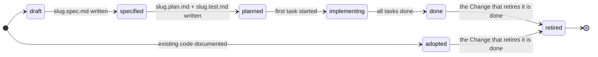
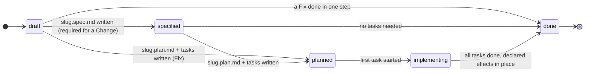
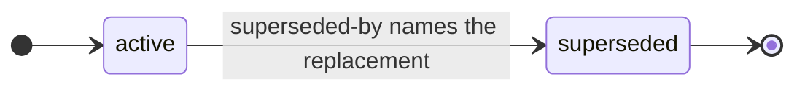
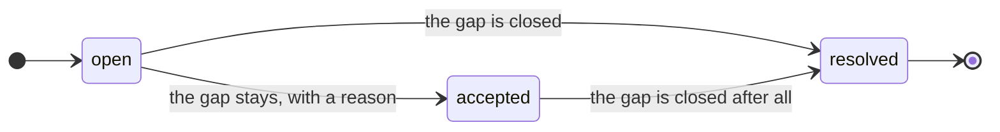
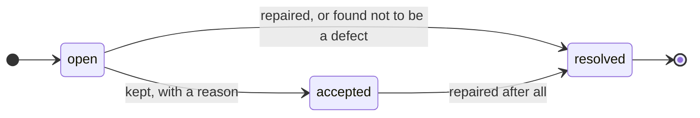

# Feature Document Format (FDF) — v0.7

FDF is a **self-contained, opinionated format** for documenting software as a
directory of Markdown files with YAML frontmatter: the **bundle**. People and AI
agents read it before they change the code, and update it as they do. There is
no schema registry and no required tooling: if you can `cat` a file, you can
read it. The reference tool is the `fdf` CLI in this repository.

A bundle holds:

- **Features.** One file per capability, `<group>/<slug>.md`, whose Gherkin
  scenarios say what the software does.
- **Each feature's trail.** Files beside the feature, named after it: its
  approved design (`<slug>.spec.md`), its plan (`<slug>.plan.md`), its test
  cases (`<slug>.test.md`) and, when needed, its interfaces
  (`<slug>.surface.md`) and its log (`<slug>.log.md`). Its tasks go in a
  directory named `<slug>/`.
- **Five Context documents** at the bundle root: `STACK.md`,
  `ARCHITECTURE.md`, `SURFACES.md`, `INFRA.md` and `DOMAIN.md`. They describe
  the project's technology stack, architecture, interface conventions,
  infrastructure and vocabulary, so a reader needs no outside context.
- **Practices** (`practices/`): the one way the project does a recurring
  mechanism, such as authorization or payment capture, written once and
  binding on all code.
- **Debts** (`debts/`): known gaps between what the project says and what the
  code does.
- **Bugs** (`bugs/`): known defects that have not been repaired yet.
- **Changes and Fixes** (`changes/`): work on a feature after it is
  delivered. A Change alters what the feature does; a Fix makes the code do
  what the feature already says. Both amend the one feature document instead
  of forking a copy of it.
- **Releases** (`releases/`, optional): what shipped in each version.

A capability the software had before the bundle existed is **adopted**:
documented from the code as it stands, without inventing a build history it
never had.

# How to read this specification

- **Keywords.** MUST, MUST NOT, SHOULD, SHOULD NOT and MAY are used as in
  RFC 2119. A rule written without a keyword ("a practice carries no
  Gherkin") is a requirement too. Text that explains why, and every example,
  is not normative.
- **Rule codes.** A requirement that a validator checks names its rule in
  parentheses, such as (F8), and *Conformance* states every such rule in
  full. A broken rule is an **error**, and a bundle with an error does not
  conform. The one rule that reports warnings instead is F12's banned-word
  check, unless strict domain mode is on. A **soft check** reports a
  **warning** and never fails a bundle.
- **Requirements without a code** are not checked by a validator. Some
  concern how work is done and cannot be seen in the files: who approves an
  edit, when a log entry is written. Others are conventions a validator does
  not verify, such as the headings of a task's body. They bind the people and
  agents who write the bundle. A bundle that breaks one still conforms, but it
  misleads its readers.
- **Who is bound.** A *bundle* conforms or does not. A *validator* checks a
  bundle. A *producer* is any person, agent or tool that writes to a bundle.
  A *reader* only reads it, and tolerates unknown types, extra frontmatter
  keys and broken links rather than rejecting the bundle.
- **Versions.** This document is v0.7. A rule applies to bundles pinning the
  version that introduced it and every later version, unless a later version
  replaced it (see *Which rules apply to which version*).

| Rule | Checks | Rule | Checks |
|---|---|---|---|
| F1 | Frontmatter, timestamps, log headings, the version pin | F9 | Context documents filled in |
| F2 | Statuses | F10 | Changes, Fixes and their effects; `retires`, `replaced-by` and feature `depends-on` |
| F3 | Positions: each file where its type belongs | F11 | Practices |
| F4 | What each status requires | F12 | Domain language |
| F5 | Feature, Change and Fix bodies | F13 | Debts |
| F6 | Plans and tasks | F14 | Bugs |
| F7 | Releases | R1 | Paths exist in the project |
| F8 | Test coverage of scenarios | | |

## Glossary

Each term is explained in full where the specification uses it.

| Term | Meaning |
|---|---|
| **bundle**, **bundle root** | The directory that holds a project's FDF files, `docs/features/` by default, and its top level. |
| **document** | A `.md` file in the bundle other than the reserved files (`INDEX.md`, `LOG.md` and the root `README.md`). It starts with YAML frontmatter that carries a `type` (F1). |
| **ID** | A document's path from the bundle root without `.md`, such as `payments/instant-refunds`. Documents name each other by ID. |
| **group** | A directory that organizes documents, usually with an `INDEX.md` that lists them. |
| **slug** | A document's file name without `.md`, such as `instant-refunds`: lowercase letters, digits and hyphens. |
| **sibling**, **role**, **owner** | A sibling is a file beside the document it belongs to (its owner), named `<slug>.<role>.md` after it. The role (`spec`, `plan`, `test`, `surface` or `log`) says what the sibling is. An owner is a feature, a Change or a Fix, or, for a log, a practice, debt or bug. "Stem-qualified" means named after the owner's slug in this way. |
| **task directory** | The directory `<slug>/` beside a feature, Change or Fix. It holds only that document's tasks. |
| **trail** | A feature's, Change's or Fix's siblings and tasks. A feature's **build trail** is its spec, plan and tasks. |
| **scenario name** | The text after `Scenario:` or `Scenario Outline:` on the same line. |
| **join** | A place that repeats a scenario name character for character so that tools can connect documents: a case in `slug.test.md`, a task's `# Acceptance`, and a Change's, Fix's or Bug's declaration. |
| **regression case** | An entry in a Fix naming a scenario the Fix proves, with its verification. |
| **declaration** | The section in which a Change, Fix or Bug names scenarios, with one `## <feature-id>` heading per feature: `# Scenario changes`, `# Regression cases` or `# Violates`. |
| **living**, **episodic** | A living document describes the software as it is today and is edited when the software changes. An episodic document records one piece of work (an **episode**: a feature's first build, or one Change or Fix); it is written as the work goes, and frozen once the work is done. |
| **delivered** | A feature whose status is `done` or `adopted`. Its behavior then changes only through a Change or a Fix, which may also name a `retired` feature. |
| **adopted**, **map entry**, **backfill** | An adopted feature documents code that predates the bundle. A map entry is an adopted feature with no scenarios yet. Backfill adds scenarios for behavior the code already has. |
| **surface** | Any interface through which people or other systems use the software: a screen, an API, a command, an event, a file format. |
| **lexicon**, **term**, **banned word** | The terms in `DOMAIN.md`: one canonical name per concept, each with the words not to use for it. |
| **register**, **cleared** | The debts under `debts/`, or the bugs under `bugs/`. A `resolved` entry is cleared by recording it in the register's `LOG.md` and removing its file, its log and its index listing. |
| **maintenance edit** | One of three edits allowed on every document, frozen ones included: a lexicon fix, a reference repair after a move, and a path repair after code moves. A lexicon fix is not a `Fix` document. |
| **reference field**, **path field** | A frontmatter field whose value is a document ID (`affects`, `retires`, `replaced-by`, a feature's `depends-on`, `superseded-by`, `resolves`) or a task's name (a task's `depends-on`); or a path in the project (`resource`, `applies-to`). |
| **project root** | The top of the outermost git repository around the bundle, found by walking up to the topmost `.git`: through a submodule to its superproject, and through nested repositories. A bundle at the top of its own repository, or in none, has no project root. |
| **strict domain mode** | F12's banned-word findings reported as errors: `strict: true` in `DOMAIN.md`, or `fdf validate --strict-domain`. |

# Living and episodic documents

Every FDF document belongs to one of two classes, and which one it is
determines what happens to it when the software changes. This distinction is
normative: it is what keeps a bundle from drifting once features start
shipping.

| | Documents | On change |
|---|---|---|
| **Living** — describes the system as it is **today** | `Feature` (Gherkin), `Test`, `Surface`, `Practice`, `Debt`, `Bug`, the five `Context` documents | **Amended in place.** A living document that describes behavior the software no longer has makes the bundle lie. A `retired` feature is the one exception, and its status says so. |
| **Episodic** — a record of **one piece of work** | `Spec`, `Plan`, `Task`, `Change`, `Fix`, `Log` entries | **Written as the work goes, frozen once it is done**, and never rewritten after that, except by a maintenance edit (below). New work gets a new episode; the old one stands as the record of why things were done the way they were. |

An episode is done when the feature, Change or Fix it belongs to is `done`.
Until then its documents are the working record: planning may add to the spec
an answer the user approved, and a task records its progress. A log entry is
frozen as soon as it is written. A delivered feature that changes therefore keeps one
feature document, whose Gherkin is edited to match the software, and gains a
new episode: a Change or Fix document with its own trail. The feature's original `slug.spec.md`,
`slug.plan.md` and tasks are not touched. They record how the feature was
first built, which is the context needed to judge a later change.

## Maintenance edits

Three edits are allowed on every document, living or episodic, at any status.
Each applies a mapping recorded elsewhere (the lexicon, a move, a code move)
and changes nothing else: no fact about the work, and nothing that was
delivered. None of them needs a `Change` or a `Fix`.

- A **lexicon fix** makes the wording match `DOMAIN.md`. It does one of three
  things:
  - replaces a banned word with its term;
  - where a banned word means something else, qualifies it into a phrase the
    term lists under `except:` ("git branch" for *branch*);
  - rewords a Gherkin step that quotes a surface's label so that the step
    names the concept instead. The label moves to the step definition (the
    test code behind the step), to `slug.test.md` or to `slug.surface.md`.

  The mapping is the lexicon. When a word is banned, every document is swept,
  episodic ones included, until the bundle speaks one vocabulary.
- A **reference repair** follows a move. Moving or renaming a document
  changes its ID, and every reference to the old ID is updated to the new
  one: Markdown links, the reference fields (`affects`, `retires`,
  `replaced-by`, `depends-on`, `superseded-by`, `resolves`), the
  `## <feature-id>` headings of declarations, and mentions of the ID in text.
  The mapping is the move. A log keeps its words, which record what things
  were called then; only its links are repaired, so they still resolve.
- A **path repair** follows the code. After a refactor moves code, a
  `resource` or `applies-to` path is updated to where the code now lives; the
  mapping is the code move. When the code is deleted, the path is an R1
  error. On a living document that means the document is out of date, and it
  is amended. On an episodic document, such as a done task, Change or Fix, a
  path repair removes the path, and the log entry records what was removed.

A maintenance edit needs no approval of its own, on Context documents and
practices too: it applies a mapping that was already approved (the lexicon)
or that is a fact (a move, a code move). Every maintenance edit is logged: a
lexicon fix or a move in the bundle-root `LOG.md`, and a path repair in the
log of the document whose field changed (for a task, the log of its feature
or Change). An edit that changes a
scenario name changes every copy of it in the same edit: the Gherkin,
`slug.test.md`, task `# Acceptance` sections, and every Change, Fix or Bug
that names it, because those names are the joins F8, F10 and F14 check.
Surface wording quoted from the software, which the lexicon does not govern,
stays as it is. Any other edit to an episodic document is not maintenance:
new work gets a new episode.

# Structure

Every `.md` file in the bundle is a **document**, with YAML frontmatter that
carries a non-empty `type` (F1), except the reserved files: `INDEX.md` and
`LOG.md` in any directory other than a task directory, and `README.md` at the
bundle root, which is ignored. A document's **ID** is its path from the bundle
root without `.md`. Files that are not Markdown are outside FDF, and so are
hidden files and directories such as `.git` and `.obsidian`: validators
ignore them.

- A **bundle** is a directory tree of Markdown files at the project's bundle
  root (see *Location*).
- A **group** is a plain directory that organizes documents, such as
  `payments/` in the example below. It is not a document and has no type, and
  groups do not nest. A group SHOULD have an `INDEX.md` that lists its
  documents.
- A **feature** is `<group>/<slug>.md`. Its siblings sit beside it in the
  same group, named after it: `<slug>.spec.md`, `<slug>.plan.md`,
  `<slug>.test.md` and, optionally, `<slug>.surface.md` and `<slug>.log.md`.
  Its tasks are `NN-<name>.md` files in its **task directory**, `<slug>/`.
  **Name and position are the link**: no frontmatter field points between a
  feature and its trail. A sibling's role is the one lowercase word after the
  last dot before `.md` (in `instant-refunds.spec.md` it is `spec`), and the
  allowed roles are `spec`, `plan`, `test`, `surface` and `log`. A task
  directory contains task files and no other Markdown file: no siblings, no
  `INDEX.md` and no `LOG.md`. A `draft` feature has no siblings, apart from an optional
  log, and no task directory. An `adopted` feature has no spec, no plan and
  no task directory; its only
  possible siblings are `slug.test.md`, `slug.surface.md` and `slug.log.md`
  (see *Adopted features*).
- **Context documents** (`type: Context`) are the five files `STACK.md`,
  `ARCHITECTURE.md`, `SURFACES.md`, `INFRA.md` and `DOMAIN.md` at the bundle
  root. Each is the current description of one part of the project: its
  technology stack, its architecture and design principles, its interface
  principles for every surface, its build and deployment infrastructure, and
  the domain language that every document and every identifier in the code
  uses. They are **critical**: a producer changes one only with explicit
  human approval, and logs the change (see *Context documents*).
- **Practices** (`type: Practice`) live in the reserved directory
  `practices/`, directly (`practices/<slug>.md`) or in groups
  (`practices/<group>/<slug>.md`). A practice is the project's binding answer
  to *how do we do X* for one recurring mechanism. It has no spec, plan, test
  or task directory; its only possible sibling is `<slug>.log.md`, where
  approved amendments are recorded. Every directory under `practices/` is
  therefore a group, never a task directory.
- **Debts** (`type: Debt`) live in the reserved directory `debts/`, directly
  (`debts/<slug>.md`) or in groups (`debts/<group>/<slug>.md`). A debt records
  a **known gap between what the project says and what the code does**: work
  deliberately left undone, or a rule the code does not follow everywhere yet.
  Like a practice, it has no spec, plan, test or task directory, its only
  possible sibling is `<slug>.log.md`, and every directory under `debts/` is a
  group.
- **Bugs** (`type: Bug`) live in the reserved directory `bugs/`, directly
  (`bugs/<slug>.md`) or in groups (`bugs/<group>/<slug>.md`). A bug records a
  **known defect**, the software doing something wrong that someone could
  observe, that has not been repaired yet. It has the same shape as a debt.
- **Changes and Fixes** (`type: Change`, `type: Fix`) live in the reserved
  directory `changes/`: two types in one place, so that a feature's whole
  post-delivery history is found together. They are filed directly
  (`changes/<slug>.md`) or in groups (`changes/<group>/<slug>.md`), and both
  shapes may coexist: a young bundle stays flat, and one with hundreds of
  changes files them in groups. Each is named and laid out like a feature:
  `<slug>.spec.md`, `<slug>.plan.md`, an optional `<slug>.log.md`, and a task
  directory `<slug>/`. The allowed roles are only `spec`, `plan` and `log`. A
  Change or Fix never has a `test` or `surface` sibling, because those are
  living documents that belong to the feature it affects. A directory under
  `changes/` is a task directory when a `<name>.md` Change or Fix sits beside
  it, and a group otherwise.
- **Releases** (`type: Release`) live in `releases/<version>.md`, one per
  version. The file name is the version.
- The reserved directories `changes/`, `practices/`, `debts/`, `bugs/` and
  `releases/` SHOULD each have an `INDEX.md` that lists their documents;
  `fdf init` and `fdf migrate` create the first four. `debts/LOG.md` and
  `bugs/LOG.md` hold the entries cleared from those registers (see *Logs*).
- `README.md` at the bundle root is allowed and ignored (a git forge shows it
  as the landing page).
- `SPEC.md` at the bundle root is the recommended home for a copy of this
  specification (`type: Reference`), so a reader needs no outside context;
  `fdf init` places it there. It is the format reference only, **not** a
  feature's spec.

Example layout:

```
docs/features/
├── INDEX.md
├── LOG.md
├── SPEC.md                 # vendored format reference (type: Reference)
├── STACK.md                # type: Context
├── ARCHITECTURE.md         # type: Context
├── SURFACES.md             # type: Context
├── INFRA.md                # type: Context
├── DOMAIN.md               # type: Context — the domain language
├── bugs/
│   ├── INDEX.md
│   └── refund-split-capture.md       # type: Bug, status: open
├── changes/
│   ├── INDEX.md
│   ├── refund-window-boundary.md     # type: Fix, filed flat (one file)
│   └── payments/                     # group: INDEX.md, no sibling .md
│       ├── INDEX.md
│       ├── refund-window.md          # type: Change
│       ├── refund-window.spec.md     # type: Spec
│       ├── refund-window.plan.md     # type: Plan
│       └── refund-window/            # task directory ONLY
│           └── 01-shorten-settlement.md
├── debts/
│   ├── INDEX.md
│   └── authz-legacy-handlers.md      # type: Debt, status: open
├── practices/
│   ├── INDEX.md
│   ├── permission-checks.md          # type: Practice
│   ├── permission-checks.log.md      # type: Log (optional, only legal sibling)
│   └── payments/                     # group: INDEX.md, no task directories
│       ├── INDEX.md
│       └── idempotency.md            # type: Practice
├── payments/
│   ├── INDEX.md
│   ├── card-payments.md              # Feature, status: adopted (predates the bundle)
│   ├── card-payments.test.md         # type: Test
│   ├── card-payments.surface.md      # type: Surface
│   ├── instant-refunds.md            # Feature + Gherkin
│   ├── instant-refunds.spec.md       # type: Spec
│   ├── instant-refunds.plan.md       # type: Plan
│   ├── instant-refunds.test.md       # type: Test
│   ├── instant-refunds.surface.md    # type: Surface (optional)
│   ├── instant-refunds.log.md        # type: Log (optional)
│   └── instant-refunds/              # task directory ONLY
│       ├── 01-refund-api.md
│       ├── 02-refund-ui.md
│       └── 03-integration-tests.md
└── releases/                         # optional
    ├── INDEX.md                      # newest first
    ├── 1.2.0.md                      # type: Release, status: shipped
    └── 1.3.0.md                      # type: Release, status: planned
```

# Location

The bundle lives at **`docs/features/`** by default, the recommended
location. Tools MUST let it be overridden by a `--root` flag or the
`FDF_ROOT_DIR` environment variable. The flag wins over the variable, and the
variable over the default. A relative value resolves against the project
root; an absolute value is used as it is.

The bundle may be a plain directory **or a git submodule at the same path**
(a separate docs repository, wiki-style). Tools MUST treat both the same
way: `resource` and `applies-to` paths resolve against the **project** root,
so when the bundle is a submodule (its root has a `.git` *file*), tools walk
up to the superproject's working tree. A bundle checked out on its own is
still validated for format, with R1 skipped and a warning, never a false
failure.

## Monorepos

A repository holding several inter-related projects is still **one project**
for FDF's purposes, and the recommended shape is **one bundle at the
repository root**. A feature describes what the software does for a user, and
in a monorepo one capability routinely spans components: an endpoint, a web
form and a mobile screen are one capability, not three. It is therefore one
feature, whose tasks carry `resource` paths into each component. **Which
components a feature touches is expressed by those paths, never by where the
feature file sits.**

Groups stay what they are: organization. Group by capability domain when
features cross components (`auth/`, `payments/`), by component when they do
not (`marketing/`, `admin/`). Nothing in FDF ties a group name to a directory
in the code.

The five Context documents describe the repository as a whole, with
per-component sections where components genuinely differ: a `STACK.md` with a
section per component, an `INFRA.md` with a section per deployment target.
`DOMAIN.md` stays single and repository-wide on purpose: a monorepo is
exactly where one concept acquires a different name in each component, and
one lexicon over all of them is the correction. `ARCHITECTURE.md` carries
more weight here than in a single-project bundle:
component boundaries and what calls what is exactly the context an agent
lacks. `SURFACES.md` already spans every surface by design, and `practices/`
earns its keep here: a mechanism repeated across components is the clearest
case for writing it down once.

Separate bundles are right only when the projects are **not** inter-related:
independent teams, independent release cadence, each extractable into its own
repository tomorrow. That is several projects sharing a VCS, and each takes
its own bundle at `<project>/docs/features/`, selected with `--root` or
`FDF_ROOT_DIR`. The cost is real and one-way: `depends-on`, `affects`, and
releases are all bundle-scoped, so nothing links across the boundary and no
release spans it. Pay it only when the projects genuinely do not link.

# Casing

Case marks what is reserved. These uppercase names are fixed:

| Name | Where | What it is |
|---|---|---|
| `INDEX.md` | the bundle root, each group, each reserved directory | A listing of the documents beside it, not a document. The root one pins the spec version |
| `LOG.md` | the bundle root, any group, any reserved directory | A log, not a document (see *Logs*) |
| `SPEC.md` | the bundle root | This specification (`type: Reference`) |
| `STACK.md`, `ARCHITECTURE.md`, `SURFACES.md`, `INFRA.md`, `DOMAIN.md` | the bundle root | The Context documents |

Every other name is lowercase, and validators enforce it (F3): group names and
slugs use `[a-z0-9-]` everywhere, siblings are `<slug>.<role>.md`, tasks are
`NN-[a-z0-9-]+.md`, and releases are `<version>.md`. Any other uppercase
Markdown file name is an error. `changes/`, `practices/`, `debts/`, `bugs/` and `releases/`
are reserved directory names at the bundle root. They are not groups, though
they hold their documents directly or in groups of their own.

# Types

| Type        | What it is                                        | Where it lives                              |
|-------------|---------------------------------------------------|---------------------------------------------|
| `Reference` | A copy of this specification                      | `SPEC.md` at the bundle root                |
| `Context`   | The current stack, architecture, surfaces, infrastructure or domain language (critical) | `STACK.md`, `ARCHITECTURE.md`, `SURFACES.md`, `INFRA.md`, `DOMAIN.md` at the bundle root |
| `Practice`  | How the project does one recurring mechanism; binding on all code | `practices/<slug>.md` or `practices/<group>/<slug>.md` |
| `Debt`      | A known gap between what the project says and what the code does | `debts/<slug>.md` or `debts/<group>/<slug>.md` |
| `Bug`       | A known defect not repaired yet: the software does something wrong | `bugs/<slug>.md` or `bugs/<group>/<slug>.md` |
| `Feature`   | One capability, in Markdown and Gherkin: built through the lifecycle, or `adopted` from existing code | `<group>/<slug>.md` |
| `Spec`      | The design of a feature or Change, as approved (a Fix may have one too) | `<group>/<slug>.spec.md`, `changes/…/<slug>.spec.md` |
| `Plan`      | The implementation plan; its body links every task | `<group>/<slug>.plan.md`, `changes/…/<slug>.plan.md` |
| `Test`      | How the feature's scenarios are proven            | `<group>/<slug>.test.md`                    |
| `Surface`   | The interfaces one feature exposes, as they are today | `<group>/<slug>.surface.md` (optional)  |
| `Log`       | What happened to one document and why, newest first | `<slug>.log.md` beside a feature, change, fix, practice, debt or bug (optional) |
| `Task`      | One unit of implementation work in a plan         | `<group>/<slug>/NN-<name>.md`, `changes/…/<slug>/NN-<name>.md` |
| `Change`    | Post-delivery work that alters what a feature does | `changes/<slug>.md` or `changes/<group>/<slug>.md` |
| `Fix`       | Post-delivery work that makes the code do what the feature document already says | `changes/<slug>.md` or `changes/<group>/<slug>.md` |
| `Release`   | A planned or shipped release, listing the features, Changes and Fixes in it | `releases/<version>.md` |

A document's `type` matches its position (F3). Validators reject, for
example, a `Feature` at the bundle root, a `Spec` inside a task directory, a
`Change` or `Fix` outside `changes/`, a `Practice` outside `practices/`, a
`Debt` outside `debts/`, and a `Bug` outside `bugs/`. A position does not
always fix one type: a document position under `changes/`
(`changes/<slug>.md` or `changes/<group>/<slug>.md`) admits both `Change` and
`Fix`, and no other type.

Every ID is the document's path without `.md`: a feature is `<group>/<slug>`,
a Change or Fix is `changes/<slug>` or `changes/<group>/<slug>`, and
practices, debts, bugs and releases follow the same rule (`practices/<slug>`,
`debts/<group>/<slug>`, `bugs/<slug>`, `releases/1.2.0`).

# Frontmatter

These fields apply to every document:

| Field | Meaning |
|---|---|
| `type` | **Required.** One of the types above, matching the document's position |
| `title` | Recommended. A short human-readable name |
| `description` | Recommended. One sentence saying what the document is |
| `timestamp` | Recommended. When the document last changed in substance: a date (`2026-02-14`) or an RFC 3339 time (`2026-02-14T09:30:00Z`); anything else is an error (F1), and an empty one counts as missing. Both are read in UTC: a date is a UTC date, and a time written with an offset (`+10:00`) is the moment it names, which falls on a UTC date. The fdf commands write UTC. A maintenance edit changes no substance, so it leaves `timestamp` as it is |
| `tags` | Optional. A list of words for finding the document |

A validator warns when a recommended field is missing (a soft check). The
other fields belong to particular types:

| Field        | On      | Meaning                                                                 |
|--------------|---------|-------------------------------------------------------------------------|
| `status`     | Feature | **Required.** `draft → specified → planned → implementing → done → retired`, or `adopted → retired` for a capability that predates its document |
| `resource`   | Feature | **Required on `adopted`**: the path(s) of the code it documents; string or list, each must exist (R1). Optional on any other status: a built feature reaches its code through its tasks, so it rarely needs one |
| `depends-on` | Feature | Optional. Feature ID(s) this feature builds on; each must exist, and the graph MUST be acyclic |
| `replaced-by`| Feature | Optional. The Feature ID(s) that replace a `retired` feature; string or list; each must exist |
| `version`    | Feature, Change, Fix | Optional. The release this document targets or shipped in. Never on an `adopted` feature |
| `surface`    | Feature | Optional. `none` when the feature has no interface of its own; such a feature has no `slug.surface.md` (F4). See *Surface documents* |
| `status`     | Change, Fix | **Required.** `draft → specified → planned → implementing → done`   |
| `affects`    | Change, Fix | **Required.** Feature ID(s) this document touches; string or list; each must name an existing `done`, `adopted` or `retired` Feature |
| `retires`    | Change  | Optional. Feature ID(s) this Change retires, each also in `affects`. While the Change is in progress each is `done` or `adopted`; once it is `done`, each is `retired`. A Change with `retires` has a non-empty `# Rationale` at every status. Never on a `Fix`: retiring behavior is a deliberate change |
| `resolves`   | Change, Fix | Optional. Bug ID(s) this document repairs; string or list. Each must name a `Bug` under `bugs/`, or, once this document is `done`, one already cleared into `bugs/LOG.md`. Once this document is `done`, every bug it names that is still in the register must be `resolved` |
| `resource`   | Task, Change, Fix | Optional. Project-relative path(s) to the code it touches; string or list, each must exist (R1) |
| `status`     | Task    | **Required.** `pending → in-progress → done`                            |
| `depends-on` | Task    | Optional. Names of other tasks in the same task directory (file name without `.md`) that must be done first; the graph MUST be acyclic |
| `status`     | Release | **Required.** `planned → shipped`                                       |
| `date`       | Release | Recommended. The target date while `planned`, the actual date once `shipped` |
| `status`     | Practice | **Required.** `active → superseded`                                    |
| `applies-to` | Practice | Optional. Project-relative path(s) the practice governs; string or list, each must exist (R1) |
| `superseded-by` | Practice | **Required when `status: superseded`**: the Practice ID that replaces it |
| `status`     | Debt    | **Required.** `open`, `accepted` or `resolved`: `open → resolved`, or `open → accepted → resolved` |
| `resource`   | Debt    | Optional. The path(s) carrying the gap; each must exist (R1). A debt for work never written has none, but nothing can route to a debt without paths, so a validator warns when an `open` or `accepted` debt has none |
| `status`     | Bug     | **Required.** `open`, `accepted` or `resolved`, as for a debt           |
| `affects`    | Bug     | Optional. The Feature ID(s) the defect shows up in; string or list; each must name an existing Feature, and every feature under `# Violates` must be listed |
| `resource`   | Bug     | Optional. The path(s) carrying the defect; each must exist (R1). As for a debt, a validator warns when an `open` or `accepted` bug has none |
| `strict`     | Context (`DOMAIN.md` only) | Optional. `true` makes F12's banned-word findings errors in every validation, exactly as `--strict-domain` does |

`depends-on` means different things on the two types, deliberately. On a
`Task` it names other tasks in the same task directory, by file name: the
order of work within one episode. On a `Feature` it names other features by
ID (`payments/instant-refunds`), because that relationship crosses groups.
The two graphs are separate, and each MUST be acyclic.

`applies-to` is to a practice what `resource` is to a task, and the link runs
one way: a feature never lists the practices it follows. The practices that
govern a piece of work are found by comparing the task's `resource` paths
with the `applies-to` paths of every `active` practice. A practice governs
the task when one of its paths and one of the task's paths are the same, or
one contains the other. FDF derives this link instead of storing it, because
a hand-written back-link goes stale.

A path in `resource` or `applies-to` is relative to the project root and
names a file or directory; it is not a pattern. A field that takes "string or
list" accepts one value or a list of them.

`Spec`, `Plan`, `Test`, `Surface`, `Log` and `Context` documents have only
the shared fields, apart from `DOMAIN.md`'s optional `strict`. The root
`INDEX.md` pins the specification version in its frontmatter,
`fdf_version: "0.7"`, and SHOULD link to this document.

# Lifecycle

## Features



| Feature status | What must be true                                                      |
|----------------|------------------------------------------------------------------------|
| `draft`        | The feature file, and at most a log (`slug.log.md`). No other sibling and no task directory |
| `specified`    | `slug.spec.md` exists                                                  |
| `planned`      | `slug.spec.md`, `slug.plan.md` and `slug.test.md` exist                |
| `implementing` | Spec, plan and test exist, and at least one task under `slug/`; not every task is `done` |
| `done`         | Spec, plan and test exist, and at least one task; every task is `done` |
| `adopted`      | It documents code that existed before its document. There is **no** `slug.spec.md`, `slug.plan.md` or task directory; `resource` names the code; there is no `version`. It may have no scenarios; once it has one, `slug.test.md` covers every scenario |
| `retired`      | The software no longer has this behavior. Exactly one `done` Change names the feature in `retires`, and that Change's `# Rationale` says why; `replaced-by` names the successor, if there is one. Test coverage (F8) no longer applies. The feature keeps the trail it had: if it has a `slug.plan.md` or a task directory, it keeps its `slug.spec.md` and its scenarios |

These are checked by F4, and the scenario rules by F5 and F8. No status
requires `slug.surface.md` or `slug.log.md` (see *Surface documents* and
*Logs* for when to write them). A `draft` may have a log but no surface
document.

`retired` is final. The behavior comes back only as a new feature, and a
retired document is never deleted: it records behavior the software once had
and why it was dropped. A feature dropped *before* it is delivered never
described what the software does, so it is deleted with its trail instead,
with a log entry saying why. It is the one living document that describes what
the software no longer does, and its status says so. A feature's `status`
tracks its implementation; a release's `status` tracks shipping.

`adopted` is a second way into the lifecycle, not a step between `draft` and
`done`. A capability the software had before the bundle existed was never
specified, planned or built through FDF, so it has no build trail, and
writing one afterwards would invent a history. It counts as delivered: a
Change or Fix reaches it exactly as it reaches a `done` feature. It never
becomes `done`. See *Adopted features*.

A delivered feature never returns to `implementing`. Work after delivery is a
`Change` or `Fix` document with its own status. That keeps `done` a stable
signal, and keeps a `shipped` release's list of features true.

## Changes and fixes

The two post-delivery types share one set of statuses but differ in what each
status requires, which is why they are separate types rather than one type
with a field to tell them apart.



| Status         | `Change`                                                 | `Fix`                                         |
|----------------|----------------------------------------------------------|-----------------------------------------------|
| `draft`        | The document, and at most a log. No spec, plan or task directory | same                                  |
| `specified`    | `slug.spec.md` exists (the approved design)              | Nothing more than `draft`: a Fix needs no spec, but may have one when its approach is worth writing down |
| `planned`      | `slug.spec.md` and `slug.plan.md` exist                  | `slug.plan.md` exists                         |
| `implementing` | `slug.spec.md`, a plan and at least one task; not every task is `done` | A plan and at least one task; not every task is `done` |
| `done`         | `slug.spec.md` exists and every task, if any, is `done`. Every `add:` and `modify:` name exists in its feature and every `remove:` name is gone (F10 lists the exceptions) | Every task, if any, is `done`. Every regression case names a scenario that exists, gives its verification, and has a case in the feature's `slug.test.md` (F10) |

A `Change` passes through `specified`: altering documented behavior is a
decision, and `slug.spec.md` is where a person approves it (the **design
gate**). A `Fix` has no such gate, because it restores behavior already
approved, so it may go from `draft` straight to `done`.

Tasks are **optional** for both, so the smallest Fix is a single file. A
Change or Fix with a task directory has a `slug.plan.md` that links every
task, exactly as a feature does (F6). Work that grows beyond a handful of
tasks, or that adds behavior needing its own `Feature:` block with its own
As a / I want / So that, is a **new feature** rather than a Change.

A new feature may add to what a delivered feature built, such as its page,
endpoint or table, without a Change, as long as every scenario of the
delivered feature stays true. It SHOULD then name that feature in
`depends-on`, and the interface it adds is described in its own
`slug.surface.md`. When one of those scenarios would stop being true, the
delivered feature changes through a Change.

## Practices



| Practice status | What it means                                                         |
|-----------------|-----------------------------------------------------------------------|
| `active`        | How the project does the thing today; new code follows it             |
| `superseded`    | No longer how it is done. `superseded-by` names the `Practice` that replaces it (F11) |

A practice has no spec, plan, test or tasks, because it is not a piece of
work: it is the standing answer that work follows. The work that first
established it is recorded in a feature's or Change's `slug.spec.md`, which
stays where it is. A `superseded` practice is kept, never deleted: it
explains code still in the tree, and the reasoning that put it there.

## Debt



| Debt status | What it means                                                             |
|-------------|---------------------------------------------------------------------------|
| `open`      | The gap exists and should close                                           |
| `accepted`  | The gap exists and the project is keeping it. Requires `# Rationale` (F13) |
| `resolved`  | The gap is closed. Requires `# Resolution` saying what closed it (F13)    |

`accepted` is not a failure state, and it is not another word for `open`. A
register with no honest way to say *we looked, and this stays* only ever
grows, and a register that only grows is one nobody reads. The point is to
record the decision.

A debt has no spec, plan, test or tasks: **a debt is a register entry, not a
unit of work**. The work that closes it is routed like any other work: a
`Change` when documented behavior changes, a `Fix` when documented behavior
is restored, and plain code work when nothing observable changes, which is
the usual case for bringing code into line with a practice. The debt is set
to `resolved` when that work is finished.

A `resolved` debt may be **cleared**: its resolution is recorded in
`debts/LOG.md`, and its file, its `<slug>.log.md` and its listing in the
index beside it are removed, with its group when nothing else is left in it
(`fdf debt --cleanup` does all of it). The two registers, debts and bugs,
are the only places FDF removes a document, and only for this reason: unlike
a `retired` feature or a `superseded` practice, a resolved entry describes
nothing that still exists. The log line keeps the fact that the entry was
closed and what closed it. An `open` or `accepted` entry is never removed.

## Bugs



| Bug status | What it means                                                              |
|------------|----------------------------------------------------------------------------|
| `open`     | The defect exists and has not been repaired. Every scenario named under `# Violates` exists, in a delivered feature (F14) |
| `accepted` | The project keeps the defect. Requires `# Rationale`, and has **no** `# Violates` (F14) |
| `resolved` | Closed. Requires `# Resolution` naming what closed it. A bug that still has a `# Violates` section is closed only by the `done` Fix or Change whose `resolves` names it (F14) |

The statuses are the debt register's, and so is the reason for `accepted`.
The one difference is what `accepted` allows. A defect that contradicts a
scenario cannot be kept forever, because the feature document would then
promise something the project has decided the software will not do. Either
the code is repaired, by a `Fix`, or the promise is changed to what the
software does, by a `Change`; either way the bug is then `resolved`.

A bug has no spec, plan, test or tasks: like a debt, it is a register entry,
not a unit of work. It is **never repaired in place**. A repair changes what
the software does, so it goes through a document that authorizes it: a `Fix`
or `Change` when the feature is delivered, or one of the feature's tasks when
it is still being built. That document, not the bug, is the permanent record
of the repair. A Fix or Change that repairs a bug names it in `resolves`, and
once the Fix or Change is `done`, the bug must be `resolved` (F10). A bug
that needs no repair, because it is not a defect, duplicates another bug, or
lived in code that is gone, is resolved with a `# Resolution` saying so. A
resolved bug can then be cleared into `bugs/LOG.md`, as a resolved debt is
(`fdf bug --cleanup`).

# Body conventions

## Feature documents (Markdown + Gherkin)

A feature's Gherkin lives in ```` ```gherkin ```` fences under these
conventional headings, with Markdown prose between the fences for what
Gherkin cannot hold:

- `# Feature`: exactly one fence holding the `Feature:` block (its name, and
  As a / I want / So that), then prose: context, links to related
  documentation, and links to the feature's own trail once it exists.
- `# Scenarios`: one fence per `Scenario:` or `Scenario Outline:`. An
  outline's `Examples:` table stays in the outline's fence.
- `# Citations`: optional.

Across its fences, a feature has exactly one `Feature:` and at least one
`Scenario:`; an adopted feature may have none yet, and so may a retired one
that never had any (F5). Every fence starts
with a Gherkin keyword (`Feature:`, `Scenario:`, `Scenario Outline:`,
`Background:`, `Rule:`) or a tag (`@…`) (F5). Joined in order, the fences
SHOULD form one valid `.feature` file: that is the test of whether the split
across headings is right. Scenario names are unique within a feature.

From `planned` on, every scenario name appears word for word in two more
places: as a `## <scenario name>` case in `slug.test.md` (F8), and in the
`# Acceptance` of the task that proves it (not checked). These repeated names are **joins**, matched
character for character, so a rename has to reach them:

- A Change renames a scenario with `remove:` for the old name and `add:` for
  the new one. It updates the living joins, `slug.test.md` and any task still
  in progress. Finished tasks, Changes and Fixes keep the name they recorded,
  and F10 holds none of them to it (see *Notes* under *Conformance*).
- A lexicon fix renames a scenario in every place it is joined, frozen
  records included, in one edit (see *Maintenance edits*).

A feature document is **living**: when a Change alters what the software
does, the scenarios here are edited to describe the new behavior. The old
wording is not kept here: the Change names each scenario it added, modified
or removed, and version control keeps the old text. A feature document SHOULD
NOT carry hand-written links back to the Changes that touched it: `affects`
is the one record of that relationship, and tools derive the rest
(`fdf history`).

## Adopted features

A project that adopts FDF rarely starts empty. Most of what its software does
was built before the bundle existed, and none of it has a feature document.
Writing one through the lifecycle, with a spec, a plan and tasks, would
invent a history that never happened, which an episodic document must never
do. Such a capability enters the bundle as an **adopted** feature: documented
from the code as it stands, not built through FDF.

- It has **no build trail**: no `slug.spec.md`, no `slug.plan.md`, no task
  directory. What it has describes the system today: its Gherkin,
  `slug.test.md` and, optionally, `slug.surface.md`. It may also have a log,
  `slug.log.md`.
- It names its code in `resource`, which is required and checked by R1. A
  built feature reaches its code through its tasks; an adopted one has none.
- It may start with **no scenarios**. A `Feature:` block and a `resource`
  make a **map entry**: the capability is on the map, with its ID, its group
  and its code, before anyone has written down how it behaves. Mapping a
  codebase this way is cheap, and it lets later work find the capability it
  is about to touch.
- From its first scenario, `slug.test.md` covers every scenario (F8). Each
  verification points at a test the project already has, or at an explicit
  manual procedure.
- It is delivered: a Change or Fix may name it in `affects`. It never becomes
  `done`, because it was never built through FDF; a Change that rebuilds it
  is still a Change.
- It has no `version`, because it shipped before the bundle recorded
  releases. Later work on it carries the version.

**Backfill.** A scenario may be added to an adopted feature without a Change
when all three hold:

1. it describes behavior the code already has;
2. its test case is added in the same edit;
3. that test passes against the code as it stands.

That is the document catching up with the software, not a decision about
what the software should do. Backfill only adds: once written, a scenario is
a promise like any other, and modifying or removing it takes a Change. Wrong
behavior is never backfilled. Written as it is, the scenario would promise
the defect; written as it should be, its test would fail. Wrong behavior is
filed as a `Bug`.

Adoption goes breadth first:

1. Map every capability as a map entry.
2. Before a Change alters behavior the capability already has, backfill
   that behavior as it is, so the Change modifies or removes it. A Change
   that adds behavior the code does not have at all needs no backfill, and
   neither does a defect the Change repairs, since wrong behavior is never
   backfilled. What decides is the code, not the scenario list: a map entry
   has no scenarios, yet a Change can still alter what it does.
3. Backfill the rest, riskiest first.

Adoption is for code that predates its capability's first document. Code
written last week is not adopted: it goes through the lifecycle, because
skipping the design gate is the drift this format exists to prevent.

## Context documents

Five bundle-root documents (`type: Context`) are the project's living
context, written once at bundle setup (the `fdf-init` interview) and changed
only with explicit human approval:

- **STACK.md** — the technology stack: languages, frameworks, runtimes,
  libraries, data stores, and the versions in use.
- **ARCHITECTURE.md** — the architecture and design principles: the style
  (e.g. modular monolith, microservices, serverless, frontend/backend/
  fullstack), how code is organized, and the guidelines contributors follow.
- **SURFACES.md** — interface and interaction principles for **all surfaces**
  through which people or systems engage the project (HTTP APIs, human UIs,
  CLIs, events/webhooks, file formats, and other inputs) — not “UI only”.
  Covers, as applicable: API naming, errors, versioning, pagination, and auth
  presentation; frontend structure, UX principles, brand, and links to
  assets/exemplars; CLI command design, flags, output, and exit codes;
  integrations and inputs (event shapes, validation philosophy,
  operator-facing feedback). Stub headings (scaffold): Purpose, Surfaces,
  Principles, Conventions by surface, Assets and exemplars, Out of scope.
- **INFRA.md** — build and deployment infrastructure: how the project is
  built, tested, packaged, and deployed, and the environments and targets it
  runs on.
- **DOMAIN.md** — the domain language: the canonical name for each thing the
  software is about, and the words that must not be used for it instead. See
  *The domain lexicon* below for its parsed structure.

A **surface** is any interface through which people or other systems use the
software. FDF avoids "design" and "UX" as document names on purpose: both
suggest a graphical interface, and "design doc" is easily confused with a
technical design, which is what a spec and `ARCHITECTURE.md` hold. The term
follows "API surface" and "the surface area of a library".

Each Context document describes the project **as it is now**; it is not a
changelog. A producer changes them rarely:

- After completing a feature or a Change, a producer MAY propose an addition
  or a correction: a new technology, a new pattern, new infrastructure such
  as a cache or a queue, a new surface convention.
- It MUST obtain explicit human approval before writing the change.
- It SHOULD record each approved change in the bundle-root `LOG.md` (see
  *Logs*).

Until the `fdf-init` interview (the question-and-answer session the
`fdf-init` skill runs) has filled a document, it carries a stub marker
(`<!-- fdf:stub -->`) and counts as absent for F9. Keeping these
documents true is the responsibility of the people who own the project; their
accuracy is what lets an agent work from the project's real context rather
than guesswork.

### The domain lexicon

`DOMAIN.md` exists because one concept called `Item` in one document,
`Product` in another and `SKU` in a third is three concepts to every reader,
human or agent. That drift does not stay in the documents: it reaches
schemas, endpoints and identifiers, where it is expensive to undo. So each
concept gets one name, written down before the second document uses it.

- `# Terms` is **required** and parsed. It has one `## <Term>` heading per
  canonical term, spelled exactly as the project spells it; no two headings
  name the same term, ignoring case. Under each heading:
  - a **definition**: a line of prose that is not one of the bullets below,
    one or two sentences saying what the term is, and what it is *not* when
    a neighboring term is easy to confuse with it. It is required.
  - `- instead-of: <word>[, <word>…]`, optional: the words this term
    replaces. They are **banned** wherever F12 scans (see *Where the lexicon
    applies*). No banned word is itself a canonical term, this term's own
    name included, and no word is banned by two terms.
  - `- except: <phrase>[, <phrase>…]`, optional: phrases in which one of this
    term's banned words means something else ("data store" when *store* is
    banned). They are never reported. Each contains one of the term's
    `instead-of` words and at least one other word with a letter or digit.
  - `- code: …`, optional: how the term appears in the code (a type, a
    table, a field), so the vocabulary reaches the implementation.
  - `- see: <link>`, optional: where the concept is explained in depth. A
    term that needs more than a definition links to a practice; it does not
    grow inside `DOMAIN.md`.
- Any other heading, such as `# Purpose` or `# Out of scope`, is free prose
  and is not parsed.

A banned word matches as a whole word, ignoring case, and also with `s` or
`es` added: scenario text says "3 items" far more often than "1 item". The
words of a phrase match across any run of spaces or hyphens. A banned word
inside a canonical term ("Line Item" when *item* is banned) is not a match.
Banning a word the bundle already uses means sweeping it out with lexicon
fixes (see *Maintenance edits*), finished work included.

```markdown
# Terms

## Venue
A physical location where a merchant sells. Owns its own inventory and staff;
a merchant with three shopfronts has three Venues.
- instead-of: store, business, tenant, shop, location
- except: data store, file location
- code: `Venue` (model), `venues` (table), `venue_id` (foreign key)
- see: /practices/multi-venue-scoping

## Product
A sellable thing in a Venue's catalogue. Never the individual unit sold — that
is a Line Item.
- instead-of: item, article, SKU

## Line Item
One Product on an order, with the quantity and the price it sold at.
```

The lexicon is one file rather than a directory of per-term files, and
Markdown rather than YAML. Its whole job is to be read **in full** before
work starts. A reader who has to guess which of sixty files to open is the
reader who invents a synonym, while a sixty-term lexicon is only a few
hundred lines. Depth belongs in a practice, which is what `see:` is for.

### Where the lexicon applies

Validators check the lexicon for consistency, and report every banned word
the bundle **chooses** (F12). That is every Markdown file in the bundle,
`INDEX.md` and `LOG.md` files and finished work included, except:

- the root `README.md`, which is ignored;
- `SPEC.md`, whose examples use somebody else's vocabulary;
- `DOMAIN.md` itself, which has to name the words it bans;
- every `slug.test.md` and `slug.surface.md`, which quote what a surface
  shows: an error message, a label, a URL. Surface wording is governed by
  `SURFACES.md`, not by the lexicon.

In frontmatter, the values of `title`, `description` and `tags` are scanned
whole, quotes included; IDs, paths and statuses are not. The names the bundle chooses are scanned too: a banned word
that forms a whole hyphen-separated part of a group, slug or task name is
reported. The fix for a name is a move, with its reference repair, not a
change of wording.

In the body of a scanned file, text that **quotes** rather than chooses is not
checked:

- code spans, and fenced blocks other than ```` ```gherkin ````;
- link targets, reference-link definitions, and URLs;
- HTML comments;
- text in double quotes, straight or curly, outside Gherkin;
- in a Change, Fix or Bug, the `## <feature-id>` headings of a declaration,
  and a regression case's verification.

So a *mention* of a word goes in a code span, such as a log entry recording
that `shop` was banned in favour of Venue, and so does a label quoted in
`SURFACES.md` ("a Venue is shown to merchants as `Store`"). Gherkin is
scanned whole, quotes included: a step that quotes a surface's label is
reworded to name the concept, and the label moves to the step definition,
`slug.test.md` or `slug.surface.md`.

Some banned words have a second, ordinary sense: *store* in "data store",
*branch* in "git branch", *line* in "log line". Where a banned word means
something else, say which thing. The qualified phrase is clearer to every
reader, and listing it under the term's `except:` keeps it out of the scan.
An `except:` entry is always a phrase, never the banned word alone, which
would silently un-ban it.

Findings are warnings by default. The lexicon check is the one rule in FDF
that matches natural language rather than structure, and a bundle that adopts
a lexicon, or bans a new word, starts with findings in everything written
before. A project that has swept them sets `strict: true` in `DOMAIN.md`'s
frontmatter. From then on every validation, whether run by a person, an agent
or CI, treats a banned word as an error; `fdf validate --strict-domain` does
the same for one run.

## Practice documents

A `Practice` (`practices/<slug>.md`, or `practices/<group>/<slug>.md`) is the
project's binding answer to *how do we do X* for one recurring mechanism:
authorization, permission checks, filter chains, payment capture, database
access, background jobs, error envelopes. It exists so that the answer is
written once and followed, instead of being worked out again, differently, in
every feature spec, and so that `ARCHITECTURE.md` does not have to hold every
mechanism in the project.

Body:

- `# Rules`: **required**, non-empty (F11). The binding statements, short and
  in the imperative: what code MUST do. Everything else in the document
  explains these.
- `# How`: recommended. The mechanism itself, walked through, with links to
  the code that implements it.
- `# Boundaries`: optional. Where the practice does not apply, and what to do
  there instead.
- `# Rationale`: optional. Why it is this way, so a later change knows what it
  would trade away.
- `# Exceptions`: optional. Approved deviations, each with its reason and the
  path it applies to. A deviation not written here is a defect, not an
  exception.

A practice has **no Gherkin** (F11): behavior claims belong to the features
that make them. It has no `resource`; `applies-to` is its path field.

Practices are **living**, and like Context documents they bind all future
code. A producer proposes an addition or a correction, MUST obtain explicit
human approval before writing it, and records the approved change in the
practice's log, `practices/<slug>.log.md`. The approval is lighter than a
Context document's, a proposal in the working conversation rather than an
interview, but it is still required.

### Practice, architecture, or spec?

These three are easy to confuse, and misfiling is exactly how an
`ARCHITECTURE.md` becomes two thousand lines nobody reads.

| Document | Holds | Class |
|---|---|---|
| `ARCHITECTURE.md` | The **overview**: what exists, how code is organized, what calls what, and which practices exist | Living, orienting |
| `practices/<slug>.md` | One **mechanism**, in enough depth to do it the same way twice | Living, binding |
| `<slug>.spec.md` | Why **this feature** was built this way, and what was considered instead | Episodic, frozen |

The test: if a reader needs it to orient, it belongs in `ARCHITECTURE.md`; if
an implementer would otherwise copy it into every feature spec, it is a
practice; if it is true of one feature only, it stays in that feature's spec.

A practice is **extracted from** a spec, never duplicated by it. The spec
keeps the past tense (*we decided X for this feature*) and is never
rewritten. The practice has the present tense (*X is how this project does
it*) and is the document later work amends. A practice is due at the
**second** occurrence: one feature doing a thing is a spec; two features doing
it the same way is a practice to write before a third one guesses.

## Debt documents

A `Debt` (`debts/<slug>.md`, or `debts/<group>/<slug>.md`) records a known gap
between what the project says and what the code does. Two things produce one:

- **Work deliberately left undone.** A feature shipped without the batch
  import, a change that migrated six of nine call sites, a task blocked on
  something outside the project. Writing it down is what separates a decision
  from an omission.
- **A rule the codebase does not follow everywhere yet.** This is the common
  case when practices are first written for an existing codebase: the practice
  states what the project does, and the debt names the files that have not
  caught up. Both are true, and neither document has to lie for the other to
  be written.

What the software does **wrong** is not a debt. If someone could observe the
software misbehaving, it is a bug (see *Bug documents*), even when a practice
the code ignores is the root cause. The debt register is for gaps nobody can
observe yet: unfinished work, a rule not followed everywhere, missing tests,
dead code. The line matters because the two are repaired differently. A debt
is usually paid with plain code work. A bug's repair changes what the
software does, so it goes through a `Fix` or a `Change` and leaves a
regression case behind.

Body:

- `# Gap`: **required**, non-empty (F13). What is not as it should be,
  concretely enough that someone else could confirm it. "Auth is
  inconsistent" is not a gap; "twelve handlers in `internal/http` read roles
  directly instead of calling `authz.Can`" is.
- `# Cost`: recommended. What carrying the gap costs, and what it risks. This
  is what lets a register be prioritized without a priority field.
- `# Rationale`: **required when `status: accepted`** (F13). Why the project
  keeps the gap.
- `# Resolution`: **required when `status: resolved`** (F13). What closed it.

`resource` names the paths that carry the gap, and it is the reason to write
a debt down at all: an agent about to edit those files can be told there is a
known gap there. It is also the debt's **only link**. A debt does not name the
practice it breaks or the feature that deferred it: comparing its `resource`
with a practice's `applies-to` already answers *what does not follow this
yet?*, and a hand-written back-link goes stale. Where the origin matters to a
reader, `# Gap` says so in prose. R1 checks that the paths exist, so a debt
about code that is gone fails validation instead of lingering unnoticed.

A debt for work that was never written has no paths to name, which is why
`resource` is optional. Leaving it out draws a warning rather than an error:
such a debt is real, but nothing can route to it, so only someone reading the
register will find it.

A debt is **living**: it describes a gap that exists today, and it is amended
as the gap narrows. It has no Gherkin (F13): behavior belongs to features.

Nothing in FDF requires debt to exist, and nothing requires it to be paid. A
static check cannot make a project fix what it has decided to leave. What
these rules guarantee is narrower and worth having: a debt cannot be closed
without saying what closed it, cannot be kept without saying why, and cannot
go on naming code that no longer exists.

## Bug documents

A `Bug` (`bugs/<slug>.md`, or `bugs/<group>/<slug>.md`) records a known
defect, the software doing something wrong that someone could observe, that
has not been repaired yet. Usually it is not yet diagnosed, waiting on a
decision about what should happen, in code no feature documents, or simply
deferred. A defect repaired as soon as it is found needs no bug: the work that
repairs it, a `Fix`, a `Change`, or a task while the feature is still being
built, is its record.

Body:

- `# Symptom`: **required**, non-empty (F14). What the software does wrong,
  with the evidence: a reproduction (the command and its failing output) or,
  for a defect found by reading, the code path and the input that reaches it.
  Say which it is. A defect nobody has reproduced is still a bug, but the
  next reader needs to know.
- `# Expected`: **required**, non-empty (F14). What should happen instead.
  When a scenario already says so, cite it under `# Violates`. When no
  document decides it, say so and name the open question: that bug is
  repaired by a `Change`, because someone has to decide.
- `# Violates`: optional. For each feature with a scenario the defect
  contradicts, a `## <feature-id>` heading, whose feature is also in
  `affects` (F14); under it, one `- <scenario name>` item per contradicted
  scenario, optionally followed by ` — <note>`. While the bug is open, each
  feature here is delivered (`done` or `adopted`) and each name exists in it
  word for word (F14). This section is the finding that the document is
  right and the code drifted, so the repair is a `Fix`.
- `# Root cause`: optional. Why, once known: the diagnosis in a sentence, with
  its `file:line`.
- `# Cost`: recommended. What the defect costs while it stays, which is what
  lets a register be prioritized without a priority field.
- `# Rationale`: **required when `status: accepted`** (F14). Why the project
  keeps the defect.
- `# Resolution`: **required when `status: resolved`** (F14). What closed it:
  the Fix or Change that repaired it (whose `resolves` names this bug), or
  why nothing needed repairing: it was not a defect, it duplicates another
  bug, or the code it lived in is gone.

`affects` names the features the defect shows up in, and `resource` the
paths that carry it. Both are optional, because a defect in code no feature
documents has no feature to name. Together they are how a bug reaches the
work that touches it: an agent about to edit a file can be told a known
defect lives there, as it can be told about a debt.

When a Fix or Change repairs the bug, it takes over the analysis and keeps it
as the permanent record. A Fix takes the symptom and root cause as its
`# Symptom` and `# Root cause`, and turns each scenario under `# Violates`
into a regression case. A Change states the problem in its `# Problem` and
the scenarios it adds or modifies under `# Scenario changes`. Either one
names the bug in `resolves`. When that document is `done`, the bug is set to
`resolved` with a `# Resolution` naming it, and it can then be cleared from
the register. The `resolves` reference stays valid, because clearing records
the bug's ID in `bugs/LOG.md`.

**A defect in code no feature documents** has no feature for a Fix or Change
to name, and that is no reason to repair it outside the bundle. The
capability is adopted first; a map entry is enough (see *Adopted features*).
A Change then adds the scenario that says what the software should do:
nobody had written that promise down, so someone decides it now. The repair
leaves a scenario and a test case behind that keep the defect from coming
back. That is how a bundle adopted from an existing codebase grows: where the
work is.

A bug is **living**: it describes a defect that exists today, and it is
amended as the diagnosis progresses. It has no Gherkin (F14): behavior
belongs to features.

## Trail documents

- **`slug.spec.md`** (`type: Spec`): the approved design, meaning what is
  being built and why, and the alternatives considered. Episodic: later work
  never rewrites it.
- **`slug.plan.md`** (`type: Plan`): a `# Tasks` section with an ordered list
  that links every task file in the task directory, each by a path relative
  to the plan, such as `instant-refunds/01-refund-api.md` (F6). It is the
  authoritative order of the tasks. For a feature, the last task satisfies
  `slug.test.md`.
- **`slug.test.md`** (`type: Test`): a `# Test Cases` section with one case
  per scenario. A case is a `## <scenario name>` heading, the name exactly
  as the Gherkin spells it, followed by the concrete verification: a
  command, a test file path, or an explicit manual procedure. `# Setup` is
  optional. From `planned` on, every scenario has its case (F8); a bullet or
  a table row that names a scenario is not a case. A case that names no
  scenario, or one repeated, is out of date and draws a warning. Living: it
  is the feature's standing regression suite, and every Change or Fix that
  changes or proves the feature's scenarios amends it.
- **`slug.surface.md`** (`type: Surface`): every interface the feature
  exposes, as it is today: screens, endpoints, commands, events, messages.
  Living. It is written whenever the feature has a surface; no status
  requires it. See *Surface documents* below.
- **`slug.log.md`** (`type: Log`): what happened to the feature and why,
  newest first. Its first entry creates it; no status requires it. See
  *Logs* below.
- **Tasks** live only in the task directory of a feature, Change or Fix,
  named `NN-[a-z0-9-]+.md`. Body: `# Objective`, `# Steps`, `# Acceptance`; the
  acceptance names the scenarios the task satisfies. `depends-on` orders the
  work beyond the `NN-` numbers: whoever works one task at a time follows
  the plan's order, and whoever runs tasks in parallel schedules them by
  their dependencies. `resource` and `depends-on` are frontmatter fields,
  never body headings. A task example is in *Document examples* below.

  A comma-separated string (`depends-on: 01-refund-api, 02-refund-ui`) is one
  invalid task name and fails F6; write a list. A `resource` path that does
  not exist yet fails R1: name the existing directory the new file will go
  in.

## Surface documents

A feature's **surface document**, `slug.surface.md`, describes every interface
the feature exposes, as it is today: what a person sees and does, and what
another system sends and receives. It is living: a Change that alters one of
those interfaces, or adds one, amends it in place (or writes it, when the
feature has none yet) before the Change is `done`.

**When to write one.** A feature SHOULD have a surface document when it adds
or changes something a person or another system uses directly:

- a screen, page, dialog, form or flow: its layout, states, copy and
  accessibility;
- an endpoint, RPC or webhook: the request, the response, and the status and
  error codes;
- a command: its arguments, flags, output and exit codes;
- an event, message, email or notification: its payload or content, and when
  it is sent;
- a file format, export or report: its fields and layout.

A feature whose work stays behind existing interfaces, such as a background
job whose output nobody reads directly or a change to how data is stored,
needs no surface document, and says so with `surface: none` in its
frontmatter. For a built feature the surface document is written once the
design is approved, beside the spec. For an adopted feature it records the
interfaces the code already has, read from the code.

A validator warns about a feature that has neither a surface document nor
`surface: none`: from `specified` on for a built feature, and from its first
scenario for an adopted one. Drafts and map entries are not asked yet, and
retired features no longer are. The warning asks for a decision, and
`surface: none` on a feature that does have an interface answers it
falsely.

**What goes where.** Five documents describe an interface, and each holds one
thing:

| Document | Holds | For example |
|---|---|---|
| `SURFACES.md` | The conventions every surface in the project follows | Every API error is `{code, message}`, with a stable snake_case `code` |
| `slug.surface.md` | This feature's surfaces, following those conventions | `POST /payments/{id}/refunds` answers 422 `outside_refund_window` |
| The feature's Gherkin | The outcomes a person or system can observe, named by concept | *the refund is rejected because it is outside the refund window* |
| `slug.test.md` | The literal values a test checks | the command that asserts the 422 and its `code` |
| `slug.spec.md` | Why the surface was designed this way, as approved | a synchronous call, so the agent sees the outcome during the call |

A surface document never promises an outcome the Gherkin does not. It gives
the shape, the codes and the wording of outcomes the scenarios already name,
so a behavior with no scenario goes into the Gherkin first. A feature that
departs from a `SURFACES.md` convention says so here, and its spec says why;
when a second feature makes the same choice, it becomes a convention in
`SURFACES.md`, which is an approved Context edit. A Change describes the
interface it proposes in its own spec, and amends the surface document when
the work is done.

It records the wording a surface shows, which `SURFACES.md` governs rather
than the lexicon, so F12 does not scan it (see *Where the lexicon applies*).
Its own prose SHOULD still use the lexicon's terms; only what it quotes from
the surface may differ.

A surface document has no required sections. One `#` heading per interface
(`# API`, `# Support console`, `# Events`) lets a reader find the one they are
about to change.

## Logs

A **log** records what happened and why, newest first. Its `##` headings are
ISO 8601 dates, `## YYYY-MM-DD`, and nothing else (F1). There is one heading
per date, the newest date at the top (a warning when not), and the newest
entry at the top of its date. A heading's date is the UTC date, as a
`timestamp`'s is, so it can differ by a day from the writer's own calendar. Its entries are episodic: an entry is never
rewritten once written, and a later entry corrects an earlier one. Only the
maintenance edits reach an entry. A reference repair updates its links but
keeps its words, which record what things were called then. A lexicon fix
replaces a banned word as it would anywhere else; an entry that has to
mention the word itself, such as the entry recording the ban, puts it in a
code span.

Two kinds of file are logs. A `LOG.md`, at the bundle root, in a group or in
a reserved directory, is a reserved file with no frontmatter. A
`<slug>.log.md` beside a feature, Change, Fix, practice, debt or bug is a
document of `type: Log`. Two `LOG.md` files have a particular job:
`debts/LOG.md` and `bugs/LOG.md` hold one line per cleared entry,
`* **<id>** — <title>. <resolution>`, as `fdf debt --cleanup` and
`fdf bug --cleanup` write it. F10 reads a cleared bug's ID from the bold
`**bugs/<slug>**` that starts its line.

**Which log.** An entry goes in the log of the one document it is about:

| The entry is about | It goes in |
|---|---|
| One feature: its status advancing, a decision taken after its design was approved, a question answered, a scope cut, a backfill, a Change or Fix that reached it | `<group>/<slug>.log.md` |
| One Change or Fix: decisions taken while doing the work | `changes/…/<slug>.log.md` |
| One practice, debt or bug: an approved amendment, a status change, what an investigation found | its `<slug>.log.md` |
| One task | the log of the feature or change it belongs to, since a task has no log of its own |
| A group as a whole: created, split, merged | the group's `LOG.md` |
| The bundle: initialization, migration, a Context document edit, an adoption batch, a release, a checkpoint (the periodic review of the Context documents), and every move or lexicon fix, since each rewrites references across the bundle | the bundle-root `LOG.md` |

An entry about one document does not go in the bundle-root `LOG.md` instead:
a root log full of feature events hides the ones about the bundle. When a
Change or Fix reaches `done`, each feature it affects gets one entry in its
own log naming it, so the feature's log tells its whole life while the detail
stays in the change.

**What an entry says.** One bullet per entry. It starts with a short bold
label that names the kind of event: a status reached (`**Specified**`,
`**Planned**`, `**Done**`, `**Retired**`), a `**Decision**`, a `**Changed**`
or `**Fixed**` naming the Change or Fix, or a maintenance edit (`**Moved**`,
`**Lexicon fix**`, `**Path repair**`). The rest of the line says what
happened and, for a decision, why and who agreed. A log does not hold what
another document owns: the design is in the spec, the behavior in the
Gherkin, the interfaces in the surface document and the steps in the tasks. A
gap left behind is a debt and a defect found is a bug: each is filed in its
register, where it can be tracked, and not only mentioned in a log.

**Creating one.** A log is created by its first entry.
`fdf log <id> "<entry>"` writes the entry in the right log and creates the
log when it does not exist yet; with no ID it writes to the bundle-root `LOG.md`. A log is the
one sibling a `draft` feature may have (F4), so a feature's log can start
before its design is approved.

## Change and Fix documents

A `Change` or `Fix` document under `changes/` is the unit of work on a
delivered feature. It says what is wrong or what should be different, names
the features it touches in `affects`, and **declares the effects it will have
on those features' living documents**, so a validator can confirm that the
effects are in place when it is done. Neither has Gherkin (F5): behavior
statements belong in the feature documents they amend. When the work repairs
a defect on the bug register, it names that bug in `resolves` and takes over
the bug's analysis as its own record.

Choosing between the two is the routing decision, and one question decides
it: *does the feature's Gherkin have to change?*

- **`type: Fix`**: no. The feature document was right, and the code drifted
  from it. Restoring the documented behavior needs no design approval.
- **`type: Change`**: yes. Someone is deciding what the software should do,
  including when the original document was silent or wrong about a situation
  nobody recognized at the time. That needs the design gate: `slug.spec.md`,
  approved, before implementation.

A maintenance edit is neither: a lexicon fix changes the Gherkin's words, not
what the software does, and a move changes where a document is filed. Both
are made in place (see *Maintenance edits*). A defect that is known but not
repaired yet is neither too: it is a `Bug`, which the Fix or Change that
eventually repairs it names in `resolves`.

### Change body

- `# Problem`: recommended. What is inadequate about the delivered behavior,
  and for whom.
- `# Scenario changes`: **required** (F10). Exactly one `## <feature-id>`
  heading for each ID in `affects`, and no other. Under each heading, every
  entry is a list item in one of three forms (F10):
  - `- add: <scenario name>`: a scenario that exists in that feature once the
    Change is `done`.
  - `- modify: <scenario name>`: an existing scenario whose **name stays the
    same** and whose steps change. It exists before and after.
  - `- remove: <scenario name>`: a scenario that no longer exists once the
    Change is `done`.

  A heading with no entries is allowed: the feature is affected (retired,
  say) without a scenario changing. A rename is a `remove:` of the old name
  plus an `add:` of the new one. Names are matched **word for word** against
  the feature's Gherkin, the same way `slug.test.md` cases are.
- `# Impact`: optional. Migrations, compatibility, rollout, and any feature in
  `affects` that is touched without a scenario change.
- `# Rationale`: **required, non-empty, when `retires` is present** (F10). Why
  the feature is being retired or replaced, and what takes its place. This is
  the one place a retirement's reasoning is recorded.

### Fix body

- `# Symptom`: recommended. The wrong behavior that was observed, with a
  reproduction.
- `# Root cause`: recommended. Why the code diverged from the documented
  behavior.
- `# Regression cases`: **required** (F10). Exactly one `## <feature-id>`
  heading for each ID in `affects`, and no other. Under each heading, one
  list item per scenario the Fix proves:
  `- <scenario name> — <verification>`, where the verification is a command,
  a test file path or an explicit manual procedure, as in `slug.test.md`. The
  separator is an em dash, an en dash or `--`, with a space on each side.
  Every named scenario already exists in that feature, which F10 checks once
  the Fix is done: a fix that needs a scenario that is not there is a
  `Change`.

A `Fix` has no `# Scenario changes` section and a `Change` has no
`# Regression cases` section; each is an error on the other type (F10). When
a Fix is done, the affected features' `slug.test.md` files have a case for
every scenario it names (F10): that regression test is what keeps the defect
from coming back.

### Changes and Fixes that affect several features

`affects` is a list on both types, and the declaration has one heading per
affected feature, so a change request that spans features and a defect that
shows up in several of them have the same shape. Where a document sits cannot
express this many-to-many relationship, so a post-delivery document links to
the features it amends with a reference field instead.

It follows that **for a Change or Fix, where it is filed says nothing about
what it affects.** `affects` is the only link. Nothing ties the group a
Change sits in to the groups of the features it touches, and no rule checks
that they correspond. Naming `changes/` groups after feature groups is a
convention, nothing more; a project may just as well file by quarter, by
release or by theme. It is also why both types live under one `changes/`
directory rather than in each feature group: a Change that spans groups
would have no single correct home there, and one that gained a second
affected feature in another group would have to move. Nothing under
`changes/` ever has to move.

## Release documents

- `# Features`: links to every feature in the release.
- `# Changes`: optional. Links to every Change and Fix in the release.
- `# Notes`: optional. Human prose.

A document's `version: "X"` and the lists in `releases/X.md` are two ends of
one relationship, checked in both directions (F7): every document a release
lists carries its version, and every document that carries a version is
listed in that release. A `shipped` release lists only `done` documents, and
features retired since they shipped (F7). Releases are optional;
`releases/INDEX.md` SHOULD list them newest first.

The two lists are the only content in FDF that is **wholly derived**: they
repeat the `version` fields on features, Changes and Fixes, and add nothing a
tool could not compute. They are written out anyway because a bundle must be
readable with `cat` alone, which is also why a plan lists its tasks when the
task directory sits beside it. A tool MAY generate the lists:
`fdf release <version>` rewrites `# Features` and `# Changes` from the
bundle, and leaves `# Notes` as it is. A tool MUST NOT decide what belongs in
a release. That is a human decision, recorded as `version` on each document;
the release file follows from those decisions, never the other way round.

## Cross-linking

Link to a document inside the bundle with a path from the bundle root that
starts with `/` (`/payments/instant-refunds.md`); a feature and its trail
conventionally link each other with plain relative paths. Link to a file
outside the bundle with a relative path. A link inside a fenced code block or
an inline code span is **sample text, not a cross-link**: it is never
resolved or reported as broken. Otherwise the vendored `SPEC.md`, whose
examples link tasks and features that no bundle has, would warn in every
bundle. A broken cross-link is a warning.

Moving a document repairs every link to it, as part of the move (a reference
repair; see *Maintenance edits*), so a link never has to be avoided for fear
of a later rename. Linking a feature and the documentation of the code that
implements it is encouraged, in both directions. Links **from** a feature to
the Changes and Fixes that amended it SHOULD NOT be written: `affects`
already records them, and a hand-written back-link goes stale.

# Document examples

One small example per document type, from the bundle of a payments system
(the PSP is its payment service provider). They all belong to that one
bundle, so the joins are visible: a scenario name written in the feature reappears word for
word in the test document, in a task's acceptance, and in the Change that
later modified it. Frontmatter is shown in full, with the recommended fields.

## Reserved files (no `type`)

The root `INDEX.md` has frontmatter holding the version pin and nothing else;
its body lists the groups. Every other `INDEX.md` has no frontmatter (a
warning otherwise), and no `LOG.md` has frontmatter at all. Every `INDEX.md` has a
bulleted list of links (a warning otherwise). A listing links a document and
says in a few words what it is. It does not repeat the document's status:
only the document's frontmatter keeps that, since a copy goes out of date
as soon as the document moves on. None of these files is a document, which
is why none has a `type`.

`INDEX.md`:

```markdown
---
fdf_version: "0.7"
---

# Feature Bundle

* [Payments](/payments/INDEX.md) — payments, refunds, payouts.
* [Format reference](/SPEC.md) — the spec this bundle pins.
```

`LOG.md`:

```markdown
# Bundle Update Log

## 2026-03-01
* **Released**: 1.2.0 — instant refunds, and the refund window's last day.

## 2026-02-10
* **Moved**: `payments/shop-refunds` → `payments/instant-refunds` (fdf mv).
* **Lexicon fix**: `shop` → Venue in 6 documents
  (fdf lexicon --term Venue --fix).

## 2026-01-12
* **Adopted**: `payments/card-payments` mapped from the code.
* **Context**: `SURFACES.md` gains the rule that a rejection renders inline,
  never as a toast. Approved by the design lead.

## 2026-01-05
* **Initialization**: scaffolded by `fdf init` (FDF v0.7).
```

Every entry here is about the bundle as a whole: a release, a move, a lexicon
fix, an adoption batch, a Context document edit. What happens to one feature
is in that feature's log, such as `payments/instant-refunds.log.md` below. The banned word is written in a
code span, because the entries *mention* it, which is quoting, not choosing.

`payments/INDEX.md`, a group index:

```markdown
# Payments

* [instant-refunds](instant-refunds.md) — refund a settled payment on the spot.
* [card-payments](card-payments.md) — take and settle card payments.
```

## Reference — `SPEC.md`

```markdown
---
type: Reference
title: Feature Document Format spec
description: The FDF v0.7 specification this bundle conforms to.
timestamp: 2026-01-05
---

<the vendored copy of this document>
```

## Context — `STACK.md`

```markdown
---
type: Context
title: Stack
description: The languages, data stores and services the project runs on.
timestamp: 2026-01-05
---

# Languages and runtimes

Go 1.26 for services; TypeScript 5.6 + React 19 for the support console.

# Data

PostgreSQL 17 (primary), Redis 7 (sessions, rate limits).

# Third party

Stripe for card payments and refunds; Resend for transactional email.
```

`ARCHITECTURE.md`, `SURFACES.md` and `INFRA.md` take the same shape with their
own headings. `DOMAIN.md`'s `# Terms` grammar is parsed, and is shown under
*The domain lexicon* above.

## Practice — `practices/permission-checks.md`

```markdown
---
type: Practice
status: active
title: Permission checks
description: Where authorization decisions are made, and how they are expressed.
applies-to: [internal/authz, internal/http]
timestamp: 2026-01-09
---

# Rules

- Every handler resolves permission through `authz.Can(ctx, action, resource)`.
  No handler reads roles or plan flags directly.
- A denial on a resource the caller may not know exists returns 404, not 403.
- Every action is registered in `internal/authz/actions.go`; an unregistered
  action fails closed.

# How

`authz.Middleware` resolves the principal once per request onto the context;
`Can` is a pure function of (principal, action, resource) with no I/O, so
handlers stay testable.

# Boundaries

Background jobs run as the system principal and do not call `Can`. They take
their scope from the job payload, which the enqueuing handler authorized.

# Exceptions

- `internal/http/health.go` — unauthenticated by design; approved 2026-01-09.
```

## Debt — `debts/authz-legacy-handlers.md`

```markdown
---
type: Debt
status: open
title: Legacy handlers read roles directly
description: Twelve handlers predate the permission-checks practice.
resource: [internal/http/admin.go, internal/http/reports.go]
timestamp: 2026-01-09T00:00:00Z
---

# Gap

Twelve handlers in `internal/http` read `user.Role` directly instead of
calling `authz.Can`. They predate `/practices/permission-checks`, which the
rest of the codebase follows.

# Cost

Each is a place a permission rule can be changed in one spot and missed in
another. The 404-not-403 rule is already inconsistent between them.
```

No field names the practice this debt is against: that is found by comparing
`resource` with each active practice's `applies-to`. The `# Gap` may still
mention the practice in prose, as this one does. A debt with
`status: accepted` adds a `# Rationale`; one with `status: resolved` adds a
`# Resolution`.

## Bug — `bugs/refund-split-capture.md`

```markdown
---
type: Bug
status: open
title: A full refund misses the second capture
description: A payment settled in two captures is refunded for the first one only.
affects: payments/instant-refunds
resource: [internal/payments/refund.go]
timestamp: 2026-06-03
---

# Symptom

A 40.00 EUR payment settled as two captures (25.00 + 15.00) and refunded in
full returns 25.00 EUR, and the payment is marked refunded. Reproduced in the
sandbox: `go test ./tests -run TestRefunds_SplitCapture` fails with
`refunded 25.00, want 40.00`.

# Expected

The customer is refunded the whole payment, as the scenario already promises.

# Violates

## payments/instant-refunds

- Full refund of a settled payment

# Root cause

`refund.go` refunds the first capture instead of summing every capture.

# Cost

Rare — split captures are used for delayed shipments only — but each one
leaves a customer owed money and a support ticket open.
```

`# Violates` names a scenario that exists, so the repair is a `Fix`: it takes
this analysis as its `# Symptom` and `# Root cause`, carries
`resolves: bugs/refund-split-capture`, and once it is `done` this bug is
`resolved` with a `# Resolution` naming it. A bug whose
`# Expected` has to say *no document decides this* has no `# Violates`, and its
repair is a `Change`.

## Feature — `payments/instant-refunds.md`

````markdown
---
type: Feature
status: done
title: Instant refunds
description: Refund a settled card payment without waiting for settlement.
depends-on: payments/card-payments
version: "1.2.0"
timestamp: 2026-05-02
---

# Feature

```gherkin
Feature: Instant refunds
  As a support agent
  I want to refund a settled payment immediately
  So that the customer is not left waiting for the next settlement cycle
```

Refunds go back to the original card, never to a stored balance. The refund
window is 90 days, and its last day is inside it. Design in
[instant-refunds.spec.md](instant-refunds.spec.md).

# Scenarios

```gherkin
Scenario: Full refund of a settled payment
  Given a settled payment of 40.00 EUR
  When the agent refunds it in full
  Then the customer is refunded 40.00 EUR
  And the payment is marked refunded
```

```gherkin
Scenario: Refund rejected outside the refund window
  Given a settled payment made 100 days ago
  When the agent attempts to refund it
  Then the refund is rejected because it is outside the refund window
```
````

The feature is living, so it reads as the software behaves today: the Change
of 2026-05-02 shortened the window from 180 days to 90 and edited this
scenario to match.

## Adopted feature — `payments/card-payments.md`

````markdown
---
type: Feature
status: adopted
title: Card payments
description: Take and settle card payments; in production before the bundle existed.
resource: [internal/payments/card.go, internal/payments/settle.go]
timestamp: 2026-01-12
---

# Feature

```gherkin
Feature: Card payments
  As a customer
  I want to pay by card
  So that I can pay without cash
```

Built before this bundle existed and documented from the code; the scenarios
below are backfilled as work reaches them.

# Scenarios

```gherkin
Scenario: A settled payment is marked settled
  Given an authorized card payment of 40.00 EUR
  When the PSP reports it settled
  Then the payment is marked settled
```
````

It has no spec, plan or tasks, and never will: nothing was built through FDF.
Its `slug.test.md` points the one scenario at the test the project already
had, and its `slug.surface.md` records the payment form and the PSP's
settlement webhook as the code has them. Before the scenarios were backfilled it was a *map entry* — the
`Feature:` block and `resource` alone — which is enough for a `Change` to name
it in `affects` and add a scenario.

## Spec — `payments/instant-refunds.spec.md`

```markdown
---
type: Spec
title: Instant refunds — design
description: Why refunds are synchronous, and what was rejected.
timestamp: 2026-02-14
---

# Approach

Call the PSP's refund endpoint synchronously and reconcile from its webhook,
so the agent sees the outcome within the request the customer is waiting on.

# Alternatives

- Queue the refund and poll — rejected: the agent cannot confirm to the
  customer while still on the call.
- Credit an internal balance — rejected: that is account credit, not a refund.

# Risks

A PSP timeout leaves a refund in flight; the webhook is the source of truth.
```

## Plan — `payments/instant-refunds.plan.md`

```markdown
---
type: Plan
title: Instant refunds — plan
description: Three tasks; the last one proves the test document.
timestamp: 2026-02-15
---

# Tasks

1. [01-refund-api.md](instant-refunds/01-refund-api.md)
2. [02-refund-ui.md](instant-refunds/02-refund-ui.md)
3. [03-integration-tests.md](instant-refunds/03-integration-tests.md) —
   satisfies `instant-refunds.test.md`
```

## Test — `payments/instant-refunds.test.md`

```markdown
---
type: Test
title: Instant refunds — test cases
description: How each instant-refund scenario is proven.
timestamp: 2026-05-02
---

# Setup

`make sandbox` starts the PSP sandbox on :4242.

# Test Cases

## Full refund of a settled payment

`go test ./tests -run TestRefunds_FullRefund`

## Refund rejected outside the refund window

`go test ./tests -run TestRefunds_OutsideWindow` (the last day of the window
included)
```

Both headings are scenario names copied character for character. F8 checks
that every scenario has a `## <scenario name>` case, which is why renaming a
scenario is never a one-file edit. The test document is living: the Fix of 2026-02-26
and the Change of 2026-05-02 each amended it.

## Surface — `payments/instant-refunds.surface.md`

````markdown
---
type: Surface
title: Instant refunds — surface
description: The refund endpoint, the support console's refund flow, and the refund event.
timestamp: 2026-05-02
---

# API

`POST /payments/{id}/refunds`, following the API conventions in `SURFACES.md`.

```json
{ "amount": "40.00", "currency": "EUR", "reason": "customer_request" }
```

| Status | Body | When |
|---|---|---|
| 200 | The refund: `id`, `payment_id`, `amount`, `status: "completed"` | The PSP confirmed the refund |
| 422 | `{"code": "outside_refund_window", "message": "…"}` | The payment is older than the 90-day refund window |

# Support console

- Each settled payment row has a **Refund** button.
- The confirmation dialog states the amount and that a refund cannot be
  undone. Focus starts on **Cancel**.
- A rejection renders inline against the row, never as a toast: "This payment
  is outside the 90-day refund window."

# Events

`refund.completed`, published once per refund when the PSP confirms it:
`refund_id`, `payment_id`, `amount`, `currency`, `completed_at`.
````

Every outcome here is one the Gherkin names: a refund made, a refund
rejected. The surface document adds the shape, the codes and the wording. When
the refund window became 90 days, the Change that did it amended the 422 row
and the console's message in place, because this document describes the
interfaces as they are today.

## Log — `payments/instant-refunds.log.md`

```markdown
---
type: Log
title: Instant refunds — log
description: What happened to this feature and why, newest first.
timestamp: 2026-05-02
---

## 2026-05-02
* **Changed**: [refund-window](/changes/payments/refund-window.md) shortened
  the refund window to 90 days. The Gherkin, `instant-refunds.test.md` and the
  surface document say so.

## 2026-02-26
* **Fixed**: [refund-window-boundary](/changes/refund-window-boundary.md). The
  last day of the window is refundable, as the feature document always said.

## 2026-02-20
* **Done**: all three tasks done; `instant-refunds.test.md` passes against the
  PSP sandbox.

## 2026-02-18
* **Decision**: partial refunds dropped from scope. The PSP settles them on
  the next cycle, so they would not be instant. Agreed with the payments lead.

## 2026-02-15
* **Planned**: three tasks; the third satisfies `instant-refunds.test.md`.

## 2026-02-14
* **Specified**: design approved: a synchronous PSP call, reconciled from its
  webhook.
```

Each entry is about this feature, so each is here rather than in the
bundle-root `LOG.md`. The Change and the Fix keep their own detail; the
feature's log names them on the day they reached it. The scope decision of
2026-02-18 is recorded only here: the spec had been approved four days
earlier, and a spec is not rewritten.

## Task — `payments/instant-refunds/03-integration-tests.md`

```markdown
---
type: Task
status: done
title: Integration tests for refunds
description: Prove both refund scenarios end to end against the PSP sandbox.
resource: [tests/refunds_test.go]
depends-on: [01-refund-api, 02-refund-ui]
timestamp: 2026-02-20
---

# Objective

Prove both refund scenarios end to end against the sandbox PSP, so
`instant-refunds.test.md` can point at a command rather than a procedure.

# Steps

1. Add a sandbox fixture that settles a payment on demand.
2. Cover the happy path: settle, refund in full, assert the payment is marked
   refunded.
3. Cover the rejection: settle with a backdated timestamp, attempt a refund,
   assert the reason.

# Acceptance

- `go test ./tests -run TestRefunds` passes.
- Scenario "Full refund of a settled payment" is proven by
  `TestRefunds_FullRefund`.
- Scenario "Refund rejected outside the refund window" is proven by
  `TestRefunds_OutsideWindow`.
```

`resource` names only paths that exist (R1); a task that creates a file names
the directory the file goes in. `depends-on` is a list; a single task may be
written as a bare name.

## Change — `changes/payments/refund-window.md`

```markdown
---
type: Change
status: done
title: Shorten the refund window to 90 days
description: Refunds past 90 days are rejected, to stay inside the PSP's chargeback window.
affects: payments/instant-refunds
timestamp: 2026-05-02
---

# Problem

The 180-day window outlives the PSP's chargeback window, so a late refund is
settled out of our own balance instead of the original authorization.

# Scenario changes

## payments/instant-refunds

- modify: Refund rejected outside the refund window

# Impact

Refunds already in flight keep the old window. No migration.
```

The `modify:` name matches the feature's scenario character for character.
Once the Change is `done`, F10 checks that a scenario of that name still
exists. That its steps now say 90 days, and that `slug.test.md` proves it, is
for the review of the work: no static check can read what a step means.

## Fix — `changes/refund-window-boundary.md`

```markdown
---
type: Fix
status: done
title: Refund rejected on the last day of the window
description: The last day of the refund window is refundable again.
affects: payments/instant-refunds
resource: [internal/payments/refund.go]
version: "1.2.0"
timestamp: 2026-02-26
---

# Symptom

A payment made exactly 180 days ago is rejected, though the documented window
is inclusive. Reproduce: settle with a 180-day-old timestamp, refund in full.

# Root cause

`refund.go` compared the age with `>=` where the feature document describes an
inclusive window.

# Regression cases

## payments/instant-refunds

- Refund rejected outside the refund window — `go test ./tests -run TestRefunds_OutsideWindow/boundary`
```

A `Fix` invents no scenario: the name it proves already exists in the
feature, which documented the window with its last day inside it. Had the
feature said nothing about the last day, the work would have been a `Change`,
because someone would have had to decide. Each regression case is one list
item: the scenario's name, the dash, then its verification.

## Release — `releases/1.2.0.md`

```markdown
---
type: Release
status: shipped
title: 1.2.0
description: Instant refunds, and the refund window's last day.
date: 2026-03-01
timestamp: 2026-03-01
---

# Features

- [payments/instant-refunds](/payments/instant-refunds.md)

# Changes

- [changes/refund-window-boundary](/changes/refund-window-boundary.md)

# Notes

First release with agent-initiated refunds.
```

Both lists are derived from the `version` fields on the documents themselves,
and `fdf release 1.2.0` rewrites them; `# Notes` is human prose, and it is
kept. A `shipped` release lists only `done` documents, and features retired
since they shipped (F7).

# Conformance

A **conforming validator** reports a broken rule below as an error, and a
soft check as a warning. F12(e) is the one rule reported as a warning, unless
strict domain mode makes it an error. A **conforming bundle** is one with no
errors. Each validator message names, in parentheses, the code of the rule it
enforces.

## Rules

**F1. Frontmatter, timestamps, log headings and the pin.**

- (a) Every document starts with a frontmatter block between two `---` lines,
  written in the subset of YAML below, with a non-empty `type`.
- (b) A `timestamp`, when it has a value, is a calendar date (`2026-02-14`)
  or an RFC 3339 time written with an uppercase `T`: `2026-02-14T09:30:00`,
  optionally with a fraction of a second, then an uppercase `Z` or an offset
  such as `+10:00`. A time with neither is an error, because F10 cannot tell
  which moment it names. An empty `timestamp` counts as a missing one, which
  is a warning (see *Soft checks*).
- (c) Every `##` heading in a log, whether a `LOG.md` or a `slug.log.md`, is
  an ISO 8601 date, `## YYYY-MM-DD`, and from v0.7 a real calendar date.
- (d) The root `INDEX.md`'s `fdf_version`, when present, is a version the
  validator supports. A bundle with no pin is validated under v0.2, with a
  warning.

The frontmatter subset: each line is a `key: value` pair, a list item
`- value` under a key whose value is empty, a blank line, or a comment line
starting with `#`. A value is plain text, quoted text (the quotes are
dropped), or a list written `[a, b]`. A `#` after a value is part of the
value; block scalars (`|`, `>`) and nested mappings are not supported.

**F2. Statuses.** Every Feature, Change, Fix, Task, Release, Practice, Debt
and Bug has a `status` from its type's list (see *Frontmatter*).

**F3. Positions.**

- (a) A file named `<slug>.<role>.md` has its owner, `<slug>.md`, beside it:
  a feature, a Change or Fix, or, for a log, a practice, debt or bug.
- (b) Beside a feature the roles are `spec`, `plan`, `test`, `surface` and
  `log`; beside a Change or Fix, `spec`, `plan` and `log`; beside a
  practice, debt or bug, only `log`. Any other role is an error.
- (c) A document's `type` matches its position (see *Types*), and each type
  appears only in its own positions: Context documents are the five root
  files, and Practices, Debts, Bugs, Changes and Fixes live only in their
  reserved directories. At the bundle root, validators check `INDEX.md`,
  `LOG.md`, `SPEC.md` and the Context documents, and ignore any other
  document, whatever its type.
- (d) A task directory contains only `NN-[a-z0-9-]+.md` task files: no
  siblings, no `INDEX.md`, no `LOG.md`, no other Markdown file.
- (e) Under `changes/`, a directory with a `<name>.md` beside it is that
  document's task directory, and any other directory is a group. Every
  directory under `practices/`, `debts/` and `bugs/` is a group. Groups do
  not nest, and no Markdown file sits deeper than a task directory.
- (f) Names follow *Casing*. Files that are not Markdown, and hidden files
  and directories, are outside these rules.

**F4. What each status requires.** The tables under *Lifecycle* hold for
features, Changes and Fixes. In particular, a `draft` has no sibling other
than a log; a Change from `specified` on has its spec; an `adopted` feature
has no spec, plan or task directory, names at least one path in `resource`,
and has no `version`; a `retired` feature with a plan or a task directory
keeps its spec; and a feature's `surface`, when present, is `none`, and then
it has no `slug.surface.md`.

**F5. Bodies.**

- (a) Across its gherkin fences, a feature has exactly one `Feature:` and at
  least one `Scenario:` or `Scenario Outline:`. An adopted feature may have
  none, and so may a retired feature with no plan and no task directory.
- (b) Every gherkin fence starts with a Gherkin keyword (`Feature:`,
  `Scenario:`, `Scenario Outline:`, `Background:`, `Rule:`) or a tag (`@…`).
- (c) A Change or Fix has no Gherkin.

**F6. Plans and tasks.**

- (a) A plan's `# Tasks` links every task file in its own task directory,
  and every link there that reaches that directory names a task that exists.
  A link counts when it resolves to the task, written relative to the plan or
  from the bundle root; a link inside code is a sample and does not count. A
  link elsewhere is an ordinary cross-link.
- (b) A task directory with at least one task has a plan.
- (c) A task's `depends-on` names tasks in the same task directory, and the
  graph has no cycle.

**F7. Releases.**

- (a) Every document a release lists carries that release's `version`, and
  every feature, Change and Fix that has a `version` is listed in
  `releases/<version>.md`, which exists. A link inside code is a sample and
  does not count.
- (b) A `shipped` release lists only `done` documents, and features retired
  since they shipped.

**F8. Test coverage.** From `planned` on, and on an adopted feature from its
first scenario, `slug.test.md` exists (`type: Test`) and has a `# Test Cases`
section with a `## <scenario name>` heading, matched exactly, for every
scenario. A retired feature is exempt.

**F9. Context documents.** Once the bundle has a feature, the five Context
documents exist at the bundle root with `type: Context`, and none is still a
stub. (`fdf migrate` reports an unfilled stub as a warning instead, because
it has just created it.)

**F10. Changes and Fixes.** On every Change and Fix:

- (a) `affects` is not empty, and each ID names an existing feature whose
  status is `done`, `adopted` or `retired`.
- (b) The declaration its type requires is present, `# Scenario changes` on a
  Change and `# Regression cases` on a Fix, with one `## <feature-id>`
  heading for each ID in `affects` and no other; the other type's section is
  absent.
- (c) Every declaration entry is a `-` or `*` list item under a feature's
  heading: on a Change, `add:`, `modify:` or `remove:` and a scenario name;
  on a Fix, `<scenario> — <verification>`, where a verification still
  reading `TODO` is none. An entry is its item's whole text: a line indented
  under it is part of it, so a long entry may wrap. A blank line, a heading,
  a fence or an unindented line ends the entry, and a nested list item is an
  entry of its own. Each feature has one heading.
- (d) `retires` appears only on a Change. Each feature it names is in
  `affects`, the Change has a non-empty `# Rationale`, and while the Change is
  not `done` the feature is still `done` or `adopted`.
- (e) Each `resolves` ID names a Bug under `bugs/`, or, once the document is
  `done`, one recorded in `bugs/LOG.md`.

Once the Change or Fix is `done`:

- (f) Every `add:` and `modify:` name exists word for word in its feature.
  Every `remove:` name does not, unless the same Change also adds it, which
  replaces the scenario, or a later `done` Change adds it back.
- (g) Every regression case names a scenario that exists in its feature,
  gives a verification, and has its `## <scenario name>` case in that
  feature's `slug.test.md`.
- (h) Each feature in `retires` is `retired`.
- (i) Each bug it `resolves` that is still in the register is `resolved`.

(f) and (g) do not apply to a name that a later `done` Change removed from
the feature. *Later* means a later `timestamp`, compared as moments in UTC
whatever offset each was written with; when the order cannot be told,
because a timestamp is missing, or both fall on the same UTC date and
either gives only the date, the check applies (see *Notes* below). On features, F10 also checks:

- (j) Each `retired` feature is named in the `retires` of exactly one `done`
  Change.
- (k) Every feature `replaced-by` names exists.
- (l) A feature's `depends-on` names existing features, and the graph has no
  cycle.

**F11. Practices.**

- (a) A practice has a non-empty `# Rules` section and no Gherkin.
- (b) A `superseded` practice has a `superseded-by` naming an existing
  practice, and those references have no cycle. An `active` practice has no
  `superseded-by`.

**F12. Domain language.**

- (a) `DOMAIN.md` has a `# Terms` section. No two terms have the same name,
  ignoring case, and each has a definition.
- (b) No `instead-of` word is a canonical term, the term's own name included,
  and no word is banned by two terms.
- (c) Every `except:` entry contains one of its term's `instead-of` words and
  at least one other word with a letter or digit.
- (d) `strict`, when present, is `true` or `false`.
- (e) A banned word where the bundle chooses its words (see *Where the
  lexicon applies*) is a **warning**, or an **error** in strict domain mode:
  `strict: true` in `DOMAIN.md`, or `fdf validate --strict-domain`.

**F13. Debts.** A debt has a non-empty `# Gap` and no Gherkin. An `accepted`
debt has a non-empty `# Rationale`, and a `resolved` one a non-empty
`# Resolution`.

**F14. Bugs.**

- (a) A bug has a non-empty `# Symptom` and `# Expected`, and no Gherkin.
- (b) Each `affects` ID names an existing feature. Every `# Violates` entry
  is a `- <scenario name>` list item, optionally followed by ` — <note>`, under the
  one heading of a feature in `affects`.
- (c) An `accepted` bug has a non-empty `# Rationale` and no `# Violates`.
- (d) A `resolved` bug has a non-empty `# Resolution`. One that still has a
  `# Violates` section is named in the `resolves` of a `done` Fix or Change.
- (e) On an `open` bug, each feature under `# Violates` is `done` or
  `adopted`, and each scenario name under it exists word for word in that
  feature.

**R1. Paths.** Every `resource` path, on a feature, task, Change, Fix, debt
or bug, and every `applies-to` path on a practice, names a file or directory
that exists, relative to the project root. A bundle with no project root,
because it is at the top of its own repository or in none, skips R1 with a
warning.

## Soft checks

A validator warns about:

- a broken cross-link;
- a missing recommended field: `title`, `description` or `timestamp`, and
  `date` on a release (an empty `timestamp` counts as missing);
- an `INDEX.md` without a bulleted list of links, or an `INDEX.md` other than
  the root one that has frontmatter;
- a root `INDEX.md` with no `fdf_version`, or no root `INDEX.md` at all;
- log dates that are not newest first;
- a Context document that is missing or still a stub, in a bundle with no
  features yet;
- a case in `slug.test.md` that names no scenario of its feature, or that
  repeats one;
- a feature with neither a `slug.surface.md` nor `surface: none`: from
  `specified` on, or for an adopted feature from its first scenario;
- a `slug.test.md` whose `timestamp` falls on an earlier day than a `done`
  Change that changed its feature's scenarios, or a `done` Fix that named
  them as regression cases, since the case that work needed may be missing;
- a banned domain word where F12 scans (an error in strict domain mode);
- a filled `DOMAIN.md` with no terms;
- an `active` practice with no `applies-to`, which no work can be routed to by
  path;
- an `open` or `accepted` debt or bug with no `resource`, which nothing can be
  routed to either;
- a file that still holds placeholder text a scaffold wrote for a person to
  replace (`TODO —`, `As a <role>`): it passes every structural rule while
  saying nothing.

## Notes

Strict domain mode is off by default, deliberately. The lexicon check is the
one rule in FDF that matches natural language rather than structure, and a
bundle that has just adopted a lexicon, or banned a new word, is certain to
have findings: everything written before the ban used the word. Warnings let
a project sweep a little at a time. A project that has finished sets
`strict: true` in `DOMAIN.md`, so that every validation from then on keeps the
bundle clean, not only those that remember a flag. A validator may summarize
F12's findings, one line per document with the full list on request, because
a sweep in progress can report hundreds.

A `remove:` in a `done` Change ends that scenario name's life in the
feature, and no *earlier* document is held to it. An earlier Fix that proved
the scenario, or an earlier Change that added it, told the truth when it was
written, and both are **episodic** documents, which are never rewritten.
Without this exception F10 would contradict the rule it exists to serve, and
every scenario rename would force edits to past records. For the same reason,
a later Change that adds the name back does not make the earlier Change that
removed it wrong. The exceptions run only backwards in time: a document is
never excused by an *earlier* one, so a new Change cannot hide an add or a
removal that did not happen behind an old record. That is why the order
comes from `timestamp`, and why an order that cannot be told excuses
nothing.

Every F12 finding can be cleared, because a maintenance edit reaches every
document F12 scans: finished Changes and Fixes, specs, plans, tasks, logs and
retired features take a lexicon fix like any other document, and a name takes
a move with its reference repair. A word used in another sense is qualified
into a phrase listed under `except:`, which is itself a lexicon fix. What F12
leaves out is text that quotes what the lexicon does not govern, and the
documents that exist to quote a surface. A rename recorded before its words
were fixed stays valid too: `remove: Store owner sets opening hours` with
`add: Venue owner sets opening hours` reads as a `remove:` and an `add:` of
one name once "store" is fixed, and F10 reads that as a replacement.

F10 cannot prove that a regression case was *strengthened*: no static check
can compare against history. It does guarantee that a Change cannot reach
`done` while the features it claims to alter still lack the scenarios it
declared, and that every retirement has a written reason.

## Which rules apply to which version

A bundle is validated under the version it pins. Each version keeps the rules
of the one before it, except where the table says a later version replaced
one:

| Pin | What it adds |
|---|---|
| 0.2 | The base format. No Context documents. The rules for a bundle with no pin |
| 0.3 | The Context documents `STACK.md`, `ARCHITECTURE.md` and `INFRA.md`; trail documents nested in a paired directory, which may have a `LOG.md` (both replaced in 0.4) |
| 0.4 | The stem-trail layout (siblings beside the feature), and `SURFACES.md` |
| 0.5 | `changes/` with the Change and Fix types, F10, the `retired` status, feature `depends-on`, and releases that list Changes and Fixes |
| 0.6 | Practices and F11, the debt register and F13, `DOMAIN.md` and F12. F12 reads only feature Gherkin and declared scenario names, and the lexicon fix is the only edit allowed on an episodic document (both widened in 0.7) |
| 0.7 | The bug register and F14, `resolves`, the `adopted` status and a feature's `resource`, the three maintenance edits, F12 over every document and name with `except:` and `strict`, and the changes listed under *Versioning* |

# Versioning

Spec versions are `MAJOR.MINOR`. A bundle pins its version in the root
`INDEX.md`. Tools say which versions they validate, and offer mechanical
migration between adjacent versions (`fdf migrate`).

This document is v0.7. `fdf migrate` upgrades a v0.6 bundle by rewriting the
pin, re-vendoring the bundle's `SPEC.md`, scaffolding `bugs/INDEX.md`,
removing the status tag older tools wrote after index listings
(` (**draft**)`), and logging the migration in the bundle-root `LOG.md`. No
document moves or changes shape. What a v0.6 bundle notices is F12's wider
reach, which is the point of the version: a bundle that swept only its
Gherkin now sees findings in every other document and in its names, as
warnings, or as errors under strict domain mode. `fdf lexicon` lists them,
and `fdf lexicon --term <Term> --fix` sweeps them one term at a time.

A bundle that satisfied every v0.6 rule satisfies v0.7's too, except where
v0.7 checks something v0.6 did not:

- A test case is a `## <scenario name>` heading under `# Test Cases`,
  matched exactly (F8, and F10 for a Fix's regression cases). Under v0.6 the
  test document only had to contain the name somewhere, so cases written as
  bullets or table rows passed; under v0.7 they fail, and are rewritten as
  headings by hand. This is the change most bundles notice first.
- `bugs/` is a reserved directory. A feature group already called `bugs/` is
  moved first (`fdf mv bugs <new-group>`); the migration refuses until it is.
- A feature's `resource`, an unchecked extra key under v0.6, is checked by
  R1.
- `DOMAIN.md`'s `except:` entries and `strict` field are checked (F12).
- Every entry under `# Scenario changes` is an `add:`, `modify:` or
  `remove:` list item under a feature's heading (F10).
- Every declaration entry is a `-` or `*` list item in its type's grammar,
  under exactly one heading per feature. A numbered or `+` entry, an entry
  under no feature's heading, a stray regression case, and a repeated
  heading are errors (F10, and F14 for `# Violates`).
- An entry may wrap: a line indented under a declaration entry is now part
  of it (under v0.6 each entry was one line), and a regression case whose
  verification still reads `TODO` has none (F10, F14).
- `retires` names only features in `affects`, with a non-empty
  `# Rationale`; while its Change is in progress, each is still `done` or
  `adopted`. `replaced-by` names features that exist (F10).
- The exceptions for removed and re-added scenario names are ordered by
  `timestamp`, compared as moments in UTC: only a later document excuses an
  earlier one (F10).
- A `timestamp` is a date or an RFC 3339 time with `Z` or an offset (F1). A
  time with no zone, such as `2026-02-14T09:30:00`, is an error: add the `Z`
  or offset it was written in, or keep only its date. A log heading is a
  real calendar date (F1).
- A plan's task links reach its own task directory, and a link inside code
  lists nothing; the same holds for a release's lists (F6, F7).
- An `INDEX.md` or `LOG.md` deeper than a task directory is an error (F3).

v0.7 also adds two soft checks: a feature that owes a decision about its
surface document (answered by writing one, or by `surface: none`), and a
test case that names no scenario.

v0.7 also allows what v0.6 refused: a log beside a `draft` feature; a
Change's `retires` declared while the Change is in progress; a `remove:`
name that a later Change adds back; a shipped release that lists a feature
retired since; a retired map entry with no scenarios; `accepted → resolved`
for debts and bugs; and a path repair that removes, from an episodic
document, a path whose code was deleted.

For every pin, validators now ignore hidden files and directories (such as
`.git` and `.obsidian`), a `##` line inside a fenced block of a log, and a
stub marker quoted in code; and a bundle at the top of its own repository
skips R1 with a warning instead of failing every path.

Defects that a v0.6 bundle filed as debts stay debts through the migration:
telling a defect from a gap is a judgment, not a mechanical rewrite.
Re-filing one amends a living document and moves it:
`fdf mv debts/<id> bugs/<id>` changes its type with its position and renames
`# Gap` to `# Symptom`, after which F14 asks for the `# Expected` a debt never
had to state.

# Extending a bundle

The usual sequence, with the commands that help. None of the tooling is
required.

1. **Set up.** `fdf init` scaffolds the bundle and the five Context stubs;
   the `fdf-init` interview fills them before feature work begins.
2. **Map existing code.** On a codebase that predates the bundle,
   `fdf adopt --resource <path>[,…] <group>/<slug>` scaffolds an adopted
   feature as a map entry, and its scenarios are backfilled as work reaches
   it (*Adopted features*). `fdf adopt` alone prints the map: what is built,
   what is adopted, and the code no document claims yet.
3. **Start a feature.** `fdf new <group>/<slug>` scaffolds a `draft` and
   lists it in the group's `INDEX.md`; write its Gherkin.
4. **Build it.** Add `slug.spec.md` (→ `specified`), with `slug.surface.md`
   when the feature has a surface (*Surface documents*); then
   `slug.plan.md` and `slug.test.md` (→ `planned`); then tasks under `slug/`
   (→ `implementing`, then `done`). Keep `# Tasks` in step with the task
   files. The last task satisfies `slug.test.md`.
5. **Log as you go.** Record each step in the log of the document it
   concerns: `fdf log <id> "<entry>"` (*Logs*).
6. **Review the project documents** once a feature or Change is done:
   - Is a Context document now out of date? Propose the correction.
   - Did the work repeat a mechanism another feature already uses? Propose a
     practice (`fdf practice [<group>/]<slug>`).
   - Did it depart from an `active` practice? Then either the code is wrong,
     or the practice gains an approved `# Exceptions` entry.

   Each of these is proposed, explicitly approved, then written and logged.
   This is what keeps a practice library alive rather than aspirational.
   - Did the work knowingly leave something undone, or write a rule the code
     does not follow everywhere yet? Propose a debt,
     `fdf debt [<group>/]<slug>`, naming the paths that carry the gap. A debt
     records a decision to leave something, so it is approved like the rest.
   - Did it find a defect it is not repairing now? File a bug,
     `fdf bug [<group>/]<slug>`, with everything the investigation learned. A
     bug records a fact, so it needs no approval.

   `fdf debt` and `fdf bug` list the registers, and `--cleanup` clears their
   resolved entries into the register's `LOG.md`.
7. **Change a delivered feature** with a Change or Fix:
   `fdf change --affects <group>/<slug>[,…] [<group>/]<slug>` when the
   Gherkin must change, `fdf fix --affects … [<group>/]<slug>` when it must
   not. Flags come before the slug, and the optional leading group files the
   document under `changes/<group>/`. `--from bugs/<id>` copies a bug's
   analysis and writes `resolves`; a defect in code no feature documents is
   adopted first. Declare the effects, get a Change's spec approved, do the
   work, and amend the affected features' living documents (Gherkin,
   `slug.test.md`, `slug.surface.md`) before setting the document `done`. The
   feature's original spec, plan and tasks stay as they are.
8. **Cut a release.** Set `version: "X"` on each feature, Change and Fix that
   ships in it. `fdf release X` scaffolds or refreshes `releases/X.md` from
   those fields, and `fdf release --ship X` marks it shipped once they are all
   `done`. The command derives the lists; it never chooses what ships.
9. **Rename with the tools.** `fdf mv <from> <to>` moves a document with its
   trail and repairs every reference to it. `fdf lexicon` reports every
   banned word F12 sees, and `fdf lexicon --term <Term> --fix` replaces one
   term's banned words, renaming a scenario everywhere it is joined; names
   are left for `fdf mv`. Both log what they did.
10. **Validate** with `fdf validate` before committing.

# Errata

Corrections made to this version after its release. Each resolves a
contradiction in the text by relaxing a rule, so no bundle that conformed
stops conforming and none needs migrating; a vendored `SPEC.md` that predates
an erratum describes a stricter rule than the one validators apply, never a
looser one.

None yet. (v0.6's lexicon-fix erratum of 2026-09-23 is part of this version's
text, generalized as *Maintenance edits*.)

# Acknowledgements

FDF's bundle conventions were inspired by
[OKF v0.1](https://github.com/GoogleCloudPlatform/knowledge-catalog/blob/main/okf/SPEC.md);
FDF is self-contained and not a profile of it. Gherkin keyword semantics:
[Gherkin reference](https://cucumber.io/docs/gherkin/reference/).
